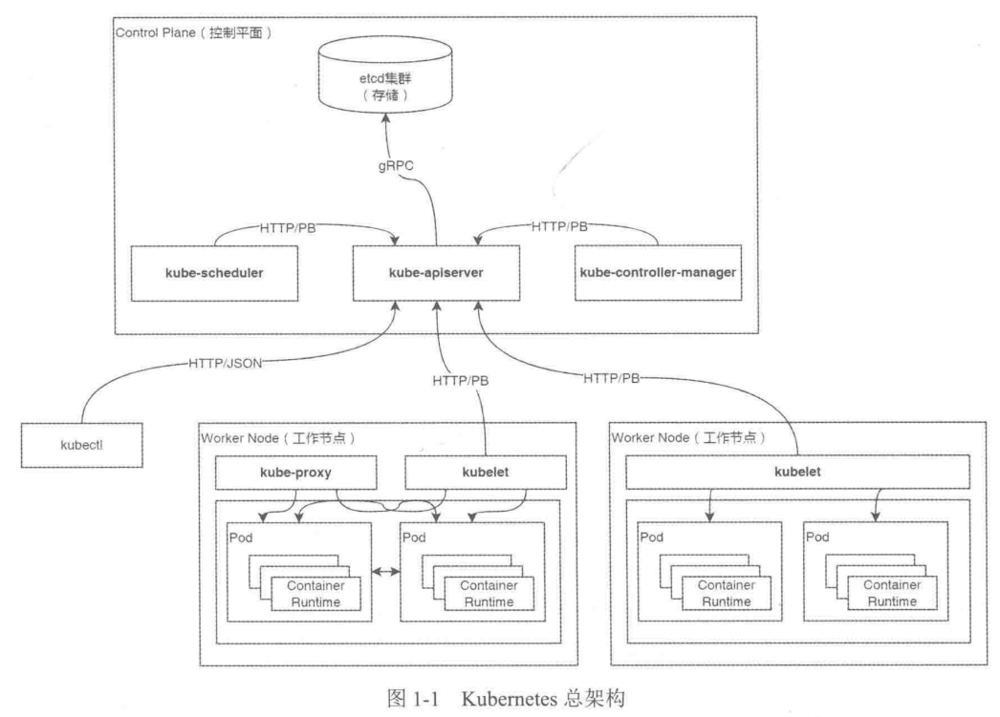

# Kubernetes 核心架构与组件深度解析
这份内容源自《深入理解Kubernetes源码》，核心围绕Kubernetes（简称K8s）的**发展历程、核心特性、整体架构、组件功能及项目代码结构**展开，是理解K8s底层设计和源码的基础，以下为系统且详细的整理与解释：

## 一、Kubernetes 基础认知
### 1. 定义与定位
K8s是Google开源的**容器编排与调度管理框架**，脱胎于Google内部的Borg集群管理系统，现为云原生计算基金会（CNCF）托管的核心项目，由Google、AWS、微软、IBM等大厂支持。其核心目标是通过容器技术推进云原生技术和服务开发，提供**以容器为中心的抽象层**，让用户能在物理/虚拟环境中便捷部署容器化应用，是目前容器编排的**事实标准**。

### 2. 核心特性
K8s的三大核心特性奠定了其云原生核心的地位，也是其被广泛应用的关键：
- **可移植**：全面支持公有云、私有云、混合云、多云（Multi-Cloud）部署，无厂商锁定；
- **可扩展**：采用模块化、插件化设计，支持组件的热插拔与自由组合，适配不同业务场景；
- **自动化**：实现容器化应用的**自动部署、自动重启、自动复制、自动伸缩/扩展**，大幅降低运维成本。

### 3. 项目背景
K8s是Google多年集群管理技术的沉淀，其发展历程与云原生技术的普及高度契合，关键时间节点如下：

| 时间 | 关键事件 |
|------|----------|
| 2003-2004 | Google发布Borg系统，从小型项目成长为超大规模内部集群管理系统，支撑数十万个作业跨集群运行 |
| 2013年左右 | Google发布Omega集群管理系统，为大型计算集群提供灵活、可扩展的调度能力，是Borg的升级 |
| 2014年左右 | Google推出K8s（Borg开源版本），发布首个Git初始版本，微软、RedHat、Docker等加入社区 |
| 2015年左右 | K8s 1.0正式发布，Google与Linux基金会组建CNCF，聚焦云原生软件生态建设 |
| 2016年左右 | K8s成为主流集群管理系统，CloudNativeCon 2016吸引全球千名开发者交流云原生技术 |
| 2017年左右 | 头部厂商全面支持K8s，AWS推出托管式容器服务，K8s 1.9版本发布 |
| 2018年左右 | K8s生态爆发，KubeCon+CloudNativeCon Europe 2018超4300名开发者参与，1.10版本发布 |
| 2020年 | K8s成为贡献者仅次于Linux的第二大开源项目，成为容器编排事实标准 |

## 二、Kubernetes 整体架构
K8s采用<span style="color: #ff6600">主从架构（CS架构）</span>，整体分为<span style="color: #ff6600">Control Plane（控制平面，原Master节点）</span> 和<span style="color: #ff6600">Worker Node（工作节点，原Minion节点）</span> 两部分，遵循**松耦合设计**，各组件各司其职，且控制平面支持多节点部署实现高可用。
核心设计理念继承自Google Borg系统（如Scheduler调度器、Pod资源管理），专为**分布式节点集群中的微服务/容器化应用管理**设计，支持**横向扩展**，能实现应用的零停机时间更新、故障自愈等能力。




### 1. 核心存储层：etcd
etcd是K8s的**分布式键值存储集群**，是整个K8s的“数据中心”，所有集群状态、元数据、资源对象信息均存储于此，且仅通过控制平面的kube-apiserver进行交互。
- 部署要求：最小可运行集群需**3个etcd节点**（带数据备份），生产环境建议**5个节点**，保证高可用和强一致性；
- 存储路径：所有K8s数据存储在etcd中**/registry**前缀的目录下。

### 2. 控制平面（Control Plane）
控制平面是K8s集群的“大脑”，负责**集群全局决策、资源管理、指令下发**，接收并处理所有集群控制命令，部署时建议多节点实现高可用，核心包含3大组件：kube-apiserver、kube-controller-manager、kube-scheduler。

### 3. 工作节点（Worker Node）
工作节点是K8s集群的“工作单元”，负责**实际运行容器化应用**，接收控制平面的任务分配，节点宕机时控制平面会将其工作迁移至其他节点。每个工作节点均包含3大核心组件：kubelet、kube-proxy、Container Runtime，且支持多种容器运行时协同工作。

## 三、Kubernetes 核心组件功能详解
K8s各组件采用松耦合架构，通过kube-apiserver实现通信，部分核心组件（如kube-controller-manager、kube-scheduler）支持多实例运行，并通过etcd实现**Leader选举**（仅Leader运行主逻辑，Candidate为候选节点，Leader宕机后自动补位），以下为所有核心组件的详细功能：

### 1. 集群交互工具：kubectl
- 定义：K8s官方提供的**命令行工具（CLI）**，是用户与K8s集群交互的主要入口；
- 通信方式：默认通过**HTTP/JSON协议**与kube-apiserver交互，发送HTTP请求并接收处理结果；
- 核心作用：用户通过kubectl执行集群操作（如创建Pod、删除Service、查看节点状态等）。

### 2. 编程交互库：client-go
- 定义：从K8s源码中独立出来的**Go语言官方客户端库**，是K8s组件间通信的基础；
- 核心作用：为编程方式操作K8s集群提供接口，K8s所有核心组件（如调度器、控制器管理器）均通过client-go与kube-apiserver交互；
- 开发价值：是K8s二次开发的**必备工具**，基于K8s的自定义开发建议优先使用（做了大量性能优化）。

### 3. 集群核心入口：kube-apiserver
<span style="color: #ff6600">kube-apiserver是K8s集群的**核心枢纽**，是唯一能与etcd直接交互的组件，所有组件/工具的操作均需通过其转发，是集群的“门户”</span>。
#### 核心特性
1. 将K8s所有资源对象封装为**RESTful风格的API接口**，统一管理资源的创建、修改、删除、查询；
2. 负责**集群状态和元数据管理**，所有资源对象的变更均通过其写入etcd；
3. 提供完善的**集群安全访问机制**：包含认证、授权、准入控制器，保证集群访问安全；
4. 作为集群组件的**通信中介**，实现各组件间的信息交互（如kubelet上报节点状态、scheduler获取Pod信息）。

### 4. 集群自动化控制中心：kube-controller-manager
kube-controller-manager是K8s集群的**“自动化运维管家”**，核心目标是**保证集群实际状态与用户期望状态一致**。
#### 核心功能
1. 管理集群各类核心资源：节点（Node）、Pod副本、端点（Endpoints）、命名空间（Namespace）、服务账户（ServiceAccount）、资源定额（ResourceQuota）等；
2. 内置多种**控制器（Controller）**：如Deployment、StatefulSet、Namespace、PersistentVolume控制器等，每个控制器实时监控对应资源的状态；
3. 实现**故障自愈**：当节点宕机、Pod异常退出等情况发生时，自动执行修复操作（如重新创建Pod、将任务迁移至健康节点）。
#### 高可用设计
基于etcd的分布式锁实现**Leader选举**，多实例运行时仅Leader执行主逻辑，Candidate处于阻塞状态，Leader宕机后自动重新选举，保证服务不中断。

### 5. 集群调度器：kube-scheduler
kube-scheduler是K8s集群的**“调度员”**，核心职责是为**新创建的Pod资源对象**在集群中选择**最优的Worker Node节点**运行。
#### 核心工作流程
1. 实时监控集群中的Pod和Node资源状态，发现未调度的新Pod后启动调度流程；
2. 通过**调度算法**为Pod选择节点，调度算法分为**预选调度算法**（过滤不符合条件的节点）和**优选调度算法**（从符合条件的节点中选择最优节点）；
3. 支持**高级调度能力**：优先级调度、抢占机制、亲和性/反亲和性调度，满足复杂业务的调度需求。
#### 高可用设计
与kube-controller-manager一致，通过etcd实现Leader选举，多实例运行保证调度服务高可用，且每次仅调度**一个Pod**，一个Pod的调度过程为一个**调度周期**。

### 6. 节点管家：kubelet
kubelet运行在**每一个Worker Node节点上**，是控制平面与工作节点的**“通信桥梁”**，负责节点上Pod的全生命周期管理，是工作节点的核心组件。
#### 核心功能
1. 接收kube-apiserver下发的任务，执行Pod的**创建、修改、监控、删除**等操作；
2. 节点启动时向kube-apiserver**注册节点自身信息**，并**定期上报节点资源使用状态**（如CPU、内存、磁盘），为kube-scheduler的调度提供依据；
3. 负责节点的**资源清理**：自动清理无用的镜像和容器，防止磁盘空间被占满。
#### 三大标准化接口
kubelet通过3种标准化接口实现**插件化扩展**，适配不同的容器运行时、网络、存储方案，是K8s可移植性和可扩展性的关键，也是云原生生态的重要标准：

| 接口名称 | 英文缩写 | 核心作用 | 常见实现 |
|----------|----------|----------|----------|
| 容器运行时接口 | CRI | 定义kubelet与容器运行时的通信协议，实现容器的创建、启动、停止等 | Docker、Containerd、CRI-O |
| 容器网络接口 | CNI | 定义容器网络插件的标准接口，配置容器的网络连接 | Calico、Flannel、Weave |
| 容器存储接口 | CSI | 定义容器存储插件的标准接口，实现持久化存储的配置与管理 | Ceph、GlusterFS、NFS、云存储 |

### 7. 网络代理：kube-proxy
kube-proxy运行在**每一个Worker Node节点上**，是K8s集群的**“网络网关”**，负责集群的**服务网络管理**，实现Service与Pod之间的通信和负载均衡。
#### 核心功能
1. 实时监控kube-apiserver中**Service和Endpoints资源的变化**，并动态更新节点的网络规则（如iptables、ipvs）；
2. 为Service背后的一组Pod提供**统一的TCP/UDP流量转发**和**负载均衡功能**，实现Service的访问入口抽象；
3. 管理**Pod-to-Service**和**External-to-Service**的网络访问，是外部访问集群内应用、集群内Pod间访问服务的核心。
#### 特性
kube-proxy是**专属K8s的轻量负载均衡**，仅针对K8s的Service和Pod资源做转发，区别于传统的通用负载均衡器。

### 8. 容器运行时：Container Runtime
Container Runtime是K8s的**“容器执行引擎”**，负责管理容器的**全生命周期**，包括容器的创建、启动、停止、销毁等操作。
#### 重要版本变更
- K8s 1.24版本前：通过kubelet中内嵌的**Dockershim**模块与Docker Engine交互；
- K8s 1.24及以后版本：完全移除Dockershim，**基于CRI接口**与容器运行时通信，任何实现CRI标准的运行时均可集成。
#### 常见实现
Containerd、CRI-O、Docker Engine、Mirantis ContainerRuntime等。

## 四、Kubernetes 项目代码结构（Go语言）
K8s整体采用**Go语言编写**，遵循Go社区的**Standard Go Project Layout**规范，项目目录结构清晰，且各核心组件的代码入口、初始化逻辑**高度一致**，便于开发和维护，同时支持模块化扩展。

### 1. 核心目录结构及说明
K8s源码的核心目录分工明确，各目录承担不同的功能，是阅读和开发K8s源码的基础：

| 目录 | 核心说明 |
|------|----------|
| cmd | 存放所有可执行文件的**入口代码**，每个组件对应一个子目录，包含main函数（如kube-apiserver、kubectl） |
| pkg | 存放**核心可复用库代码**，可在项目内部或外部被引用，是K8s核心逻辑的封装 |
| vendor | 存放项目**依赖的第三方库代码**，解决依赖版本问题 |
| api | 存放OpenAPI/Swagger的spec文件，包含JSON、Protocol的定义，是K8s API的基础 |
| build | 存放与**容器环境构建相关的脚本**，用于构建K8s组件的容器镜像 |
| test | 存放**测试工具及测试数据**，支撑项目的单元测试、集成测试 |
| docs | 存放**设计文档和用户使用文档**，包括架构设计、使用教程等 |
| hack | 存放与**本地构建、测试相关的脚本**，用于开发环境的搭建 |
| third_party | 存放**第三方工具、代码或资源**，非核心依赖但需使用的内容 |
| plugin | 存放K8s**插件代码**，如认证、授权、网络等插件 |
| translations | 存放**国际化（i18n）语言包**，支持多语言，无需修改核心代码 |
| CHANGELOG | 存放项目**版本更新记录**，追踪代码修改历程和版本特性 |
| staging | 核心包的**暂存目录**，将部分核心包软链接至vendor/k8s.io目录，解决早期包过多的问题 |

### 2. 组件代码入口的统一设计
K8s所有核心组件（如kube-apiserver、kube-controller-manager、kubectl）的代码入口均在`cmd/`目录下，且**目录结构、文件命名高度一致**，新增组件可直接复用原有模板，仅需简单修改。
示例：`cmd/`目录的二级结构
```
cmd/
├── kube-apiserver/  # apiserver组件入口
│   ├── app/
│   └── apiserver.go
├── kube-controller-manager/  # 控制器管理器入口
│   ├── app/
│   └── controller-manager.go
├── kube-proxy/  # proxy组件入口
│   ├── app/
│   └── proxy.go
├── kube-scheduler/  # 调度器入口
│   ├── app/
│   └── scheduler.go
├── kubectl/  # 命令行工具入口
│   └── kubectl.go
├── kubelet/  # kubelet组件入口
│   ├── app/
│   └── kubelet.go
```

### 3. 组件统一的初始化过程
K8s所有核心组件的**进程初始化和运行逻辑高度统一**，以main函数为入口，遵循固定的执行流程，保证了组件开发的一致性，核心流程为：
`初始化参数 → 日志初始化 → 参数补全 → 参数验证 → 持久运行 → 接收退出信号退出`
以kube-apiserver为例，具体步骤：
1. **rand.Seed**：初始化组件内全局随机数生成对象；
2. **app.NewCommand**：实例化命令行参数，通过Flag将参数解析并存储至Option对象；
3. **log.InitLogs**：实例化日志对象，完成日志管理的初始化；
4. **command.Execute**：组件进程的核心运行逻辑，包含三步子操作：
    - `Complete`：填充参数的默认值；
    - `Validate`：验证所有参数的合法性；
    - `Run`：启动组件主逻辑并**持久运行**，直到接收到退出信号（如Ctrl+C）才终止进程。

## 五、核心总结
1. K8s是Google基于Borg/Omega技术沉淀的容器编排框架，现为云原生核心，核心特性是**可移植、可扩展、自动化**；
2. K8s采用**控制平面+工作节点**的主从架构，etcd为核心存储，所有组件通过kube-apiserver通信，松耦合设计保证了集群的高可用和可扩展；
3. 控制平面的核心是**kube-apiserver（入口）、kube-controller-manager（自动化）、kube-scheduler（调度）**，工作节点的核心是**kubelet（节点管理）、kube-proxy（网络）、Container Runtime（容器执行）**；
4. kubelet的**CRI/CNI/CSI三大标准化接口**是K8s生态扩展的关键，实现了容器运行时、网络、存储的插件化；
5. K8s基于Go语言开发，遵循Standard Go Project Layout规范，**组件入口和初始化逻辑高度统一**，便于开发和维护，是阅读K8s源码的重要基础。

