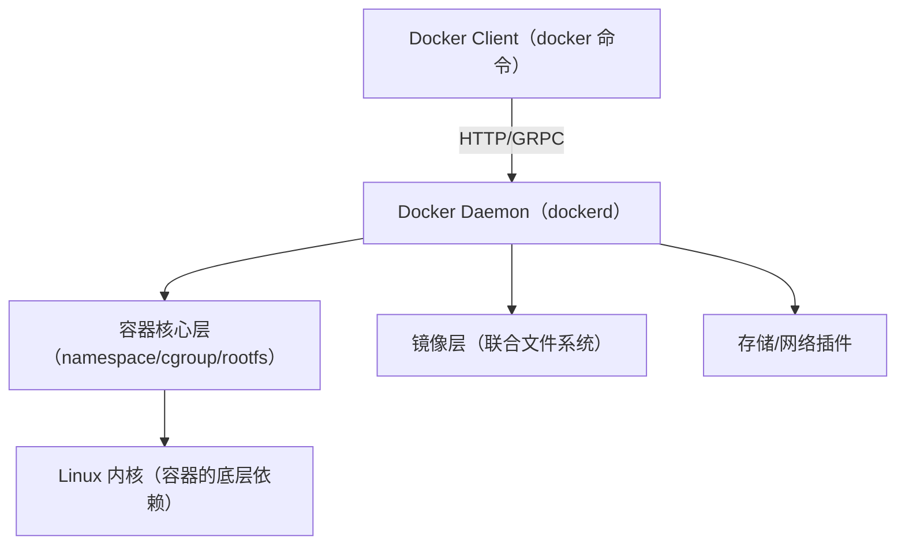
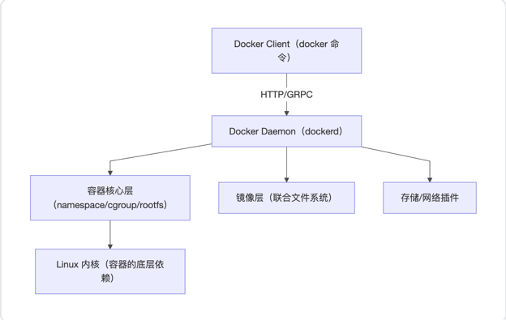

# Docker 原理学习路径 + 官方/权威文档全指南
Docker 是容器化技术的核心，学习它要从「核心架构（客户端/服务端）→ 底层原理（namespace/cgroup/联合文件系统）→ 源码精读」层层拆解，结合官方文档+实战验证形成闭环。下面给你一套从入门到精通的学习方案，附所有权威资料和源码学习技巧。

## 一、先理清 Docker 核心架构（学习原理的基础）
Docker 采用 **C/S（客户端-服务端）架构**，所有操作最终由后台 `dockerd` 进程执行，先搞懂架构能避免学习时“只见树木不见森林”：


### 核心组件说明
| 组件 | 作用 | 学习重点 |
|------|------|----------|
| Docker Client | 命令行工具（`docker run/build/ps`），负责发送请求 | 了解 GRPC 通信协议、命令参数解析逻辑 |
| Docker Daemon（dockerd） | 后台守护进程，处理所有容器/镜像操作 | 源码核心入口，容器生命周期管理逻辑 |
| Containerd | 底层容器运行时（Docker 1.12+ 剥离出的核心） | 容器创建/销毁、OCI 规范实现 |
| RunC | 轻量级容器运行时（符合 OCI 标准） | 直接调用 Linux 内核接口（namespace/cgroup） |
| 镜像层 | 联合文件系统（UnionFS），构建镜像分层存储 | 镜像打包/解压、分层复用原理 |

## 二、Docker 官方/权威文档（唯一可信来源）
### 1. 官方核心文档（必读）
| 文档类型 | 地址 | 学习价值 |
|----------|------|----------|
| 官方入门文档 | https://docs.docker.com/get-started/ | 零基础掌握 Docker 基本操作，理解核心概念（镜像/容器/卷/网络） |
| 官方架构文档 | https://docs.docker.com/engine/docker-overview/ | 系统讲解 Docker 架构、核心组件、底层原理 |
| Docker Engine 源码文档 | https://docs.docker.com/engine/contribute/ | 源码编译、贡献指南、核心模块说明 |
| OCI 规范（容器标准） | https://opencontainers.org/ | 理解 RunC/Containerd 遵循的行业标准，是容器跨平台的基础 |
| Containerd 官方文档 | https://containerd.io/docs/ | 学习底层容器运行时的原理和使用 |

### 2. 权威补充资料
| 资料类型 | 地址                                                                                                                                                 | 学习价值 |
|----------|----------------------------------------------------------------------------------------------------------------------------------------------------|----------|
| Docker 源码仓库（GitHub） | https://github.com/moby/moby （Docker 引擎核心）<br>https://github.com/containerd/containerd （底层运行时）<br>https://github.com/opencontainers/runc （OCI 运行时） | 源码精读的唯一来源，优先看 `moby/moby` 的 `master` 分支 |
| Linux 内核文档（容器底层） | https://www.kernel.org/doc/html/latest/                                                                                                            | 学习 namespace/cgroup/UnionFS 的内核实现 |
| 《Docker 源码分析》（官方风格指南） | https://github.com/moby/moby/blob/master/CONTRIBUTING.md                                                                                           | 了解 Docker 源码的编码规范、模块划分 |

## 三、Docker 核心原理拆解（从底层到上层）
### 1. 容器本质：Linux 内核特性的封装（最核心）
Docker 容器不是“轻量级虚拟机”，而是**利用 Linux 内核特性隔离的进程**，核心依赖 3 大技术：
#### （1）Namespace：资源隔离（让容器“看不见”主机资源）
| Namespace 类型 | 作用 | 示例 |
|----------------|------|------|
| PID | 隔离进程 ID（容器内 PID 1 是自己的进程） | `docker run --pid=host` 取消 PID 隔离 |
| NET | 隔离网络（容器有独立网卡/IP/端口） | `docker run -p 8080:80` 端口映射本质是修改 iptables |
| MNT | 隔离文件系统（容器有独立根目录） | 容器的 `/` 是主机的 `/var/lib/docker/overlay2/xxx` |
| UTS | 隔离主机名/域名 | `docker run --hostname my-container` |
| IPC | 隔离进程间通信（消息队列/共享内存） | 容器间默认无法通过 IPC 通信 |
| USER | 隔离用户/组 ID（容器内 root 不是主机 root） | 容器内 `uid 0` 映射到主机的普通用户 |

#### （2）Cgroup：资源限制（控制容器使用的资源上限）
- 作用：限制容器的 CPU/内存/磁盘 IO/网络带宽等；
- 核心文件：主机 `/sys/fs/cgroup/` 目录下，每个容器对应一个子目录，修改该目录下的文件即可限制资源（如 `cpu.cfs_quota_us` 限制 CPU 使用率）；
- 示例：`docker run --cpus=0.5 --memory=1G` 本质是修改 cgroup 配置。

#### （3）UnionFS（联合文件系统）：镜像分层存储
- 作用：将多个只读的镜像层和一个可写的容器层联合成一个统一的文件系统；
- 核心实现：Docker 常用 `overlay2`（主流）/`aufs`，镜像的每一层都是只读的，容器运行时新增一个可写层（容器内修改文件只影响该层，不改变底层镜像）；
- 验证：主机 `/var/lib/docker/overlay2/` 目录可查看所有镜像/容器的文件层。

### 2. 镜像原理：分层+可复用
- 镜像结构：每个 `Dockerfile` 指令对应一个镜像层（如 `FROM`/`RUN`/`COPY`），层是只读的，可跨镜像复用（如多个镜像基于同一个 `alpine` 基础层）；
- 镜像打包：`docker build` 时将各层打包成 tar 文件，`docker push` 时只推送本地没有的层；
- 镜像加载：`docker pull` 时解压各层，通过 UnionFS 联合成完整文件系统。

### 3. 容器生命周期原理
`docker run` 命令的完整执行流程（从命令到容器启动）：
```
docker run -d -p 8080:80 nginx
↓
1. Client 发送 GRPC 请求给 dockerd
2. dockerd 调用 containerd，请求创建容器
3. containerd 调用 runc，执行以下操作：
   a. 创建 Namespace（隔离资源）
   b. 配置 Cgroup（限制资源）
   c. 挂载 UnionFS（镜像层+可写层）
   d. 执行容器入口命令（nginx）
4. runc 退出，containerd 接管容器进程（守护）
5. dockerd 返回容器 ID 给 Client
```

## 四、Docker 源码学习路径（从易到难）
### 1. 前置准备（源码环境搭建）
#### （1）源码下载
- 核心仓库：`git clone https://github.com/moby/moby.git`  （Docker Engine 核心，原 Docker 源码）；
- 建议切换到稳定分支（如 `v25.0.0`），避免主分支代码不稳定。

#### （2）编译源码（以 Linux/Mac 为例）
```bash
# 安装依赖（Go 1.21+、make、gcc）
brew install go make gcc  # Mac
# 或
apt install golang make gcc -y  # Linux

# 进入源码目录
cd moby

# 编译 dockerd 和 docker 客户端
make binary

# 编译完成后，可执行文件在 ./bundles/binary-daemon/ 目录下
./bundles/binary-daemon/dockerd  # 启动自定义编译的 dockerd
./bundles/binary-daemon/docker ps  # 用自定义客户端执行命令
```

### 2. 分阶段学习源码（从核心模块入手）
#### 阶段1：入门（理解命令执行流程）
- **核心文件**：`cmd/docker/`（客户端命令入口）、`cmd/dockerd/`（服务端入口）；
- **学习重点**：
    1. 看 `docker run` 命令的解析逻辑（`cmd/docker/run.go`）；
    2. 跟踪 Client 到 Daemon 的 GRPC 通信（`api/client/` 目录）；
    3. 断点调试：编译源码后，用 IDEA/Goland 调试 `docker run` 命令，观察请求如何发送到 `dockerd`。

#### 阶段2：进阶（容器创建核心逻辑）
- **核心文件**：`daemon/container/create.go`（容器创建）、`daemon/start.go`（容器启动）；
- **学习重点**：
    1. 容器配置解析（`container/config.go`）；
    2. 调用 containerd 的逻辑（`daemon/containerd/client.go`）；
    3. 理解 `docker run` 如何转化为 containerd 的 API 调用。

#### 阶段3：深入（底层运行时）
- 跳转到 `containerd` 源码（`github.com/containerd/containerd`）；
- 核心文件：`pkg/cri/server/container_create.go`（容器创建）、`runtime/runc/run.go`（调用 runc）；
- 学习重点：如何调用 Linux 内核接口创建 namespace/cgroup。

#### 阶段4：底层（Linux 内核特性）
- 结合 Linux 内核源码，学习 namespace（`kernel/nsproxy.c`）、cgroup（`kernel/cgroup/`）的实现；
- 实战验证：手动用 `unshare` 命令创建隔离环境（模拟 Docker 容器）：
  ```bash
  # 创建 PID/UTS/MNT 隔离的环境，进入后执行 ps -ef 只能看到当前进程
  unshare --pid --uts --mount --fork --mount-proc /bin/bash
  ```

### 3. 源码学习技巧（新手友好）
1. **先抓主线，再抠细节**：先搞懂 `docker run` 的完整流程，再深入某一个模块（如网络/存储）；
2. **结合日志调试**：启动 `dockerd` 时加 `--debug` 参数，打印详细日志，跟踪容器创建的每一步；
3. **对比实战操作**：执行 `docker run` 后，查看主机 `/var/lib/docker/`、`/sys/fs/cgroup/` 目录的变化，对应源码逻辑；
4. **参考官方注释**：Docker 源码注释完善，优先看注释再看代码。

## 五、分阶段学习路径（从入门到精通）
### 阶段1：基础入门（1-2周）
1. 看官方「Get Started」文档，掌握 `docker run/build/ps/images/network/volume` 等基础命令；
2. 理解核心概念：镜像（只读）、容器（可写层+镜像层）、卷（数据持久化）、网络（端口映射/网桥）；
3. 写一个简单的 `Dockerfile`（如打包 Spring Boot 应用），理解每一行指令的作用。

### 阶段2：原理理解（2-3周）
1. 学习 Linux namespace/cgroup/UnionFS 三大核心技术，手动用 `unshare`/`mount` 命令模拟容器；
2. 理解 `docker run` 的完整执行流程，能画出流程图；
3. 查看 Docker 镜像的分层结构（`docker inspect <镜像ID>`），理解 UnionFS 如何工作。

### 阶段3：源码精读（1-2个月）
1. 编译 Docker 源码，调试 `docker run` 命令；
2. 精读 `dockerd` 核心模块（容器创建/启动）；
3. 精读 `containerd` 与 `runc` 的交互逻辑；
4. 尝试修改源码（如自定义容器启动日志），验证自己的理解。

### 阶段4：实战进阶（持续学习）
1. 学习 Docker 网络原理（网桥/overlay/ipvlan）；
2. 学习 Docker 存储驱动（overlay2/volume）；
3. 学习 Kubernetes 与 Docker 的集成（容器运行时接口 CRI）。

## 六、学习避坑指南
1. **不要混淆 Docker 和容器运行时**：Docker ≠ 容器，Docker 是容器管理工具，底层依赖 containerd/runc；
2. **不要跳过 Linux 内核知识**：容器的本质是 Linux 内核特性，不懂 namespace/cgroup 就无法真正理解 Docker；
3. **优先看官方文档**：第三方博客可能简化/错误解读原理，以 Docker 官方和 Linux 内核文档为准；
4. **不要只看源码不实战**：源码逻辑要结合 `docker` 命令执行后的系统变化（如 cgroup 配置、文件系统）验证。

## 七、下一步行动
先从**官方入门文档**掌握基础操作，再学习 Linux 内核的 namespace/cgroup 特性，然后编译 Docker 源码调试 `docker run` 命令。

需要我给你一份 **Docker 核心源码调试清单**（标注关键文件、断点位置、调试步骤），帮你快速定位容器创建的核心逻辑吗？


