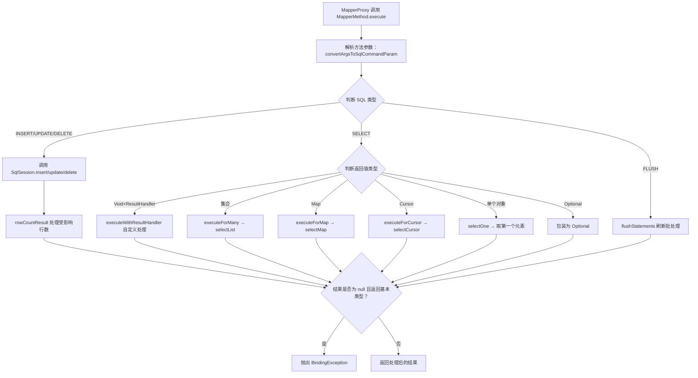

## 目录
- [1](#1)
- [2](#2)


# 1

这段代码是 MyBatis 框架中 `MapperMethod` 类的核心实现。它是 **连接“Java 接口方法”与“SQL 执行引擎”的桥梁**。

在上一段 `MapperProxy` 的代码中，我们看到了代理对象如何拦截调用并委托给 `MapperMethod`。
而 `MapperMethod` 的职责就是：**解析方法签名、准备参数、根据 SQL 类型选择正确的执行策略、处理返回值**。

下面我将分两部分详细解释：**代码流程详解** 和 **底层原理深度剖析**。

---

### 一、代码流程详解

#### 1. 构造函数：元数据预解析
```java
public MapperMethod(Class<?> mapperInterface, Method method, Configuration config) {
    this.command = new SqlCommand(config, mapperInterface, method);
    this.method = new MethodSignature(config, mapperInterface, method);
}
```
*   **目的**：在对象创建时（通常是在 `MapperProxy` 的缓存初始化阶段），一次性完成所有耗时的解析工作，避免在每次 SQL 执行时重复解析。
*   **`SqlCommand`**：负责解析 SQL 相关信息。
    *   确定 SQL 类型（INSERT, UPDATE, DELETE, SELECT, FLUSH）。
    *   确定 SQL 的唯一标识符（Namespace + MethodName，即 XML 中的 `id` 或注解中的值）。
    *   检查是否存在对应的 SQL 语句配置。
*   **`MethodSignature`**：负责解析 Java 方法签名相关信息。
    *   返回值类型（是 List？Map？void？Optional？基本类型？）。
    *   参数类型及名称映射（将 Java 参数名映射到 SQL 中的 `#{paramName}`）。
    *   是否有 `ResultHandler` 或 `RowBounds` 参数。

#### 2. 核心执行方法：`execute`
这是真正的逻辑分发中心。它接收 `SqlSession` 和参数数组 `args`，根据 SQL 类型进入不同的 `switch` 分支。

##### A. 写操作 (INSERT, UPDATE, DELETE)
```java
case INSERT: 
case UPDATE: 
case DELETE: {
    Object param = method.convertArgsToSqlCommandParam(args); // 1. 参数转换
    result = rowCountResult(sqlSession.xxx(command.getName(), param)); // 2. 执行 & 3. 结果处理
    break;
}
```
1.  **参数转换**：`convertArgsToSqlCommandParam` 将 `Object[] args` 转换为 MyBatis 能识别的参数对象（通常是 `ParamMap` 或单个对象），以便 SQL 中的 `#{}` 占位符能取到值。
2.  **执行**：调用 `sqlSession` 对应的方法，传入 SQL ID 和参数。这些方法最终返回受影响的行数（`int`）。
3.  **结果处理**：`rowCountResult` 方法会将返回的行数转换为符合接口定义的类型。
    *   如果接口返回 `int`/`long`，直接返回行数。
    *   如果接口返回 `boolean`，则判断行数 > 0。
    *   如果接口返回 `void`，忽略返回值。

##### B. 读操作 (SELECT) - 最复杂的部分
`SELECT` 分支根据 **返回值的类型** 进行了细致的分流：

1.  **带 ResultHandler 的 void 方法**：
    ```java
    if (method.returnsVoid() && method.hasResultHandler()) {
        executeWithResultHandler(sqlSession, args);
        result = null;
    }
    ```
    *   用于流式处理大量数据。用户传入一个 `ResultHandler` 回调，MyBatis 每查出一行数据就回调一次，不将所有数据加载到内存。

2.  **返回集合 (List, Set, Collection, Array)**：
    ```java
    else if (method.returnsMany()) {
        result = executeForMany(sqlSession, args);
    }
    ```
    *   调用 `sqlSession.selectList`，返回多个对象。

3.  **返回 Map**：
    ```java
    else if (method.returnsMap()) {
        result = executeForMap(sqlSession, args);
    }
    ```
    *   调用 `sqlSession.selectMap`，需要指定 Map 的 key 列（通过 `@MapKey` 注解）。

4.  **返回游标 (Cursor)**：
    ```java
    else if (method.returnsCursor()) {
        result = executeForCursor(sqlSession, args);
    }
    ```
    *   返回 `Cursor<T>`，用于懒加载遍历结果集，节省内存。

5.  **返回单个对象 (Default Case)**：
    ```java
    else {
        Object param = method.convertArgsToSqlCommandParam(args);
        result = sqlSession.selectOne(command.getName(), param);
        
        // Optional 特殊处理
        if (method.returnsOptional() && (result == null || !method.getReturnType().equals(result.getClass()))) {
            result = Optional.ofNullable(result);
        }
    }
    ```
    *   调用 `sqlSession.selectOne`。注意：如果 SQL 返回多行，`selectOne` 会抛出异常（TooManyResultsException）。
    *   **Optional 支持**：如果接口返回类型是 `Optional<T>`，这里会自动将查询结果（可能为 null）包装成 `Optional` 对象，避免空指针异常，提升 API 友好度。

##### C. 刷新操作 (FLUSH)
```java
case FLUSH:
    result = sqlSession.flushStatements();
    break;
```
*   用于批量操作中强制刷新 JDBC 批处理语句（较少直接使用）。

##### D. 最终校验：基本类型防 Null
```java
if (result == null && method.getReturnType().isPrimitive() && !method.returnsVoid()) {
    throw new BindingException("Mapper method ... attempted to return null ... primitive return type ...");
}
```
*   **原理**：Java 的基本类型（`int`, `boolean` 等）不能为 `null`。如果数据库查询结果为空（NULL），而接口定义为 `int getCount()`，直接返回 `null` 会导致自动拆箱时抛出 `NullPointerException`。
*   **策略**：MyBatis 选择主动抛出清晰的 `BindingException`，告诉开发者“SQL 没查到数据，但你需要返回一个基本类型，这冲突了”，而不是让程序在后续崩溃。

---

### 二、背后/底层原理深度剖析

#### 1. 命令模式 (Command Pattern) 的应用
`MapperMethod` 本质上是一个 **命令对象**。
*   它将“请求”（Java 方法调用）封装成一个对象，包含所有必要信息（SQL ID、参数、执行类型）。
*   这使得 `MapperProxy` 不需要知道具体的 SQL 逻辑，只需要调用 `command.execute()` 即可。
*   这种解耦让 MyBatis 可以灵活地扩展新的 SQL 类型或执行策略，而无需修改代理层代码。

#### 2. 运行时多态与策略分发
`execute` 方法中的 `switch (command.getType())` 和内部的 `if-else` 链体现了 **基于元数据的策略分发**。
*   **静态绑定 vs 动态绑定**：虽然 Java 方法重载是编译期绑定的，但 MyBatis 在运行时根据 **XML/注解配置** 和 **方法签名反射信息** 动态决定走哪条路。
*   **返回值适配**：同一个 SQL 语句（例如 `SELECT * FROM users`），根据 Mapper 接口定义的不同（`List<User>`, `User`, `Map`, `Cursor`），MyBatis 会自动切换底层的 `SqlSession` 调用方法（`selectList`, `selectOne`, `selectMap`...）。这极大地提高了开发效率，实现了“一套 SQL，多种返回形态”。

#### 3. 参数映射机制 (`ParamNameResolver`)
在 `method.convertArgsToSqlCommandParam(args)` 背后，隐藏着 MyBatis 强大的参数解析器 `ParamNameResolver`。
*   **问题**：Java 编译后，方法参数名通常会丢失（除非开启 `-parameters` 编译选项）。SQL 中却需要用 `#{username}` 这样的名字。
*   **解决方案**：
    1.  优先使用 `@Param("username")` 注解指定的名字。
    2.  如果没有注解且开启了编译参数名保留，使用反射获取真实参数名。
    3.  如果只有一个参数且无注解，可以直接用 `_parameter` 或直接引用该对象属性。
    4.  如果有多个参数且无注解，默认生成 `param1`, `param2`... 作为键。
*   最终生成一个 `ParamMap` (继承自 `HashMap`)，供后续的 `PreparedStatement` 设置参数时使用。

#### 4. 类型安全与防御性编程
代码末尾对 **基本类型返回 null** 的检查是一个非常经典的防御性设计。
*   **场景**：`select count(*)` 在某些数据库如果没有记录可能返回 NULL（虽然通常返回 0，但某些复杂聚合或左连接可能导致 NULL）。
*   **风险**：如果 MyBatis 直接返回 `null` 给 `int` 返回值，JVM 在执行 `return (int)null` 时会抛出晦涩的 `NullPointerException`，堆栈指向调用方，难以排查。
*   **优化**：MyBatis 在框架层提前拦截，抛出带有明确语义的 `BindingException`，指出是“Mapper 方法定义与数据库结果不匹配”，极大降低了调试成本。

#### 5. Optional 的现代 Java 支持
`Optional.ofNullable(result)` 的处理展示了 MyBatis 对现代 Java 特性的跟进。
*   在 Java 8 之前，处理“可能为空”的查询结果通常需要手动判空。
*   MyBatis 内部自动完成了 `null` -> `Optional.empty()` 或 `value` -> `Optional.of(value)` 的转换，使得接口定义 `Optional<User> findById(...)` 能够无缝工作，鼓励开发者使用函数式风格处理空值。

#### 6. 性能考量
*   **元数据缓存**：`MapperMethod` 对象本身是被 `MapperProxy` 缓存的。这意味着 `SqlCommand` 和 `MethodSignature` 的解析（包括正则匹配、反射扫描）只在应用启动或首次调用时发生一次。
*   **执行路径**：一旦进入 `execute` 方法，除了参数转换（轻量级）和 switch 判断，几乎没有额外开销，直接透传给 `SqlSession`，保证了接近原生 JDBC 的执行效率。

### 总结
`MapperMethod` 是 MyBatis 的 **业务逻辑调度员**。
它不直接执行 SQL（那是 `Executor` 的事），也不直接生成代理（那是 `MapperProxy` 的事）。它的核心价值在于：
1.  **翻译**：将 Java 方法调用翻译成 MyBatis 内部的标准指令。
2.  **路由**：根据返回值类型和 SQL 类型，精准路由到 `SqlSession` 的不同方法。
3.  **适配**：处理参数命名、结果包装（Optional, List）、类型安全检查等繁琐细节。

正是有了 `MapperMethod`，开发者才能享受到“定义接口即实现功能”的极致体验。


[目录](#目录)

# 2

你想要深入理解 MyBatis 中 `MapperMethod` 类的详细实现逻辑和底层原理，这个类是 MyBatis 连接「Mapper 接口方法」和「SQL 执行」的核心枢纽，负责解析方法元信息、分发 SQL 执行逻辑并处理返回结果。下面我会从**功能定位、核心代码逐行解析、底层原理、设计思想**四个维度完整拆解这个类。

### 一、核心定位：MapperMethod 是什么？
`MapperMethod` 是 MyBatis 对「Mapper 接口中的单个方法」的**元信息封装类**，也是「方法执行的调度器」。
简单来说：
1. 它会解析 Mapper 方法的关键信息（比如方法名对应哪个 SQL ID、返回值类型是 List/Map/单个对象、参数如何映射）；
2. 它的 `execute` 方法是真正触发 SQL 执行的核心入口，会根据 SQL 类型（SELECT/INSERT/UPDATE/DELETE）调用 `SqlSession` 的对应方法，并处理返回结果。

### 二、核心代码逐行解析（带原理说明）
#### 1. 类成员变量
```java
public class MapperMethod {
  // 封装 SQL 命令信息（SQL ID、SQL 类型：INSERT/UPDATE/DELETE/SELECT 等）
  private final SqlCommand command;
  // 封装方法签名信息（返回值类型、参数映射、是否有 ResultHandler 等）
  private final MethodSignature method;
}
```
- **核心作用**：将 Mapper 方法拆分为「SQL 命令」和「方法签名」两个维度封装，职责分离：
    - `SqlCommand`：关注「要执行哪个 SQL、是什么类型的 SQL」；
    - `MethodSignature`：关注「方法的参数怎么处理、返回值要什么格式」。
- **底层原理**：这是典型的「单一职责原则」应用，把 SQL 相关和方法元信息相关的逻辑解耦，便于维护。

#### 2. 构造方法：解析方法元信息
```java
public MapperMethod(Class<?> mapperInterface, Method method, Configuration config) {
  // 1. 解析 SQL 命令信息（从注解/XML 中获取 SQL ID 和 SQL 类型）
  this.command = new SqlCommand(config, mapperInterface, method);
  // 2. 解析方法签名信息（返回值类型、参数映射规则、ResultHandler 等）
  this.method = new MethodSignature(config, mapperInterface, method);
}
```
- **核心逻辑**：
  构造方法是「解析阶段」的核心，在第一次调用 Mapper 方法时（`MapperProxy.cachedInvoker` 中）执行，后续缓存复用。
- **底层原理拆解**：
    - `SqlCommand` 解析逻辑：
        1. 先获取方法对应的 SQL ID（默认规则：`Mapper接口全限定名 + 方法名`，比如 `com.example.mapper.UserMapper.selectById`）；
        2. 从 `Configuration` 中根据 SQL ID 查找 `MappedStatement`（MyBatis 中封装 SQL 配置的核心对象）；
        3. 从 `MappedStatement` 中获取 SQL 类型（INSERT/UPDATE/DELETE/SELECT/FLUSH）。
    - `MethodSignature` 解析逻辑：
        1. 解析方法的返回值类型（是否是 List/Map/Cursor/Optional、是否是基本类型、是否返回 void）；
        2. 解析参数映射规则（比如 `@Param` 注解、参数顺序、是否有 ResultHandler 参数）；
        3. 解析方法的其他特性（比如是否使用了 RowBounds 分页）。

#### 3. 核心方法：execute（SQL 执行调度）
这是 `MapperMethod` 的核心方法，负责根据 SQL 类型分发执行逻辑，并处理参数和返回值。

##### 3.1 整体结构：按 SQL 类型分支
```java
public Object execute(SqlSession sqlSession, Object[] args) {
  Object result;
  // 核心：根据 SQL 类型（INSERT/UPDATE/DELETE/SELECT/FLUSH）分发执行逻辑
  switch (command.getType()) {
    case INSERT: // 插入逻辑
    case UPDATE: // 更新逻辑
    case DELETE: // 删除逻辑
    case SELECT: // 查询逻辑（最复杂，分支最多）
    case FLUSH:  // 刷新批处理语句
    default:     // 未知类型异常
  }
  // 兜底检查：避免基本类型返回 null（比如方法返回 int 但 SQL 查不到结果）
  if (result == null && method.getReturnType().isPrimitive() && !method.returnsVoid()) {
    throw new BindingException("Mapper method '" + command.getName()
        + "' attempted to return null from a method with a primitive return type (" + method.getReturnType() + ").");
  }
  return result;
}
```
- **底层原理**：
    - `SqlSession` 是 MyBatis 对外提供的核心会话接口，封装了所有 SQL 执行方法（`selectOne`/`insert`/`update` 等）；
    - 这里的 `args` 是用户调用 Mapper 方法时传入的参数（比如 `selectById(1)` 中的 `1`）。

##### 3.2 INSERT/UPDATE/DELETE 分支（逻辑一致）
```java
case INSERT: {
  // 1. 将方法参数转换为 SQL 执行所需的参数（处理 @Param、多参数等）
  Object param = method.convertArgsToSqlCommandParam(args);
  // 2. 调用 SqlSession.insert 执行 SQL，返回受影响行数，并处理返回结果
  result = rowCountResult(sqlSession.insert(command.getName(), param));
  break;
}
case UPDATE: {
  Object param = method.convertArgsToSqlCommandParam(args);
  result = rowCountResult(sqlSession.update(command.getName(), param));
  break;
}
case DELETE: {
  Object param = method.convertArgsToSqlCommandParam(args);
  result = rowCountResult(sqlSession.delete(command.getName(), param));
  break;
}
```
- **核心步骤拆解**：
    1. `convertArgsToSqlCommandParam`：参数转换核心方法，底层逻辑包括：
        - 如果方法只有一个参数且没有 `@Param` 注解：直接返回该参数；
        - 如果方法有多个参数或有 `@Param` 注解：将参数封装为 `Map`（key 为 `@Param` 注解值或 `param1/param2`，value 为参数值）；
        - 支持 `RowBounds`/`ResultHandler` 等特殊参数的过滤（这些参数不传入 SQL 执行）。
    2. `sqlSession.insert/update/delete`：调用 `SqlSession` 的对应方法，传入「SQL ID」和「处理后的参数」，执行 SQL 并返回**受影响的行数**；
    3. `rowCountResult`：处理受影响行数的返回格式，底层逻辑：
        - 如果方法返回值是 `int`/`long`/`boolean`：直接返回受影响行数（boolean 类型时，行数>0 返回 true）；
        - 如果方法返回值是自定义对象（比如 `User`）：尝试从 `SqlSession` 中获取自增主键并封装为对象返回。

##### 3.3 SELECT 分支（最复杂，按返回值类型分支）
```java
case SELECT:
  // 分支1：返回 void 且有 ResultHandler（自定义结果处理）
  if (method.returnsVoid() && method.hasResultHandler()) {
    executeWithResultHandler(sqlSession, args);
    result = null;
  }
  // 分支2：返回集合（List/Collection/数组）
  else if (method.returnsMany()) {
    result = executeForMany(sqlSession, args);
  }
  // 分支3：返回 Map
  else if (method.returnsMap()) {
    result = executeForMap(sqlSession, args);
  }
  // 分支4：返回 Cursor（游标，流式查询）
  else if (method.returnsCursor()) {
    result = executeForCursor(sqlSession, args);
  }
  // 分支5：返回单个对象（默认分支）
  else {
    Object param = method.convertArgsToSqlCommandParam(args);
    result = sqlSession.selectOne(command.getName(), param);
    // 处理 Optional 类型返回值（Java 8+）
    if (method.returnsOptional() && (result == null || !method.getReturnType().equals(result.getClass()))) {
      result = Optional.ofNullable(result);
    }
  }
  break;
```
- **各分支底层原理**：
    1. **分支1（ResultHandler）**：
        - `executeWithResultHandler`：调用 `sqlSession.select(command.getName(), param, resultHandler)`，将查询结果交给用户自定义的 `ResultHandler` 处理（比如逐行处理大数据量结果，避免内存溢出）；
        - 底层：MyBatis 会流式读取 ResultSet，逐行调用 `ResultHandler.handleResult()`，不缓存结果到内存。
    2. **分支2（返回集合）**：
        - `executeForMany`：调用 `sqlSession.selectList(command.getName(), param)`，返回 List 集合；
        - 底层：如果方法返回值是数组，会将 List 转换为对应类型的数组；如果是 Collection 子类，会创建对应类型的集合并填充数据。
    3. **分支3（返回 Map）**：
        - `executeForMap`：调用 `sqlSession.selectMap(command.getName(), param, mapKey)`，其中 `mapKey` 是方法注解中指定的 Map 键（比如 `@MapKey("id")` 中的 `id`）；
        - 底层：将查询结果的每一行封装为对象，以指定的 `mapKey` 为键、对象为值，封装成 Map 返回。
    4. **分支4（返回 Cursor）**：
        - `executeForCursor`：调用 `sqlSession.selectCursor(command.getName(), param)`，返回 Cursor 对象；
        - 底层：Cursor 是 MyBatis 的流式查询接口，基于 JDBC 的 ResultSet 流式读取，适合大数据量查询（避免一次性加载所有数据到内存）。
    5. **分支5（返回单个对象）**：
        - `sqlSession.selectOne`：调用 `sqlSession.selectList` 后取第一个元素（如果结果集为空返回 null，超过一个元素抛出异常）；
        - `Optional` 处理：如果方法返回 `Optional<T>`，会将结果包装为 `Optional`（null 时返回 `Optional.empty()`）。

##### 3.4 FLUSH 分支
```java
case FLUSH:
  result = sqlSession.flushStatements();
  break;
```
- **核心作用**：触发 `SqlSession` 刷新批处理语句（执行所有缓存的批处理 SQL）；
- **底层原理**：MyBatis 的批处理执行器（`BatchExecutor`）会缓存 SQL 语句，调用 `flushStatements()` 时才真正执行所有缓存的 SQL，并返回执行结果。

##### 3.5 兜底异常检查
```java
if (result == null && method.getReturnType().isPrimitive() && !method.returnsVoid()) {
  throw new BindingException("Mapper method '" + command.getName()
      + "' attempted to return null from a method with a primitive return type (" + method.getReturnType() + ").");
}
```
- **核心作用**：避免「基本类型返回 null」的运行时异常（Java 中基本类型不能为 null）；
- **场景举例**：如果 Mapper 方法返回 `int`，但 SQL 执行结果为 null（比如查询不到数据），此时会抛出异常，而不是返回 null 导致 `NullPointerException`。

### 三、底层核心原理总结
#### 1. 元信息解析原理
- `MapperMethod` 在构造阶段完成「静态解析」：基于 `Configuration`（MyBatis 全局配置）、Mapper 接口类、方法对象，解析出 `SqlCommand` 和 `MethodSignature`；
- 解析结果缓存在 `MapperProxy` 的 `methodCache` 中，避免每次调用方法重复解析，提升性能。

#### 2. 参数映射原理
- MyBatis 对 Mapper 方法参数的处理遵循「约定优于配置」：
    - 无 `@Param` 且单个参数：直接传入参数；
    - 多参数或有 `@Param`：封装为 Map；
    - 特殊参数（RowBounds/ResultHandler）：过滤掉，不传入 SQL 执行。

#### 3. 结果处理原理
- 根据方法返回值类型「适配」`SqlSession` 的执行方法：
    - 集合 → `selectList`；
    - Map → `selectMap`；
    - 单个对象 → `selectOne`（底层还是 `selectList`）；
    - 流式查询 → `selectCursor`。
- 对基本类型、Optional 等特殊返回值做兜底处理，避免运行时异常。

#### 4. 执行调度原理
- `MapperMethod` 本身不执行 SQL，而是「调度者」：根据 SQL 类型和方法签名，调用 `SqlSession` 的对应方法，真正的 SQL 执行由 `Executor`（执行器）完成；
- `SqlSession` 是「门面接口」，屏蔽了底层不同执行器（SimpleExecutor/BatchExecutor/ReuseExecutor）的差异。

### 四、执行流程可视化（Mermaid 流程图）


### 总结
1. **核心职责**：`MapperMethod` 是 MyBatis 方法执行的「调度中心」，负责解析方法元信息、转换参数、分发 SQL 执行逻辑、处理返回结果；
2. **核心设计**：拆分 `SqlCommand` 和 `MethodSignature` 实现职责分离，按 SQL 类型/返回值类型分支执行，兼顾灵活性和可读性；
3. **核心优化**：静态解析+缓存，避免重复解析方法元信息；对基本类型、Optional 等做兜底处理，提升代码健壮性。

这个类是 MyBatis 「接口式编程」的核心体现——你只需要定义 Mapper 接口和 SQL 注解/XML，MyBatis 会通过 `MapperMethod` 自动完成参数映射、SQL 执行、结果转换的全流程。


[目录](#目录)
