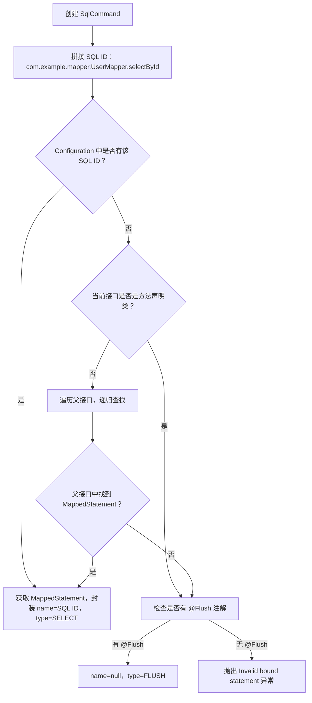

## 目录
- [1](#1)
- [2](#2)


# 1

这段代码是 MyBatis `MapperMethod` 类的内部静态类 **`SqlCommand`**。

它的核心职责非常明确：**在初始化阶段，将 Java 接口方法“绑定”到 MyBatis 配置中的具体 SQL 语句（MappedStatement）**。它解决了“这个方法对应哪条 SQL？”以及“这条 SQL 是什么类型（增删改查）？”这两个根本问题。

下面我将分两部分详细解释：**代码流程详解** 和 **底层原理深度剖析**。

---

### 一、代码流程详解

#### 1. 核心字段
*   `name`: SQL 语句的唯一标识符（ID）。通常是 `全限定接口名.方法名`（例如 `com.example.UserMapper.selectById`）。
*   `type`: SQL 的命令类型 (`INSERT`, `UPDATE`, `DELETE`, `SELECT`, `FLUSH`)。

#### 2. 构造函数：绑定逻辑的核心
```java
public SqlCommand(Configuration configuration, Class<?> mapperInterface, Method method) {
    final String methodName = method.getName();
    final Class<?> declaringClass = method.getDeclaringClass(); // 方法实际定义的类（可能是父接口）
    
    // 【步骤 1】查找对应的 MappedStatement
    MappedStatement ms = resolveMappedStatement(mapperInterface, methodName, declaringClass, configuration);
    
    if (ms == null) {
        // 【步骤 2】如果没找到，检查是否是 @Flush 方法
        if (method.getAnnotation(Flush.class) == null) {
            // 既不是 @Flush，又找不到 SQL 配置 -> 报错！
            throw new BindingException(
                "Invalid bound statement (not found): " + mapperInterface.getName() + "." + methodName);
        }
        // 如果是 @Flush 方法，允许 name 为 null，类型设为 FLUSH
        name = null;
        type = SqlCommandType.FLUSH;
    } else {
        // 【步骤 3】找到了配置，提取 ID 和类型
        name = ms.getId();
        type = ms.getSqlCommandType();
        
        // 防御性检查：防止 XML 中定义了但类型未知
        if (type == SqlCommandType.UNKNOWN) {
            throw new BindingException("Unknown execution method for: " + name);
        }
    }
}
```
*   **逻辑流**：
    1.  调用 `resolveMappedStatement` 尝试在 MyBatis 的全局配置 (`Configuration`) 中查找是否有与该接口方法匹配的 SQL 定义。
    2.  **如果没找到 (`ms == null`)**：
        *   检查方法上是否有 `@Flush` 注解。
        *   如果没有 `@Flush`，直接抛出 `BindingException`。这是开发者最常遇到的错误之一：“Invalid bound statement (not found)”，通常意味着 XML 的 namespace 写错了，或者方法名和 XML 的 id 对不上。
        *   如果有 `@Flush`，则标记为 `FLUSH` 类型，不需要具体的 SQL ID。
    3.  **如果找到了 (`ms != null`)**：
        *   记录 SQL ID (`name`) 和执行类型 (`type`)。
        *   这些值将在后续 `MapperMethod.execute` 中被用来调用 `SqlSession`。

#### 3. 核心查找算法：`resolveMappedStatement`
这是整个类最复杂的部分，负责处理 **接口继承** 场景下的 SQL 查找。

```java
private MappedStatement resolveMappedStatement(...) {
    // 【尝试 1】直接拼接：接口全名 + 方法名
    String statementId = mapperInterface.getName() + "." + methodName;
    if (configuration.hasStatement(statementId)) {
        return configuration.getMappedStatement(statementId);
    }
    
    // 【边界检查】如果方法声明类就是当前接口，且没找到，说明真没了
    if (mapperInterface.equals(declaringClass)) {
        return null;
    }
    
    // 【尝试 2】递归查找父接口
    // 如果方法是在父接口定义的 (declaringClass != mapperInterface)，我们需要去父接口找
    for (Class<?> superInterface : mapperInterface.getInterfaces()) {
        // 确保当前方法确实属于这个父接口体系
        if (declaringClass.isAssignableFrom(superInterface)) {
            MappedStatement ms = resolveMappedStatement(superInterface, methodName, declaringClass, configuration);
            if (ms != null) {
                return ms;
            }
        }
    }
    return null;
}
```
*   **场景 A：普通方法**
    *   接口 `UserMapper`，方法 `selectById`。
    *   构造 ID: `com.example.UserMapper.selectById`。
    *   去配置里查，有就返回。
*   **场景 B：接口继承 (重点)**
    *   接口 `BaseMapper<T>` 定义了 `insert(T t)`。
    *   接口 `UserMapper extends BaseMapper<User>` 继承了 `insert`。
    *   当调用 `userMapper.insert(user)` 时：
        *   `mapperInterface` 是 `UserMapper`。
        *   `declaringClass` 是 `BaseMapper` (因为方法是在 BaseMapper 里写的)。
        *   **第一次尝试**：拼凑 `UserMapper.insert` -> 找不到 (因为 XML 里配的是 `BaseMapper.insert` 或者通用配置)。
        *   **判断**：`UserMapper` != `BaseMapper`，进入循环。
        *   **递归**：遍历 `UserMapper` 的父接口，发现 `BaseMapper`。递归调用 `resolveMappedStatement(BaseMapper, "insert", ...)`。
        *   **第二次尝试**：拼凑 `BaseMapper.insert` -> 找到了！返回 `MappedStatement`。
    *   **意义**：这使得 MyBatis 完美支持 **泛型基座接口模式**（如 MyBatis-Plus 的 `BaseMapper`），允许子接口直接复用父接口定义的 SQL。

---

### 二、背后/底层原理深度剖析

#### 1. 命名空间与方法名的强绑定约定
MyBatis 的核心约定是：**Mapper 接口的全限定名 = XML 中的 namespace**，**方法名 = XML 中的 id**。
*   `SqlCommand` 类硬编码了这个规则 (`mapperInterface.getName() + "." + methodName`)。
*   **底层原理**：`Configuration` 对象内部维护了一个 `Map<String, MappedStatement> mappedStatements`。`hasStatement` 和 `getMappedStatement` 本质上就是 HashMap 的 `containsKey` 和 `get` 操作，时间复杂度为 O(1)。
*   这种设计使得 MyBatis 不需要扫描所有 XML 来匹配方法，而是通过确定的 Key 直接定位，效率极高。

#### 2. 接口继承链的动态解析策略
`resolveMappedStatement` 中的递归逻辑是支持 **接口多态** 的关键。
*   **问题**：Java 反射中，`method.getDeclaringClass()` 返回的是方法**最初定义**的类，而不是你调用它的那个接口。
    *   例如：`UserMapper` 继承 `BaseMapper`。调用 `UserMapper.insert` 时，反射拿到的 `declaringClass` 是 `BaseMapper`。
*   **挑战**：XML 配置可能写在 `BaseMapper.xml` (namespace=`BaseMapper`)，也可能写在 `UserMapper.xml` (覆盖了父类行为)。
*   **解决策略**：
    1.  **优先匹配子类**：先假设用户在子接口 (`UserMapper`) 中覆写了 SQL，尝试查找 `UserMapper.insert`。这符合面向对象的多态原则（子类优先）。
    2.  **回溯父类**：如果子类没定义，且方法确实源自父接口，则沿着 `interface.getInterfaces()` 向上递归查找。
    3.  **终止条件**：当 `mapperInterface` 等于 `declaringClass` 时停止，避免无限递归或错误匹配。
*   **价值**：这一机制支撑了像 **MyBatis-Plus** 这样的框架，它们只需定义一个通用的 `BaseMapper` 接口和对应的 XML/注解，所有业务 Mapper 只需继承即可自动获得 CRUD 能力，无需重复配置。

#### 3. `@Flush` 注解的特殊处理
代码中对 `Flush.class` 的判断体现了一种 **元数据驱动的特例处理**。
*   **背景**：有时开发者不需要执行具体 SQL，只想强制刷新 JDBC 批处理缓存（例如在批量插入后）。
*   **实现**：定义一个接口方法，加上 `@Flush` 注解，不需要在 XML 中配置任何 SQL。
*   **逻辑**：`SqlCommand` 检测到该注解后，故意将 `name` 设为 `null`，类型设为 `FLUSH`。后续的 `MapperMethod.execute` 看到 `FLUSH` 类型，会直接调用 `sqlSession.flushStatements()`，完全跳过 SQL 解析和执行阶段。这是一种轻量级的命令模式扩展。

#### 4. 启动时校验 vs 运行时校验
`SqlCommand` 的实例化发生在 `MapperProxy` 首次缓存方法时（通常是应用启动后第一次调用该接口）。
*   **提前失败 (Fail-Fast)**：如果 XML 配置写错了（namespace 不对或 id 缺失），`BindingException` 会在**第一次调用该方法时**立即抛出，而不是等到 SQL 真正执行到数据库时才报错。
*   **优势**：这比传统的 JDBC 模板更早地发现配置错误，且错误信息非常明确（"Invalid bound statement"），极大地降低了调试难度。

#### 5. 不可变性 (Immutability)
`SqlCommand` 的字段 `name` 和 `type` 都是 `final` 的，且没有 setter 方法。
*   **原理**：一旦 `MapperMethod` 被创建并缓存，它对应的 SQL 语义就不应该改变。
*   **线程安全**：由于状态不可变，`SqlCommand` 对象天生是线程安全的。多个线程同时调用同一个 Mapper 方法时，共享同一个 `SqlCommand` 实例不会有任何并发问题，无需加锁。

### 总结
`SqlCommand` 虽然代码量不大，但它实现了 MyBatis **配置绑定的核心逻辑**：
1.  **契约执行**：强制执行“接口名 + 方法名”与“XML namespace + id”的映射契约。
2.  **多态支持**：通过递归查找，优雅地解决了接口继承带来的 SQL 定位问题，是通用 BaseMapper 模式的基石。
3.  **快速失败**：在调用初期验证配置的有效性，提供清晰的错误反馈。
4.  **特例扩展**：通过 `@Flush` 支持非 SQL 类型的数据库操作。

它是连接 Java 代码世界与 SQL 配置世界的“导航仪”，确保了每一个 Java 方法调用都能精准地找到对应的 SQL 执行路径。


[目录](#目录)

# 2

你想要深入理解 `MapperMethod.SqlCommand` 这个静态内部类的实现逻辑和底层原理，它是 MyBatis 解析 Mapper 方法对应「SQL 命令元信息」的核心类，负责绑定 Mapper 接口方法到具体的 SQL 配置（MappedStatement）。下面我会从**功能定位、核心代码逐行解析、底层原理、设计思想**四个维度完整拆解这个类。

### 一、核心定位：SqlCommand 是什么？
`SqlCommand` 是 `MapperMethod` 的静态内部类，核心职责是**解析并封装 Mapper 接口方法对应的「SQL 命令信息」**，包括：
1. `name`：SQL 唯一标识（即 MappedStatement 的 ID，格式为「Mapper 接口全限定名 + 方法名」，如 `com.example.mapper.UserMapper.selectById`）；
2. `type`：SQL 命令类型（INSERT/UPDATE/DELETE/SELECT/FLUSH/UNKNOWN）。

简单来说，它解决了「**哪个 Mapper 方法对应哪个 SQL、这个 SQL 是做什么类型操作**」的核心问题，是 MyBatis 接口与 SQL 配置绑定的关键。

### 二、核心代码逐行解析（带原理说明）
#### 1. 类成员变量
```java
public static class SqlCommand {
  // SQL 命令的唯一标识（MappedStatement ID）
  private final String name;
  // SQL 命令类型（枚举：INSERT/UPDATE/DELETE/SELECT/FLUSH/UNKNOWN）
  private final SqlCommandType type;
}
```
- **核心设计**：两个成员变量都是 `final`，说明 `SqlCommand` 是「不可变对象」，一旦创建就无法修改，保证线程安全（因为 MapperMethod 会被缓存，可能被多线程访问）；
- **SqlCommandType 枚举**：MyBatis 定义的 SQL 操作类型，核心值包括：
    - `SELECT`：查询
    - `INSERT`：插入
    - `UPDATE`：更新
    - `DELETE`：删除
    - `FLUSH`：刷新批处理
    - `UNKNOWN`：未知类型（异常场景）

#### 2. 构造方法：核心解析逻辑
```java
public SqlCommand(Configuration configuration, Class<?> mapperInterface, Method method) {
  // 1. 获取当前方法名和声明该方法的类（可能是父接口）
  final String methodName = method.getName();
  final Class<?> declaringClass = method.getDeclaringClass();
  // 2. 核心：解析方法对应的 MappedStatement（SQL 配置对象）
  MappedStatement ms = resolveMappedStatement(mapperInterface, methodName, declaringClass, configuration);
  
  // 3. 处理 MappedStatement 不存在的场景
  if (ms == null) {
    // 3.1 检查是否是 FLUSH 方法（@Flush 注解）
    if (method.getAnnotation(Flush.class) == null) {
      // 抛出「绑定失败」异常（经典的 "Invalid bound statement (not found)" 异常）
      throw new BindingException(
          "Invalid bound statement (not found): " + mapperInterface.getName() + "." + methodName);
    }
    // 3.2 是 FLUSH 方法：name 为 null，type 为 FLUSH
    name = null;
    type = SqlCommandType.FLUSH;
  } else {
    // 4. MappedStatement 存在：封装 name 和 type
    name = ms.getId();
    type = ms.getSqlCommandType();
    // 4.1 校验 SQL 类型是否合法（不能是 UNKNOWN）
    if (type == SqlCommandType.UNKNOWN) {
      throw new BindingException("Unknown execution method for: " + name);
    }
  }
}
```
- **核心逻辑拆解**：
  构造方法是 `SqlCommand` 的核心，完成「MappedStatement 查找 → 异常处理 → 命令信息封装」的全流程。
- **关键细节解析**：
    1. **declaringClass 说明**：`method.getDeclaringClass()` 获取的是「方法实际声明的类/接口」，比如 Mapper 接口继承了父接口，方法可能定义在父接口中，而非当前 mapperInterface；
    2. **经典异常场景**：当 `ms == null` 且方法没有 `@Flush` 注解时，抛出的 `Invalid bound statement (not found)` 是 MyBatis 最常见的异常之一，原因通常是：
        - Mapper 接口方法名与 XML 中 `<select>/<insert>` 等标签的 `id` 不匹配；
        - Mapper 接口全限定名与 XML 中 `<mapper>` 标签的 `namespace` 不匹配；
        - XML 文件未被 MyBatis 扫描到（比如未配置 `mapper-locations`）；
    3. **@Flush 注解处理**：`@Flush` 是 MyBatis 用于标记「刷新批处理」的注解，这类方法不需要绑定具体 SQL，因此 `name` 为 null，`type` 为 FLUSH。

#### 3. 核心工具方法：resolveMappedStatement（查找 MappedStatement）
```java
private MappedStatement resolveMappedStatement(Class<?> mapperInterface, String methodName, Class<?> declaringClass,
    Configuration configuration) {
  // 1. 拼接默认的 SQL ID：Mapper 接口全限定名 + 方法名
  String statementId = mapperInterface.getName() + "." + methodName;
  
  // 2. 优先检查当前接口的 SQL ID 是否存在
  if (configuration.hasStatement(statementId)) {
    return configuration.getMappedStatement(statementId);
  }
  
  // 3. 如果当前 mapperInterface 就是方法的声明类，说明确实没有对应的 MappedStatement，返回 null
  if (mapperInterface.equals(declaringClass)) {
    return null;
  }
  
  // 4. 递归查找父接口：遍历当前接口的所有父接口
  for (Class<?> superInterface : mapperInterface.getInterfaces()) {
    // 4.1 检查父接口是否是方法声明类的父类/父接口（确保方法属于该父接口）
    if (declaringClass.isAssignableFrom(superInterface)) {
      // 4.2 递归解析父接口的方法
      MappedStatement ms = resolveMappedStatement(superInterface, methodName, declaringClass, configuration);
      if (ms != null) {
        return ms;
      }
    }
  }
  
  // 5. 所有场景都没找到，返回 null
  return null;
}
```
- **核心作用**：按「当前接口 → 父接口」的顺序递归查找方法对应的 `MappedStatement`，是 MyBatis 支持「Mapper 接口继承」的关键；
- **底层原理拆解**：
    1. **SQL ID 命名规则**：MyBatis 约定 Mapper 接口方法对应的 SQL ID 是「接口全限定名 + 方法名」，这是「约定优于配置」的典型体现；
    2. **Configuration 存储 MappedStatement**：`Configuration` 是 MyBatis 的全局配置中心，启动时会将所有 XML/注解配置的 SQL 解析为 `MappedStatement`，并以 SQL ID 为 key 存储在内部的 `mappedStatements` 集合中；
    3. **父接口递归查找**：支持 Mapper 接口继承，比如：
       ```java
       // 父接口
       public interface BaseMapper<T> {
           T selectById(Long id);
       }
       // 子接口
       public interface UserMapper extends BaseMapper<User> {}
       ```
       调用 `UserMapper.selectById()` 时，会先查找 `com.example.mapper.UserMapper.selectById`，找不到则递归查找父接口 `BaseMapper` 的 `selectById`；
    4. `isAssignableFrom` 作用：`A.isAssignableFrom(B)` 表示「B 是 A 的子类/实现类」，这里用于判断父接口是否包含当前方法的声明。

#### 4. Getter 方法
```java
public String getName() {
  return name;
}

public SqlCommandType getType() {
  return type;
}
```
- **核心作用**：对外暴露不可变的 `name` 和 `type`，符合「封装」原则（只暴露必要的属性，且不允许修改）。

### 三、底层核心原理总结
#### 1. MappedStatement 核心定位
- `MappedStatement` 是 MyBatis 中「SQL 配置的最小单元」，封装了：
    - SQL 语句（原生 SQL/动态 SQL）；
    - 参数映射规则；
    - 返回值映射规则；
    - SQL 命令类型（SqlCommandType）；
    - 执行器类型、缓存规则等；
- `Configuration` 在 MyBatis 启动时完成所有 `MappedStatement` 的解析和存储，`SqlCommand` 本质是从 `Configuration` 中「查找并绑定」对应的 `MappedStatement`。

#### 2. 接口继承支持原理
- MyBatis 通过 `resolveMappedStatement` 的递归逻辑，支持 Mapper 接口的多层继承，保证子接口能复用父接口的 SQL 配置；
- 递归终止条件：找到 `MappedStatement` 或遍历完所有父接口。

#### 3. 线程安全原理
- `SqlCommand` 的所有成员变量都是 `final`，且构造过程是「一次性」的（在 MapperMethod 构造时完成，后续缓存复用）；
- 不可变对象天然线程安全，因此多线程调用 Mapper 方法时，无需担心 `SqlCommand` 的数据安全。

#### 4. 异常设计原理
- 「Invalid bound statement (not found)」异常是 MyBatis 「早失败」设计的体现：在解析阶段（而非执行阶段）就检查 SQL 绑定是否存在，提前暴露问题，避免运行时才抛出异常；
- 对 `UNKNOWN` 类型的校验，确保 SQL 操作类型是明确的，避免执行阶段出现不可预期的行为。

### 四、典型执行流程（以 UserMapper.selectById 为例）


### 总结
1. **核心职责**：`SqlCommand` 是 Mapper 方法与 SQL 配置的「绑定器」，解析方法对应的 SQL ID 和操作类型，是 MyBatis 接口式编程的核心桥梁；
2. **核心特性**：支持 Mapper 接口继承、不可变设计保证线程安全、早失败异常设计提前暴露配置问题；
3. **底层依赖**：核心依赖 `Configuration` 存储的 `MappedStatement`，遵循「约定优于配置」的 SQL ID 命名规则。

理解 `SqlCommand` 是解决 MyBatis 「Invalid bound statement (not found)」异常的关键——这个异常本质就是 `resolveMappedStatement` 方法返回 null，且方法没有 `@Flush` 注解导致的。


[目录](#目录)