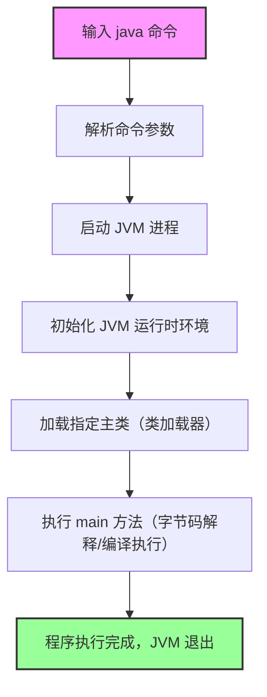

## 目录
- [Java命令](#java命令)
- [实践](#实践)
  - [javaagent](#javaagent)
  - [java命令参数](#java命令参数)


## Java命令

### 1. 核心需求理解
 Java 命令的**完整用法**和**底层运行原理**——包括命令的基本语法、核心参数、常见使用场景，以及从命令输入到程序执行的底层流程（JVM 启动、类加载、字节码执行等），帮助你不仅会用 `java` 命令，还能理解其背后的运行机制。

### 2. 详细解释：Java 命令（`java`）
#### 2.1 基础认知：`java` 命令是什么？
`java` 命令是 JDK 提供的**核心可执行程序**，用于<span style="color:#ff6600; font-weight:bold;">启动 Java 虚拟机（JVM）,并执行 Java 字节码程序</span>（`.class` 文件或 JAR 包）。它是连接开发者编写的 Java 代码与操作系统的桥梁，所有 Java 程序的运行最终都依赖该命令触发。

- **位置**：JDK 安装目录的 `bin` 下（如 `$JAVA_HOME/bin/java`）；
- **跨平台**：Windows/Linux/macOS 下命令语法一致（仅路径分隔符、环境变量配置不同）；
- **核心作用**：解析命令参数 → 启动 JVM 进程 → 加载指定类/资源 → 执行 `main` 方法（或模块化程序入口）。

#### 2.2 基本语法
`java` 命令的完整语法遵循“参数优先级”规则，核心结构如下：
```bash
java [选项] <主类> [程序参数]
# 或（执行 JAR 包）
java [选项] -jar <JAR文件名> [程序参数]
# 或（模块化程序）
java [选项] --module <模块名>/<主类> [程序参数]
```
- **核心组成**：
   - `[选项]`：JVM 配置参数（如堆内存、类路径、日志等），可选；
   - `<主类>`：包含 `public static void main(String[] args)` 方法的类的全限定名（如 `com.example.Main`）；
   - `-jar`：指定执行 JAR 包（JAR 包的 `MANIFEST.MF` 需定义 `Main-Class`）；
   - `[程序参数]`：传递给 `main` 方法的 `args` 数组的参数，可选。

#### 2.3 核心参数分类解析
`java` 命令的参数多达上百个，按功能可分为 6 大类，以下是最常用、最核心的参数：

##### （1）类路径相关（ClassPath）：指定类/资源加载路径
| 参数 | 作用 | 示例 |
|------|------|------|
| `-cp`/`-classpath` | 指定类加载路径（优先级高于系统环境变量 `CLASSPATH`） | `java -cp ./bin:./lib/* com.example.Main` |
| `--module-path`/`-p` | 指定模块化程序的模块路径（Java 9+） | `java -p ./modules --module com.example/main` |

- **关键说明**：
   - 路径分隔符：Windows 用 `;`，Linux/macOS 用 `:`；
   - 通配符：`*` 可匹配路径下所有 JAR 包（如 `./lib/*` 加载 `lib` 下所有 JAR）；
   - 优先级：`-cp` > 系统 `CLASSPATH` > 默认路径（当前目录 `.`）。

##### （2）JVM 内存配置：控制堆/栈/方法区大小
| 参数 | 作用 | 示例 |
|------|------|------|
| `-Xms<size>` | 设置 JVM 初始堆内存（如 256M、1G） | `-Xms512m`（初始堆 512MB） |
| `-Xmx<size>` | 设置 JVM 最大堆内存（建议与 `-Xms` 相同，避免频繁扩容） | `-Xmx2g`（最大堆 2GB） |
| `-Xss<size>` | 设置每个线程的栈内存大小 | `-Xss1m`（每个线程栈 1MB） |
| `-XX:MetaspaceSize=<size>` | 设置元空间（方法区）初始大小（Java 8+ 替代永久代） | `-XX:MetaspaceSize=128m` |
| `-XX:MaxMetaspaceSize=<size>` | 设置元空间最大大小 | `-XX:MaxMetaspaceSize=256m` |

- **单位**：支持 `k`（KB）、`m`（MB）、`g`（GB），如 `512m` = 512 兆字节。

##### （3）运行模式/调试相关
| 参数 | 作用 | 示例 |
|------|------|------|
| `-version` | 输出 JVM 版本信息（含 JDK 版本、虚拟机类型） | `java -version` |
| `-verbose:class` | 打印类加载详细日志（排查类加载失败问题） | `java -verbose:class com.example.Main` |
| `-verbose:gc` | 打印垃圾回收（GC）日志（排查内存泄漏） | `java -Xmx2g -verbose:gc com.example.Main` |
| `-agentlib:jdwp=...` | 开启远程调试（开发/排查问题） | `java -agentlib:jdwp=transport=dt_socket,server=y,suspend=n,address=5005 com.example.Main` |

##### （4）系统属性相关：设置 JVM 系统属性
| 参数 | 作用 | 示例 |
|------|------|------|
| `-D<key>=<value>` | 设置系统属性（可通过 `System.getProperty(key)` 获取） | `java -Duser.language=zh -Dfile.encoding=UTF-8 com.example.Main` |

- **常用场景**：配置编码、环境标识、自定义参数等。

##### （5）JAR 包执行相关
| 参数 | 作用 | 示例 |
|------|------|------|
| `-jar <jarfile>` | 执行可执行 JAR 包（必须配合 `MANIFEST.MF` 的 `Main-Class`） | `java -jar myapp.jar` |
| `-cp <jarfile> <主类>` | 执行 JAR 包中的指定类（无需 `Main-Class`） | `java -cp myapp.jar com.example.Main` |

##### （6）其他核心参数
| 参数 | 作用 | 示例 |
|------|------|------|
| `-server`/`-client` | 指定 JVM 运行模式（server 模式优化性能，client 模式启动快） | `java -server com.example.Main` |
| `-XX:+PrintGCDetails` | 打印详细 GC 日志（含内存区域、回收耗时） | `java -Xmx2g -XX:+PrintGCDetails com.example.Main` |
| `-XX:+HeapDumpOnOutOfMemoryError` | OOM（内存溢出）时自动生成堆转储文件（排查 OOM 问题） | `java -Xmx2g -XX:+HeapDumpOnOutOfMemoryError com.example.Main` |

#### 2.4 典型使用示例
```bash
# 1. 基础执行：执行当前目录下的 com.example.Main 类
java com.example.Main

# 2. 指定类路径：加载 bin 目录的类 + lib 下的所有 JAR
java -cp ./bin:./lib/* com.example.Main

# 3. 执行 JAR 包：运行可执行 JAR
java -jar myapp.jar

# 4. 配置内存 + 系统属性：设置堆内存 1G，编码 UTF-8
java -Xms1g -Xmx1g -Dfile.encoding=UTF-8 com.example.Main

# 5. 传递程序参数：给 main 方法传递 args 参数
java com.example.Main arg1 arg2 arg3

# 6. 调试模式：开启 5005 端口远程调试
java -agentlib:jdwp=transport=dt_socket,server=y,suspend=n,address=5005 com.example.Main
```

#### 2.5 `java` 命令的底层运行原理
从输入 `java` 命令到程序执行完成，底层分为 7 个核心步骤，完整覆盖 JVM 启动到退出的全生命周期：



##### 步骤 1：解析命令参数
- 操作系统（如 Linux/macOS 的 shell、Windows 的 cmd）解析 `java` 命令的参数，传递给 JDK 的 `java` 可执行程序；
- `java` 程序先校验参数合法性（如主类是否存在、JAR 包是否可读），非法参数直接抛出异常（如 `Could not find or load main class`）。

##### 步骤 2：启动 JVM 进程
- `java` 命令本质是<span style="color:#ff6600; font-weight:bold;">启动一个新的操作系统进程（进程名通常为 `java`），并初始化 JVM 实例</span>；
- JVM 实例包含：
   - 内存区域（堆、栈、元空间、程序计数器等）；
   - 类加载器（Bootstrap/Extension/Application 类加载器）；
   - 执行引擎（解释器、JIT 编译器）；
   - 垃圾回收器（GC）；
   - 本地方法接口（JNI）。

##### 步骤 3：初始化 JVM 运行时环境
- 根据命令参数配置 JVM 内存（如 `-Xms`/`-Xmx`）、系统属性（`-D` 参数）、类路径（`-cp`）等；
- 初始化核心组件：类加载器、GC、执行引擎等；
- 加载 JVM 核心类（如 `java.lang.Object`、`java.lang.String`），这些类由 Bootstrap 类加载器从 `rt.jar` 加载。

##### 步骤 4：加载指定主类
- 类加载器（默认 Application 类加载器）根据类路径查找主类的 `.class` 文件（或从 JAR 包中读取）；
- 执行类加载的“三步过程”：
   1. **加载**：读取 `.class` 文件字节码，生成内存中的 `Class` 对象；
   2. **链接**：验证（字节码合法性）→ 准备（静态变量赋默认值）→ 解析（符号引用转直接引用）；
   3. **初始化**：执行静态代码块、静态变量赋值，调用 `<clinit>()` 方法。
- 若主类依赖其他类（如自定义工具类、第三方库），递归加载这些类。

##### 步骤 5：执行 `main` 方法
- JVM 找到主类的 `public static void main(String[] args)` 方法，作为程序入口；
- 执行引擎处理字节码：
   - 解释执行：逐行解析字节码并执行（启动快，适合短程序）；
   - JIT 编译：将热点代码（频繁执行的代码）编译为机器码，提升执行效率（server 模式默认开启）；
- 程序参数（`[程序参数]`）被封装为 `String[] args` 传递给 `main` 方法。

##### 步骤 6：程序执行与资源管理
- 程序运行过程中，JVM 负责：
   - 内存管理：GC 自动回收无用对象，释放堆内存；
   - 线程管理：创建/调度线程，处理线程同步（如 `synchronized`）；
   - 异常处理：捕获/抛出异常，调用 `finally` 块释放资源。

##### 步骤 7：JVM 退出
- 当 `main` 方法执行完成（或调用 `System.exit(int)`），JVM 执行以下操作：
   1. 执行所有注册的 `ShutdownHook`（如资源释放、日志保存）；
   2. 关闭所有线程，释放内存、文件句柄、网络连接等资源；
   3. 终止操作系统进程，返回退出码（`0` 表示正常退出，非 0 表示异常）。

#### 2.6 常见问题与排查
| 问题现象 | 原因 | 解决方案 |
|----------|------|----------|
| `Could not find or load main class` | 主类名错误、类路径配置错误、类未编译 | 1. 检查主类全限定名；2. 确认 `-cp` 包含类所在路径；3. 编译 `.java` 生成 `.class` |
| `java.lang.OutOfMemoryError: Java heap space` | 堆内存不足 | 增大 `-Xmx`（如 `-Xmx2g`），排查内存泄漏 |
| `java.lang.ClassNotFoundException` | 类未找到（类路径缺失、JAR 包未加载） | 检查 `-cp` 是否包含该类所在的 JAR/目录 |
| `中文乱码` | 编码不一致 | 添加 `-Dfile.encoding=UTF-8 -Duser.language=zh` |

### 3. 总结
#### 核心关键点
1. **`java` 命令的核心定位**：
   启动 JVM 并执行 Java 字节码的入口，是连接 Java 代码与操作系统的桥梁，所有 Java 程序的运行都依赖该命令。

2. **核心参数记忆**：
   - 类路径：`-cp`/`-classpath`（指定类/JAR 加载路径）；
   - 内存配置：`-Xms`（初始堆）、`-Xmx`（最大堆）、`-Xss`（线程栈）；
   - 系统属性：`-Dkey=value`（设置全局属性）；
   - JAR 执行：`-jar`（执行可执行 JAR）；
   - 调试/排查：`-verbose:class`（类加载）、`-verbose:gc`（GC 日志）、`-agentlib:jdwp`（远程调试）。

3. **底层运行原理**：
   解析参数 → 启动 JVM 进程 → 初始化 JVM 环境 → 类加载（加载/链接/初始化）→ 执行 `main` 方法（解释/JIT 编译）→ 程序运行 → JVM 退出，核心是 JVM 对内存、类加载、执行引擎的管理。

4. **最佳实践**：
   - 始终指定 `-Xms`/`-Xmx`，避免 JVM 频繁扩容堆内存；
   - 用 `-cp` 而非系统 `CLASSPATH`，保证类路径可控；
   - 生产环境添加 `-XX:+HeapDumpOnOutOfMemoryError`，便于排查 OOM；
   - 程序参数通过 `main` 方法的 `args` 传递，系统属性通过 `-D` 设置，区分场景使用。

#### 应用价值
- **日常开发**：掌握 `java` 命令的核心参数，能快速运行、调试 Java 程序；
- **问题排查**：通过 `-verbose:class`/`-verbose:gc`/堆转储等参数，定位类加载、内存、GC 相关问题；
- **生产环境**：合理配置内存、编码、GC 参数，提升程序稳定性和性能；
- **底层理解**：掌握 JVM 启动和执行流程，深入理解 Java 跨平台、自动内存管理的核心机制。


[目录](#目录)


## 实践

## javaagent
你想理解 `-javaagent:/Users/chl/Applications/IntelliJ IDEA.app/Contents/lib/idea_rt.jar=64227` 这行 JVM 参数的含义、作用和背后的逻辑，我会从**参数构成、核心作用、工作原理、使用场景**四个维度把它讲透，让你清楚这个参数的来龙去脉。

### 一、参数核心含义（逐段拆解）
这是一个 JVM 启动参数（`-javaagent`），用于给 Java 程序挂载「Java 代理」，核心作用是让 IntelliJ IDEA 能够调试/监控这个 Java 进程。先逐段解析：

| 部分 | 含义 |
|------|------|
| `-javaagent` | JVM 的核心参数，指定要加载的 **Java Agent**（Java 代理），属于 JVM 插桩（Instrumentation）机制的一部分 |
| `/Users/chl/Applications/IntelliJ IDEA.app/Contents/lib/idea_rt.jar` | IDEA 内置的代理 JAR 包路径，`idea_rt.jar` 是 IDEA 实现调试/运行监控的核心组件（rt = Runtime） |
| `=64227` | 代理的启动参数，这里是 IDEA 分配的**调试端口号**（64227），用于 IDEA 与被调试的 Java 进程建立通信连接 |

### 二、Java Agent 是什么？
先铺垫核心概念：
`Java Agent` 是 JVM 提供的一种「插桩机制」，允许你在不修改目标程序源码的前提下，通过字节码增强（ASM/Javassist）的方式，在程序运行时修改类的字节码、监控方法执行、收集运行时数据。

而 `idea_rt.jar` 是 IDEA 定制的 Java Agent，专门用于：
1. **调试（Debug）**：让 IDEA 能断点调试 Java 程序，实时查看变量、调用栈、执行流程；
2. **运行监控**：收集程序的运行日志、性能数据，在 IDEA 控制台输出；
3. **进程通信**：通过指定的端口（如 64227），让 IDEA 主程序与被调试的 Java 进程建立 TCP 连接，传输调试指令和运行数据。

### 三、这个参数的工作流程
当你在 IDEA 中「Debug 运行」一个 Java 程序时，IDEA 会自动给 JVM 追加这个参数，完整流程：
1. IDEA 随机分配一个空闲端口（比如 64227）；
2. IDEA 启动 Java 进程时，通过 `-javaagent` 加载 `idea_rt.jar`，并把端口号作为参数传给这个代理；
3. `idea_rt.jar` 中的代理类初始化，在 64227 端口启动一个监听服务；
4. IDEA 主程序通过 64227 端口连接到这个 Java 进程，建立调试会话；
5. 你在 IDEA 中打断点、执行 Step Over/Into 等操作，指令通过这个连接传输到 Java 进程，实现调试。

### 四、关键细节补充
1. **端口号的随机性**：`64227` 不是固定值，每次启动 Debug 时 IDEA 会分配不同的空闲端口（比如下次可能是 64228），避免端口冲突；
2. **仅 Debug/Run 时生效**：这个参数是 IDEA 自动添加的，手动启动 Java 进程（比如 `java -jar xxx.jar`）不会有这个参数；
3. **idea_rt.jar 的核心功能**：
    - 实现 JDWP（Java Debug Wire Protocol）协议，处理调试指令；
    - 重定向程序的标准输出/错误输出到 IDEA 控制台；
    - 收集进程的运行时信息（如内存、线程）展示在 IDEA 中；
4. **参数格式规范**：`-javaagent:jar路径=代理参数`，等号后面的内容会被传递给 `idea_rt.jar` 中的 `premain` 方法（Java Agent 的入口方法）。

### 五、常见问题与注意事项
1. **端口被占用**：如果 IDEA 提示「端口 64227 被占用」，只需重启 Debug，IDEA 会自动换一个端口；
2. **手动指定代理**：如果需要手动调试外部 Java 进程，可手动添加该参数，格式：
   ```bash
   java -javaagent:/Applications/IntelliJ\ IDEA.app/Contents/lib/idea_rt.jar=64227:/Applications/IntelliJ\ IDEA.app/Contents/bin -jar your-app.jar
   ```
   （冒号后是 IDEA 的 bin 目录路径，用于加载调试依赖）；
3. **打包/生产环境无需此参数**：这个参数仅用于 IDEA 调试，生产环境启动 Java 程序时要移除，否则会加载不必要的代理，增加性能开销。

### 总结
1. `-javaagent:idea_rt.jar=64227` 是 IDEA 自动添加的调试参数，核心是挂载 IDEA 的 Java 代理，建立调试通信；
2. `idea_rt.jar` 是 IDEA 实现调试/监控的核心组件，`64227` 是调试通信的端口号；
3. 该参数仅用于开发调试，生产环境需移除，避免性能损耗和安全风险。

理解这个参数后，你就能清楚 IDEA 的调试功能是如何与 Java 进程建立连接的，也能解决调试时的端口冲突、代理加载失败等问题。


## java命令参数
/Users/chl/.gradle/jdks/eclipse_adoptium-21-aarch64-os_x.2/jdk-21.0.9+10/Contents/Home/bin/java
-Dnacos.standalone=true
-XX:TieredStopAtLevel=1
-Dspring.output.ansi.enabled=always
-javaagent:/Users/chl/Applications/IntelliJ IDEA.app/Contents/lib/idea_rt.jar=64227
-Dfile.encoding=UTF-8 -Dsun.stdout.encoding=UTF-8 -Dsun.stderr.encoding=UTF-8
-classpath
/Users/chl/chl-code/java-source/spring-cloud/nacos/bootstrap/target/classes:
/Users/chl/chl-code/java-source/spring-cloud/nacos/console/target/classes:
/Users/chl/chl-code/java-source/spring-cloud/nacos/config/target/classes:
/Users/chl/chl-code/repository/org/springframework/boot/spring-boot-starter-web/3.4.4/spring-boot-starter-web-3.4.4.jar:
/Users/chl/chl-code/repository/org/springframework/boot/spring-boot-starter-json/3.4.4/spring-boot-starter-json-3.4.4.jar:
/Users/chl/chl-code/repository/com/fasterxml/jackson/datatype/jackson-datatype-jdk8/2.18.3/jackson-datatype-jdk8-2.18.3.jar:
/Users/chl/chl-code/repository/com/fasterxml/jackson/datatype/jackson-datatype-jsr310/2.18.3/jackson-datatype-jsr310-2.18.3.jar:
/Users/chl/chl-code/repository/com/fasterxml/jackson/module/jackson-module-parameter-names/2.18.3/jackson-module-parameter-names-2.18.3.jar:
/Users/chl/chl-code/repository/org/springframework/spring-web/6.2.5/spring-web-6.2.5.jar:
/Users/chl/chl-code/repository/io/micrometer/micrometer-observation/1.14.5/micrometer-observation-1.14.5.jar:
/Users/chl/chl-code/repository/org/springframework/spring-webmvc/6.2.5/spring-webmvc-6.2.5.jar:
/Users/chl/chl-code/java-source/spring-cloud/nacos/api/target/classes:
/Users/chl/chl-code/repository/io/grpc/grpc-util/1.68.2/grpc-util-1.68.2.jar:
/Users/chl/chl-code/repository/org/codehaus/mojo/animal-sniffer-annotations/1.24/animal-sniffer-annotations-1.24.jar:
/Users/chl/chl-code/repository/io/grpc/grpc-inprocess/1.68.2/grpc-inprocess-1.68.2.jar:
/Users/chl/chl-code/repository/javax/annotation/javax.annotation-api/1.3.2/javax.annotation-api-1.3.2.jar:
/Users/chl/chl-code/java-source/spring-cloud/nacos/core/target/classes:
/Users/chl/chl-code/java-source/spring-cloud/nacos/consistency/target/classes:
/Users/chl/chl-code/repository/com/caucho/hessian/4.0.63/hessian-4.0.63.jar:
/Users/chl/chl-code/java-source/spring-cloud/nacos/auth/target/classes:
/Users/chl/chl-code/java-source/spring-cloud/nacos/plugin/trace/target/classes:
/Users/chl/chl-code/repository/org/springframework/boot/spring-boot-starter-actuator/3.4.4/spring-boot-starter-actuator-3.4.4.jar:
/Users/chl/chl-code/repository/org/springframework/boot/spring-boot-actuator-autoconfigure/3.4.4/spring-boot-actuator-autoconfigure-3.4.4.jar:
/Users/chl/chl-code/repository/org/springframework/boot/spring-boot-actuator/3.4.4/spring-boot-actuator-3.4.4.jar:
/Users/chl/chl-code/repository/io/micrometer/micrometer-jakarta9/1.14.5/micrometer-jakarta9-1.14.5.jar:
/Users/chl/chl-code/repository/org/apache/tomcat/embed/tomcat-embed-core/10.1.39/tomcat-embed-core-10.1.39.jar:
/Users/chl/chl-code/repository/org/apache/tomcat/tomcat-annotations-api/10.1.39/tomcat-annotations-api-10.1.39.jar:
/Users/chl/chl-code/repository/com/alipay/sofa/jraft-core/1.3.14/jraft-core-1.3.14.jar:
/Users/chl/chl-code/repository/org/ow2/asm/asm/6.0/asm-6.0.jar:
/Users/chl/chl-code/repository/org/rocksdb/rocksdbjni/8.8.1/rocksdbjni-8.8.1.jar:
/Users/chl/chl-code/repository/net/java/dev/jna/jna/5.5.0/jna-5.5.0.jar:
/Users/chl/chl-code/repository/org/jctools/jctools-core/2.1.1/jctools-core-2.1.1.jar:
/Users/chl/chl-code/repository/com/lmax/disruptor/3.3.7/disruptor-3.3.7.jar:
/Users/chl/chl-code/repository/commons-lang/commons-lang/2.6/commons-lang-2.6.jar:
/Users/chl/chl-code/repository/com/alipay/sofa/hessian/3.3.6/hessian-3.3.6.jar:
/Users/chl/chl-code/repository/io/dropwizard/metrics/metrics-core/4.0.2/metrics-core-4.0.2.jar:
/Users/chl/chl-code/repository/com/alipay/sofa/rpc-grpc-impl/1.3.14/rpc-grpc-impl-1.3.14.jar:
/Users/chl/chl-code/java-source/spring-cloud/nacos/persistence/target/classes:
/Users/chl/chl-code/repository/org/springframework/boot/spring-boot-starter-jdbc/3.4.4/spring-boot-starter-jdbc-3.4.4.jar:
/Users/chl/chl-code/repository/com/zaxxer/HikariCP/3.4.2/HikariCP-3.4.2.jar:
/Users/chl/chl-code/repository/org/springframework/spring-jdbc/6.2.5/spring-jdbc-6.2.5.jar:
/Users/chl/chl-code/java-source/spring-cloud/nacos/sys/target/classes:
/Users/chl/chl-code/java-source/spring-cloud/nacos/plugin/environment/target/classes:
/Users/chl/chl-code/repository/io/micrometer/micrometer-core/1.12.8/micrometer-core-1.12.8.jar:
/Users/chl/chl-code/repository/io/micrometer/micrometer-commons/1.14.5/micrometer-commons-1.14.5.jar:
/Users/chl/chl-code/repository/org/hdrhistogram/HdrHistogram/2.1.12/HdrHistogram-2.1.12.jar:
/Users/chl/chl-code/repository/org/latencyutils/LatencyUtils/2.0.3/LatencyUtils-2.0.3.jar:
/Users/chl/chl-code/repository/org/apache/derby/derby/10.14.2.0/derby-10.14.2.0.jar:
/Users/chl/chl-code/repository/commons-io/commons-io/2.14.0/commons-io-2.14.0.jar:
/Users/chl/chl-code/repository/ch/qos/logback/logback-classic/1.5.12/logback-classic-1.5.12.jar:
/Users/chl/chl-code/java-source/spring-cloud/nacos/plugin/encryption/target/classes:
/Users/chl/chl-code/java-source/spring-cloud/nacos/plugin/config/target/classes:
/Users/chl/chl-code/repository/org/apache/httpcomponents/client5/httpclient5/5.4.2/httpclient5-5.4.2.jar:
/Users/chl/chl-code/repository/org/apache/httpcomponents/core5/httpcore5-h2/5.3.3/httpcore5-h2-5.3.3.jar:
/Users/chl/chl-code/repository/org/springframework/boot/spring-boot-starter-tomcat/3.4.4/spring-boot-starter-tomcat-3.4.4.jar:
/Users/chl/chl-code/repository/jakarta/annotation/jakarta.annotation-api/2.1.1/jakarta.annotation-api-2.1.1.jar:
/Users/chl/chl-code/repository/org/apache/tomcat/embed/tomcat-embed-el/10.1.39/tomcat-embed-el-10.1.39.jar:
/Users/chl/chl-code/repository/org/apache/tomcat/embed/tomcat-embed-websocket/10.1.39/tomcat-embed-websocket-10.1.39.jar:
/Users/chl/chl-code/repository/com/fasterxml/jackson/core/jackson-core/2.18.3/jackson-core-2.18.3.jar:
/Users/chl/chl-code/repository/com/fasterxml/jackson/core/jackson-databind/2.18.3/jackson-databind-2.18.3.jar:
/Users/chl/chl-code/repository/com/fasterxml/jackson/core/jackson-annotations/2.18.3/jackson-annotations-2.18.3.jar:
/Users/chl/chl-code/repository/io/micrometer/micrometer-registry-prometheus/1.12.8/micrometer-registry-prometheus-1.12.8.jar:
/Users/chl/chl-code/repository/io/prometheus/simpleclient_common/0.16.0/simpleclient_common-0.16.0.jar:
/Users/chl/chl-code/repository/io/micrometer/micrometer-registry-influx/1.12.8/micrometer-registry-influx-1.12.8.jar:
/Users/chl/chl-code/repository/io/micrometer/micrometer-registry-elastic/1.12.8/micrometer-registry-elastic-1.12.8.jar:
/Users/chl/chl-code/repository/org/springframework/boot/spring-boot-starter-aop/3.4.4/spring-boot-starter-aop-3.4.4.jar:
/Users/chl/chl-code/repository/org/aspectj/aspectjweaver/1.9.23/aspectjweaver-1.9.23.jar:
/Users/chl/chl-code/repository/org/yaml/snakeyaml/2.0/snakeyaml-2.0.jar:
/Users/chl/chl-code/java-source/spring-cloud/nacos/plugin/control/target/classes:
/Users/chl/chl-code/java-source/spring-cloud/nacos/plugin/datasource/target/classes:
/Users/chl/chl-code/java-source/spring-cloud/nacos/naming/target/classes:
/Users/chl/chl-code/repository/org/springframework/boot/spring-boot/3.4.4/spring-boot-3.4.4.jar:
/Users/chl/chl-code/repository/org/springframework/spring-core/6.2.5/spring-core-6.2.5.jar:
/Users/chl/chl-code/repository/org/springframework/spring-jcl/6.2.5/spring-jcl-6.2.5.jar:
/Users/chl/chl-code/repository/org/springframework/spring-context/6.2.5/spring-context-6.2.5.jar:
/Users/chl/chl-code/repository/commons-collections/commons-collections/3.2.2/commons-collections-3.2.2.jar:
/Users/chl/chl-code/repository/org/slf4j/slf4j-api/2.0.13/slf4j-api-2.0.13.jar:
/Users/chl/chl-code/repository/ch/qos/logback/logback-core/1.5.12/logback-core-1.5.12.jar:
/Users/chl/chl-code/repository/org/apache/httpcomponents/core5/httpcore5/5.3.3/httpcore5-5.3.3.jar:
/Users/chl/chl-code/repository/com/mysql/mysql-connector-j/8.2.0/mysql-connector-j-8.2.0.jar:
/Users/chl/chl-code/java-source/spring-cloud/nacos/cmdb/target/classes:
/Users/chl/chl-code/java-source/spring-cloud/nacos/ai/target/classes:
/Users/chl/chl-code/java-source/spring-cloud/nacos/common/target/classes:
/Users/chl/chl-code/java-source/spring-cloud/nacos/lock/target/classes:
/Users/chl/chl-code/java-source/spring-cloud/nacos/maintainer-client/target/classes:
/Users/chl/chl-code/java-source/spring-cloud/nacos/client-basic/target/classes:
/Users/chl/chl-code/java-source/spring-cloud/nacos/plugin/auth/target/classes:
/Users/chl/chl-code/java-source/spring-cloud/nacos/plugin-default-impl/nacos-default-auth-plugin/target/classes:
/Users/chl/chl-code/repository/org/springframework/ldap/spring-ldap-core/3.2.11/spring-ldap-core-3.2.11.jar:
/Users/chl/chl-code/repository/org/springframework/spring-tx/6.2.5/spring-tx-6.2.5.jar:
/Users/chl/chl-code/java-source/spring-cloud/nacos/plugin-default-impl/nacos-default-control-plugin/target/classes:
/Users/chl/chl-code/java-source/spring-cloud/nacos/istio/target/classes:
/Users/chl/chl-code/java-source/spring-cloud/nacos/client/target/classes:
/Users/chl/chl-code/java-source/spring-cloud/nacos/logger-adapter-impl/logback-adapter-12/target/classes:
/Users/chl/chl-code/repository/com/alibaba/nacos/logback-adapter/1.1.4/logback-adapter-1.1.4.jar:
/Users/chl/chl-code/java-source/spring-cloud/nacos/logger-adapter-impl/log4j2-adapter/target/classes:
/Users/chl/chl-code/repository/io/prometheus/simpleclient/0.16.0/simpleclient-0.16.0.jar:
/Users/chl/chl-code/repository/io/prometheus/simpleclient_tracer_otel/0.16.0/simpleclient_tracer_otel-0.16.0.jar:
/Users/chl/chl-code/repository/io/prometheus/simpleclient_tracer_common/0.16.0/simpleclient_tracer_common-0.16.0.jar:
/Users/chl/chl-code/repository/io/prometheus/simpleclient_tracer_otel_agent/0.16.0/simpleclient_tracer_otel_agent-0.16.0.jar:
/Users/chl/chl-code/repository/io/grpc/grpc-netty-shaded/1.68.2/grpc-netty-shaded-1.68.2.jar:
/Users/chl/chl-code/repository/io/grpc/grpc-core/1.68.2/grpc-core-1.68.2.jar:
/Users/chl/chl-code/repository/com/google/android/annotations/4.1.1.4/annotations-4.1.1.4.jar:
/Users/chl/chl-code/repository/io/grpc/grpc-context/1.68.2/grpc-context-1.68.2.jar:
/Users/chl/chl-code/repository/com/google/guava/guava/33.2.1-android/guava-33.2.1-android.jar:
/Users/chl/chl-code/repository/com/google/guava/failureaccess/1.0.2/failureaccess-1.0.2.jar:
/Users/chl/chl-code/repository/com/google/guava/listenablefuture/9999.0-empty-to-avoid-conflict-with-guava/listenablefuture-9999.0-empty-to-avoid-conflict-with-guava.jar:
/Users/chl/chl-code/repository/org/checkerframework/checker-qual/3.42.0/checker-qual-3.42.0.jar:
/Users/chl/chl-code/repository/com/google/j2objc/j2objc-annotations/3.0.0/j2objc-annotations-3.0.0.jar:
/Users/chl/chl-code/repository/com/google/errorprone/error_prone_annotations/2.28.0/error_prone_annotations-2.28.0.jar:
/Users/chl/chl-code/repository/io/perfmark/perfmark-api/0.27.0/perfmark-api-0.27.0.jar:
/Users/chl/chl-code/repository/io/grpc/grpc-api/1.68.2/grpc-api-1.68.2.jar:
/Users/chl/chl-code/repository/io/grpc/grpc-protobuf/1.68.2/grpc-protobuf-1.68.2.jar:
/Users/chl/chl-code/repository/com/google/code/findbugs/jsr305/3.0.2/jsr305-3.0.2.jar:
/Users/chl/chl-code/repository/io/grpc/grpc-protobuf-lite/1.68.2/grpc-protobuf-lite-1.68.2.jar:
/Users/chl/chl-code/repository/io/grpc/grpc-stub/1.68.2/grpc-stub-1.68.2.jar:
/Users/chl/chl-code/repository/com/google/api/grpc/proto-google-common-protos/2.17.0/proto-google-common-protos-2.17.0.jar:
/Users/chl/chl-code/repository/com/google/protobuf/protobuf-java/3.25.5/protobuf-java-3.25.5.jar:
/Users/chl/chl-code/repository/io/envoyproxy/controlplane/api/0.1.27/api-0.1.27.jar:
/Users/chl/chl-code/java-source/spring-cloud/nacos/prometheus/target/classes:
/Users/chl/chl-code/java-source/spring-cloud/nacos/k8s-sync/target/classes:
/Users/chl/chl-code/repository/io/kubernetes/client-java-api/22.0.0/client-java-api-22.0.0.jar:
/Users/chl/chl-code/repository/io/swagger/swagger-annotations/1.6.14/swagger-annotations-1.6.14.jar:
/Users/chl/chl-code/repository/com/squareup/okhttp3/okhttp/4.12.0/okhttp-4.12.0.jar:
/Users/chl/chl-code/repository/com/squareup/okio/okio/3.6.0/okio-3.6.0.jar:
/Users/chl/chl-code/repository/com/squareup/okio/okio-jvm/3.6.0/okio-jvm-3.6.0.jar:
/Users/chl/chl-code/repository/org/jetbrains/kotlin/kotlin-stdlib-common/1.9.25/kotlin-stdlib-common-1.9.25.jar:
/Users/chl/chl-code/repository/org/jetbrains/kotlin/kotlin-stdlib-jdk8/1.9.25/kotlin-stdlib-jdk8-1.9.25.jar:
/Users/chl/chl-code/repository/org/jetbrains/kotlin/kotlin-stdlib/1.9.25/kotlin-stdlib-1.9.25.jar:
/Users/chl/chl-code/repository/org/jetbrains/annotations/13.0/annotations-13.0.jar:
/Users/chl/chl-code/repository/org/jetbrains/kotlin/kotlin-stdlib-jdk7/1.9.25/kotlin-stdlib-jdk7-1.9.25.jar:
/Users/chl/chl-code/repository/com/squareup/okhttp3/logging-interceptor/4.12.0/logging-interceptor-4.12.0.jar:
/Users/chl/chl-code/repository/com/google/code/gson/gson/2.11.0/gson-2.11.0.jar:
/Users/chl/chl-code/repository/io/gsonfire/gson-fire/1.9.0/gson-fire-1.9.0.jar:
/Users/chl/chl-code/repository/org/apache/commons/commons-lang3/3.17.0/commons-lang3-3.17.0.jar:
/Users/chl/chl-code/repository/jakarta/ws/rs/jakarta.ws.rs-api/3.1.0/jakarta.ws.rs-api-3.1.0.jar:
/Users/chl/chl-code/repository/io/kubernetes/client-java/22.0.0/client-java-22.0.0.jar:
/Users/chl/chl-code/repository/io/kubernetes/client-java-proto/22.0.0/client-java-proto-22.0.0.jar:
/Users/chl/chl-code/repository/commons-codec/commons-codec/1.17.2/commons-codec-1.17.2.jar:
/Users/chl/chl-code/repository/org/apache/commons/commons-compress/1.27.1/commons-compress-1.27.1.jar:
/Users/chl/chl-code/repository/org/bouncycastle/bcpkix-jdk18on/1.79/bcpkix-jdk18on-1.79.jar:
/Users/chl/chl-code/repository/org/bouncycastle/bcprov-jdk18on/1.79/bcprov-jdk18on-1.79.jar:
/Users/chl/chl-code/repository/org/bouncycastle/bcutil-jdk18on/1.79/bcutil-jdk18on-1.79.jar:
/Users/chl/chl-code/repository/org/apache/commons/commons-collections4/4.4/commons-collections4-4.4.jar:
/Users/chl/chl-code/repository/org/bitbucket/b_c/jose4j/0.9.6/jose4j-0.9.6.jar:
/Users/chl/chl-code/repository/io/modelcontextprotocol/sdk/mcp/0.10.0/mcp-0.10.0.jar:
/Users/chl/chl-code/repository/io/projectreactor/reactor-core/3.7.4/reactor-core-3.7.4.jar:
/Users/chl/chl-code/repository/org/reactivestreams/reactive-streams/1.0.4/reactive-streams-1.0.4.jar:
/Users/chl/chl-code/repository/org/slf4j/log4j-over-slf4j/2.0.17/log4j-over-slf4j-2.0.17.jar:
/Users/chl/chl-code/repository/org/slf4j/jcl-over-slf4j/2.0.17/jcl-over-slf4j-2.0.17.jar:
/Users/chl/chl-code/repository/org/slf4j/jul-to-slf4j/2.0.17/jul-to-slf4j-2.0.17.jar:
/Users/chl/chl-code/repository/org/springframework/boot/spring-boot-starter-security/3.4.4/spring-boot-starter-security-3.4.4.jar:
/Users/chl/chl-code/repository/org/springframework/boot/spring-boot-starter/3.4.4/spring-boot-starter-3.4.4.jar:
/Users/chl/chl-code/repository/org/springframework/boot/spring-boot-autoconfigure/3.4.4/spring-boot-autoconfigure-3.4.4.jar:
/Users/chl/chl-code/repository/org/springframework/boot/spring-boot-starter-logging/3.4.4/spring-boot-starter-logging-3.4.4.jar:
/Users/chl/chl-code/repository/org/apache/logging/log4j/log4j-to-slf4j/2.24.3/log4j-to-slf4j-2.24.3.jar:
/Users/chl/chl-code/repository/org/apache/logging/log4j/log4j-api/2.24.3/log4j-api-2.24.3.jar:
/Users/chl/chl-code/repository/org/springframework/spring-aop/6.2.5/spring-aop-6.2.5.jar:
/Users/chl/chl-code/repository/org/springframework/spring-beans/6.2.5/spring-beans-6.2.5.jar:
/Users/chl/chl-code/repository/org/springframework/security/spring-security-config/6.4.4/spring-security-config-6.4.4.jar:
/Users/chl/chl-code/repository/org/springframework/security/spring-security-core/6.4.4/spring-security-core-6.4.4.jar:
/Users/chl/chl-code/repository/org/springframework/security/spring-security-crypto/6.4.4/spring-security-crypto-6.4.4.jar:
/Users/chl/chl-code/repository/org/springframework/security/spring-security-web/6.4.4/spring-security-web-6.4.4.jar:
/Users/chl/chl-code/repository/org/springframework/spring-expression/6.2.5/spring-expression-6.2.5.jar:
/Users/chl/chl-code/java-source/spring-cloud/nacos/server/target/classes:
/Users/chl/chl-code/java-source/spring-cloud/nacos/mcp-registry-adaptor/target/classes com.alibaba.nacos.bootstrap.NacosBootstrap

