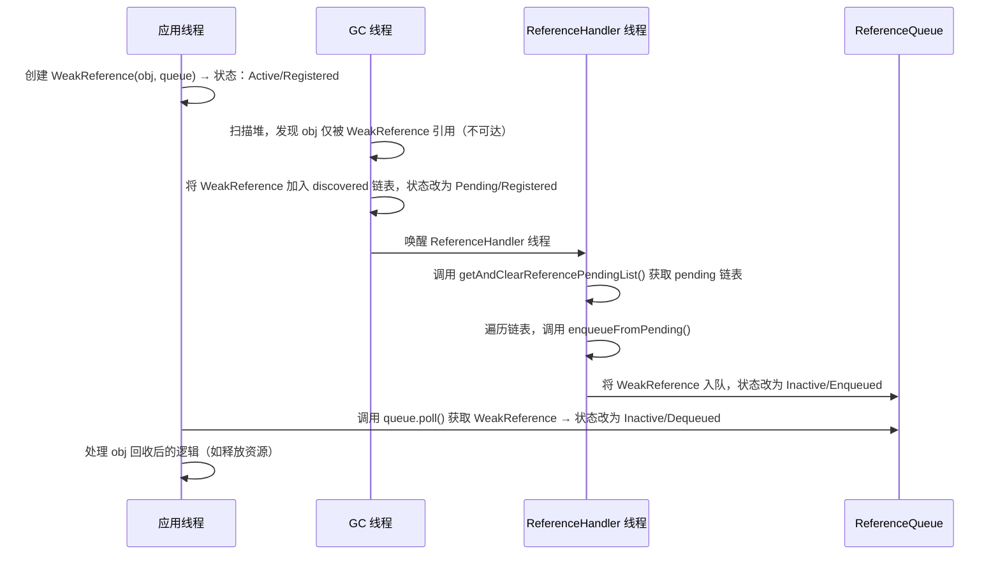

## 目录
- [java.lang.Reference<T>](#javalangreferencet)
  - [1](#1)
  - [2](#2)


## java.lang.Reference<T>

# 1
这段代码是 Java 引用体系的核心基石：`java.lang.Reference<T>`。它是 `WeakReference`、`SoftReference`、`PhantomReference` 以及内部用于终结机制的 `FinalReference` 的抽象父类。

理解这个类，就是理解 **Java 垃圾回收器（GC）如何与用户代码协作** 来管理对象生命周期的底层机制。

---

### 1. 核心设计意图：GC 与应用层的“握手”协议

普通的 Java 对象对 GC 是“透明”的：GC 决定回收就回收，应用层通常无法感知（除了对象突然变成 null）。

但 `Reference` 类打破了这个单向性。它定义了一种**特殊的对象**，GC 在回收其引用的目标对象（referent）时，会遵循一套特定的**状态机协议**，并通知应用层。

*   **目的**：允许应用在对象被回收前（或回收时）收到通知，或者实现特殊的内存管理策略（如缓存、弱键映射）。
*   **关键限制**：Javadoc 明确指出 `this class may not be subclassed directly`。这是因为引用对象的内部字段（如 `referent`, `discovered`, `next`）需要 GC 直接操作，且`状态转换逻辑 高度依赖 JVM 内部实现`，普通子类无法保证这种紧密协作。

---

### 2. 底层原理：状态机与生命周期

Javadoc 中那段长长的注释描述了 `Reference` 对象的**状态机**。这是理解其行为的钥匙。

#### A. 两个维度的状态
一个 `Reference` 对象的状态由两个属性决定：
1.  **活性状态 (Activity State)**: `Active` -> `Pending` -> `Inactive`
2.  **队列状态 (Queue State)**: `Registered` -> `Enqueued` -> `Dequeued` (或 `Unregistered`)

#### B. 状态流转详解 (The Lifecycle)

让我们追踪一个典型的 `WeakReference` (注册了 Queue) 的生命周期：

1.  **初始状态：[Active / Registered]**
    *   **创建时**：`new WeakReference(obj, queue)`。
    *   **字段**：`referent` 指向目标对象；`queue` 指向关联队列；`discovered` 为 null。
    *   **含义**：GC 会特殊对待它。如果目标对象还活着，它就一直保持 Active。

2.  **GC 发现弱可达：[Active] -> [Pending]**
    *   **触发**：GC 运行时，发现 `referent` 对象变成了 **Weakly Reachable**（只有弱引用指向它）。
    *   **GC 动作**：
        1.  **原子性清除**：将 `referent` 字段设为 `null`（切断强连接，防止应用层再通过 `get()` 拿到已死对象）。
        2.  **加入待处理链表**：将这个 `Reference` 对象本身添加到 JVM 内部的一个全局单向链表（**pending-Reference list**）中。此时 `discovered` 字段指向链表中的下一个元素。
    *   **状态**：变为 **Pending**。此时它还没进入用户定义的 `queue`，而是在 JVM 的内部等待列表中。

3.  **ReferenceHandler 线程处理：[Pending] -> [Inactive / Enqueued]**
    *   **关键角色**：JVM 启动时会有一个高优先级的守护线程，名为 **`Reference Handler`** (代码中的 `ReferenceHandler` 内部类)。
    *   **动作**：
        1.  该线程不断轮询或等待 JVM 内部的 `pending-Reference list`。
        2.  一旦发现有新的 `Reference` 进入 pending 列表，它会将其取出。
        3.  调用 `enqueueFromPending()`：将该 `Reference` 对象添加到用户创建的 `ReferenceQueue` 中。
        4.  更新状态：`queue` 标记为 `ENQUEUE`，`next` 指向队列中的下一个节点。
    *   **结果**：状态变为 **Enqueued** (且活性状态变为 **Inactive**)。
    *   **应用层感知**：此时，用户代码调用 `queue.poll()` 或 `queue.remove()` 就能拿到这个 `Reference` 对象，从而知道“哦，我关注的那个对象被回收了”。

4.  **最终状态：[Inactive / Dequeued]**
    *   当用户从 `ReferenceQueue` 中移除该对象后，状态变为 `Dequeued`。
    *   此时 `referent` 为 null，`queue` 标记为 `NULL`。对象彻底完成使命，等待自己被 GC 回收。

#### C. 特殊路径：未注册队列 (Unregistered)
如果创建时没有传入 `ReferenceQueue` (`new WeakReference(obj)`)：
*   GC 发现弱可达 -> 清除 `referent` -> 状态直接变为 **[Inactive / Unregistered]**。
*   **注意**：Javadoc 提到 `[3] The garbage collector may directly transition a Reference from [active/unregistered] to [inactive/unregistered], bypassing the pending-Reference list.`
    *   这意味着如果没有队列需要通知，GC 可能会优化掉加入 pending 列表的步骤，直接清空引用，减少开销。

---

### 3. 关键字段深度解析

这些字段是 GC 和应用层沟通的桥梁：

```java
private T referent;         // 【核心】被引用的对象。GC 直接修改此字段为 null。
volatile ReferenceQueue<? super T> queue; // 【状态标记】指示当前队列状态 (NULL, ENQUEUE, 或具体队列)。
volatile Reference next;    // 【链表指针】用于在 ReferenceQueue 内部构建链表。
private transient Reference<?> discovered; // 【GC 专用】用于 GC 构建内部的 pending-Reference 链表。
```

*   **为什么 `referent` 不是 volatile？**
    *   因为它的修改是由 GC 线程在 `Stop-The-World (STW) 或 特定安全点`进行的，不需要通过 volatile 保证可见性给 Java 应用线程（应用线程读到 null 是因为 GC 已经完成了清除动作并发布了屏障）。但在较新的 JDK 实现中，为了配合并发 GC，内存语义非常复杂，通常由 intrinsic 方法保证。
*   **`discovered` vs `next`**:
    *   `discovered`: 仅在 **GC 阶段** 和 **Pending 状态** 使用。它是 JVM 内部链表的指针。
    *   `next`: 仅在 **入队后 (Enqueued)** 使用。它是 `ReferenceQueue` 内部链表的指针。
    *   **分离的好处**：允许 GC 在后台收集引用放入 pending 列表的同时，应用层线程正在从 `ReferenceQueue` 中消费（移除）之前的引用，两者互不干扰。

---

### 4. 幕后英雄：ReferenceHandler 线程

代码中的 `ReferenceHandler` 内部类是整个过程的关键驱动者。

```java
private static class ReferenceHandler extends Thread {
    public void run() {
        while (true) {
            processPendingReferences();
        }
    }
}
```

*   **优先级**：`Thread.MAX_PRIORITY`。确保引用处理尽可能快，避免 `ReferenceQueue` 堆积。
*   **工作流程 (`processPendingReferences`)**:
    1.  `waitForReferencePendingList()`: 阻塞等待，直到 GC 往 pending 列表里加了东西。这是一个 native 方法，直接与 JVM 交互。
    2.  `getAndClearReferencePendingList()`: 原子地拿走整个 pending 链表。
    3.  遍历链表：
        *   如果是 `Cleaner` (Java 9+ 推荐的清理机制)，直接执行 `clean()`。
        *   如果是普通 `Reference`，调用 `enqueueFromPending()` 将其放入用户队列。
*   **为什么需要这个线程？**
    *   GC 线程通常专注于内存扫描和整理，不适合执行复杂的 Java 逻辑（如操作用户层的 `ReferenceQueue` 对象，这可能触发类加载、分配内存等）。
    *   将“发现死亡” (GC 做) 和 “通知应用” (ReferenceHandler 做) 解耦，提高了 GC 效率。

---

### 5. 高级特性：reachabilityFence

代码末尾有一个看似奇怪的方法：

```java
public static void reachabilityFence(Object ref) {
    // Does nothing... annotated with @ForceInline
}
```

*   **问题背景**：JIT 编译器非常激进。如果一个对象在方法后半段不再被“使用”（即没有字段读取或方法调用），编译器可能认为它已经死了，即使方法还没结束。这可能导致对象过早被 GC 回收，甚至触发 `finalize()`，而此时方法的后续代码可能还在依赖该对象的一些副作用（如本地资源句柄）。
*   **原理**：
    *   `reachabilityFence(ref)` 是一个**屏障 (Fence)**。
    *   虽然它是空的，但标注了 `@ForceInline` 且 JIT 编译器被特别告知：**在这个调用之前，`ref` 必须被视为“强可达”的**。
    *   它强制延长对象的生命周期直到 fence 执行完毕。
*   **用途**：主要用于解决“ premature finalization”（过早终结）问题，特别是在操作堆外内存（DirectByteBuffer）或 JNI 资源时。

---

### 6. 总结：从代码到 JVM 的全景图

| 组件 | 角色 | 交互方式 |
| :--- | :--- | :--- |
| **Application** | 创建 `WeakReference`，监听 `ReferenceQueue` | 调用 `get()`, `poll()`, `remove()` |
| **GC Thread** | 检测可达性，发现弱可达对象 | **原子清零** `referent`，将 Reference 加入 **pending 链表** (`discovered` 字段) |
| **ReferenceHandler** | 搬运工 | 从 pending 链表取出，放入用户的 **ReferenceQueue** (`next` 字段) |
| **JVM Internal** | 维护状态 | 管理 `pending-Reference list`，处理状态机转换 |

**底层原理一句话总结**：
`Reference` 类利用 JVM 特殊的**状态机**和**双链表机制**（GC 内部链表 + 用户队列链表），配合独立的 **`ReferenceHandler` 守护线程**，实现了垃圾回收器对用户代码的**异步通知机制**。它使得 Java 能够在不破坏 GC 自动管理内存的前提下，提供精细化的对象生命周期控制能力。


[目录](#目录)


# 2


### 一、核心需求理解
你希望我详细解释 Java 核心类 `java.lang.ref.Reference` 的源码实现，同时深入剖析其背后的底层原理（包括 GC 交互逻辑、状态流转、核心机制等），帮助你理解这个抽象类的设计目的和运行机制。

### 二、详细解释 + 底层原理
#### 1. 类的核心定位与设计背景
`Reference<T>` 是 Java 中所有引用类型（软引用 `SoftReference`、弱引用 `WeakReference`、虚引用 `PhantomReference`、终结引用 `FinalReference`）的抽象基类，**核心作用是为 GC 提供可追踪的对象引用机制**，让程序能主动感知对象的可达性变化，而非被动等待对象被回收。

- **为什么不能直接子类化？**  
  注释中明确说明该类与 GC 深度耦合，GC 会直接操作其内部字段（如 `referent`、`discovered`），自定义子类会破坏 GC 对引用状态的管理逻辑，因此 Java 禁止直接继承，仅允许使用 JDK 提供的子类。
- **核心设计目标**：通过维护引用对象的状态，让 GC 能精准控制引用的生命周期，并通过 `ReferenceQueue` 通知程序对象的可达性变化。

#### 2. 核心字段解析（底层核心）
| 字段名       | 类型                          | 作用 & 底层原理                                                                 |
|--------------|-------------------------------|---------------------------------------------------------------------------------|
| `referent`   | `private T`                   | 引用指向的目标对象（被引用者）。<br>✅ 底层：GC 会直接检查此字段判断对象可达性，且 `clear0()` 是 native 方法（避免 JVM 优化干扰），确保 GC 能可靠清空引用。 |
| `queue`      | `volatile ReferenceQueue<?>`  | 关联的引用队列，用于接收引用状态变化通知。<br>✅ 底层：`volatile` 保证多线程（GC 线程 + 应用线程）可见性，状态分为 `NULL`/`ENQUEUED`/`注册队列`。 |
| `next`       | `volatile Reference`          | 引用队列中的链表节点指针。<br>✅ 底层：用于构建队列的单向链表，`volatile` 保证队列操作的线程安全。 |
| `discovered` | `private transient Reference` | GC 专用的「发现链表」指针。<br>✅ 底层：GC 扫描对象时，会将需要处理的引用对象加入该链表，避免与 `next`（队列链表）冲突，是 GC 与 `ReferenceHandler` 线程的通信桥梁。 |

#### 3. 引用对象的状态体系（底层核心）
`Reference` 的状态由两个维度构成，GC 正是通过状态判断来决定如何处理引用：
| 维度1（可达性） | 含义                                                                 |
|----------------|----------------------------------------------------------------------|
| Active         | 活跃状态：引用对象仍受 GC 特殊处理，`referent` 非 null，GC 会监控其可达性变化。 |
| Pending        | 待处理状态：GC 已检测到 `referent` 不可达，加入「pending-Reference 链表」，等待 `ReferenceHandler` 线程处理。 |
| Inactive       | 非活跃状态：引用已处理完成（清空/入队），`referent` 为 null，GC 不再处理。 |

| 维度2（队列关联） | 含义                                                                 |
|------------------|----------------------------------------------------------------------|
| Registered       | 已关联队列但未入队：创建时指定了 `ReferenceQueue`，但尚未被 GC/程序入队。 |
| Enqueued         | 已入队：引用被加入队列，未被移除。                                   |
| Dequeued         | 已出队：引用从队列中被移除。                                         |
| Unregistered     | 未关联队列：创建时未指定 `ReferenceQueue`（`queue = NULL`）。         |

##### 状态流转核心规则（底层 GC 交互逻辑）
```mermaid
graph TD
    A[Active/Registered] -->|GC检测referent不可达| B[Pending/Registered]
    A -->|手动clear()| C[Inactive/Registered]
    B -->|ReferenceHandler线程| D[Inactive/Enqueued]
    C -->|enqueue()| D
    D -->|poll/remove| E[Inactive/Dequeued]
    F[Active/Unregistered] -->|GC| G[Pending/Unregistered]
    F -->|GC/clear| H[Inactive/Unregistered]
    G -->|ReferenceHandler| H
    E & H -->|终端状态| I[不再被GC处理]
```
- **关键底层细节**：
    1. GC 只会处理 `Active` 状态的引用，检测到 `referent` 不可达后，将其标记为 `Pending` 并加入 `discovered` 链表；
    2. `FinalReference` 特殊处理：不遵循 `referent = null` 的状态判断规则，而是通过 `next = this` 标记非活跃状态（因为终结引用需要保留 `referent` 直到 `finalize()` 执行）；
    3. GC 可直接将 `Active/Unregistered` 转为 `Inactive/Unregistered`（跳过 `Pending` 阶段），减少不必要的线程调度。

#### 4. 核心线程：ReferenceHandler（底层执行引擎）
`ReferenceHandler` 是 JVM 启动时创建的**高优先级守护线程**，核心作用是处理 GC 提交的 `Pending` 状态引用，是连接 GC 与应用程序的关键：
```java
// 静态代码块初始化 ReferenceHandler 线程
static {
    ThreadGroup tg = ...; // 获取最顶层线程组
    Thread handler = new ReferenceHandler(tg, "Reference Handler");
    handler.setPriority(Thread.MAX_PRIORITY); // 最高优先级，确保及时处理
    handler.setDaemon(true); // 守护线程，不阻塞 JVM 退出
    handler.start();
}
```
##### 核心运行逻辑（`processPendingReferences()`）
```mermaid
graph LR
    A[waitForReferencePendingList()] -->|等待GC填充pending链表| B[getAndClearReferencePendingList()]
    B -->|原子获取并清空pending链表| C{遍历pendingList}
    C -->|Cleaner类型| D[执行clean()清理资源]
    C -->|普通引用| E[enqueueFromPending()入队]
    D & E -->|循环处理完所有引用| F[通知等待线程]
```
- **底层关键细节**：
    1. `getAndClearReferencePendingList()` 是 native 方法：原子性获取并清空 GC 维护的 pending 链表，避免 GC 与应用线程竞争；
    2. `Cleaner` 是虚引用的子类（替代 `finalize()`）：优先执行 `clean()` 方法清理资源（如堆外内存），无需等待 finalizer 线程，效率更高；
    3. 线程同步：通过 `processPendingLock` 实现 `ReferenceHandler` 与 `waitForReferenceProcessing()` 的通信，确保应用线程能等待引用处理完成。

#### 5. 核心方法解析（底层原理 + 用法）
##### (1) `get()` & `refersTo(T obj)`
```java
@IntrinsicCandidate // JVM 会做 intrinsics 优化（直接操作内存）
public T get() { return this.referent; }

public final boolean refersTo(T obj) { return refersToImpl(obj); }
private native boolean refersTo0(Object o);
```
- **底层原理**：
    - `get()` 是 intrinsic 方法：JVM 会跳过常规方法调用，直接读取 `referent` 字段，避免被 JIT 优化（如内联后丢失引用）；
    - `refersTo()`（Java 16+）：解决 `get() == obj` 的「强引用强化问题」—— `get()` 会返回强引用，导致 `referent` 被临时标记为可达；而 `refersTo0()` 是 native 方法，仅做地址比对，不创建强引用，不影响 GC 判断。

##### (2) `clear()` & `clear0()`
```java
public void clear() { clear0(); }
private native void clear0();
```
- **底层原理**：
    - 为什么用 native 方法？JVM 的 GC 实现（如 HotSpot）对 `referent` 字段有特殊处理，Java 层的简单赋值（`this.referent = null`）可能被 JIT 优化（如死代码消除），而 `clear0()` 是 JVM 直接操作内存，确保引用被可靠清空；
    - GC 清空引用时**不会调用 `clear()`**，而是直接修改 `referent` 字段，避免 Java 层代码干扰。

##### (3) `enqueue()`
```java
public boolean enqueue() {
    clear0(); // 先清空引用，再入队
    return this.queue.enqueue(this);
}
```
- **底层原理**：
    - 入队前必须清空引用：确保入队后的引用不再指向原对象，避免程序误操作导致对象重新可达；
    - `queue.enqueue()` 是线程安全的：`ReferenceQueue` 内部通过 `volatile` 和 CAS 保证多线程入队的原子性。

##### (4) `reachabilityFence(Object ref)`（Java 9+）
```java
@ForceInline
public static void reachabilityFence(Object ref) {
    // 空方法，仅靠注解和 JVM 语义生效
}
```
- **底层原理（核心）**：
    - 注解 `@ForceInline` 强制 JIT 内联该方法，JVM 规定：**在调用 `reachabilityFence` 之前，`ref` 引用的对象必须保持强可达**，即使代码中没有显式使用 `ref`；
    - 解决「提前终结问题」：比如对象的 `finalize()` 可能在对象字段仍被使用时执行，通过 `reachabilityFence(this)` 可确保对象在方法执行完前不被回收。

##### (5) 构造方法
```java
Reference(T referent) { this(referent, null); }
Reference(T referent, ReferenceQueue<? super T> queue) {
    this.referent = referent;
    this.queue = (queue == null) ? ReferenceQueue.NULL : queue;
}
```
- **底层原理**：
    - 未指定队列时，`queue` 赋值为 `ReferenceQueue.NULL`（而非 null）：GC 会识别该标记，跳过入队逻辑，避免空指针；
    - 所有引用对象创建时默认处于 `Active/Registered` 或 `Active/Unregistered` 状态，是状态流转的起点。

#### 6. GC 与 Reference 的底层交互流程（核心）
以「弱引用 + ReferenceQueue」为例，完整的底层交互流程：

- **关键底层细节**：
    1. GC 是「主动方」：只有 GC 能将引用从 `Active` 转为 `Pending`，应用线程无法修改；
    2. `ReferenceHandler` 是「中间件」：GC 不直接操作 `ReferenceQueue`，而是将引用交给该线程处理，避免 GC 线程阻塞；
    3. 状态流转是「不可逆」的：一旦进入 `Inactive` 状态，GC 不再处理，引用对象最终会被普通 GC 回收。

#### 7. FinalReference 特殊处理（底层补充）
`FinalReference` 是用于支持 `Object.finalize()` 的内部引用，与普通引用的核心差异：
- 不遵循 `referent = null` 的状态规则：`finalize()` 执行前，`referent` 仍非 null，GC 通过 `next = this` 标记其为非活跃；
- 不支持 `enqueue()`：终结引用的处理由 `Finalizer` 线程负责，而非 `ReferenceHandler`；
- 禁止 `Unregistered` 状态：必须关联队列，确保 `finalize()` 能被执行。

### 三、总结（核心关键点）
1. **核心定位**：`Reference` 是 Java 引用体系的基类，通过与 GC 深度耦合，实现「对象可达性感知」，是软/弱/虚引用的底层支撑；
2. **状态与线程**：引用对象的状态由 GC 维护，`ReferenceHandler`（最高优先级守护线程）负责处理待办引用，确保 GC 不阻塞；
3. **底层优化**：核心方法（`get()`/`clear0()`/`refersTo0()`）为 native/intrinsic 方法，避免 JVM 优化干扰，保证与 GC 交互的可靠性；
4. **关键机制**：`reachabilityFence` 解决提前终结问题，`ReferenceQueue` 实现引用状态的异步通知，是程序与 GC 协作的核心桥梁。

### 四、补充说明
- **使用建议**：优先使用 `refersTo()` 替代 `get() == null` 判断引用是否清空，避免强引用强化；
- **性能注意**：`ReferenceHandler` 是高优先级线程，频繁创建引用对象会增加其负担，需避免滥用；
- **替代方案**：`Cleaner`（虚引用）比 `finalize()` 更高效，是 JDK 推荐的资源清理方式（如 `DirectByteBuffer` 的堆外内存清理）。


[目录](#目录)


