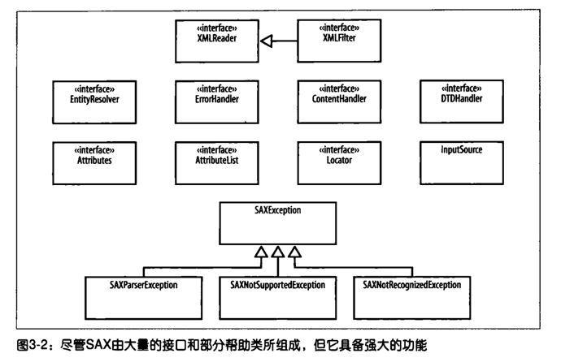

## 目录
- [SAX（用于XML的简单API）](#sax用于xml的简单api)
- [使用SAX解析文档](#使用sax解析文档)


## SAX（用于XML的简单API）
SAX是Java处理XML的两大核心API之一，与后续会介绍的DOM形成互补，是基于事件驱动的XML解析方案。

### 一、SAX的核心定位
1. **XML解析的核心目的**：XML本质是数据载体，编程处理XML的核心是**解析**（从XML文件中获取数据），SAX是实现XML解析的关键Java API，为Java和XML交互提供了至关重要的操作框架。
2. **SAX的特点**：API轻量（类的体积小、数量少），但功能核心，是Java程序员处理XML的基础工具，其基于<span style="color:#ff9900; font-weight:bold;">事件驱动+回调</span>的设计是解析XML的重要思路。
3. **与DOM的关系**：SAX和DOM是Java中XML两大核心API类库，DOM相关知识会在后续章节介绍，二者是Java解析XML的两种主流方案，设计思路差异显著。

### 二、SAX的核心编程模型：回调与基于事件的编程
SAX的核心设计是**基于事件的回调模型**，这是与传统面向对象主动编程完全不同的被动编程方式，也是SAX解析XML的核心逻辑。
### 1. 核心原理
SAX解析器会**逐个解析XML文档的元素**，在解析过程中遇到XML的任意组成单元（标签、注释、文本、属性等）时，会触发对应的**解析事件**，并通过**回调机制**调用用户预先编写的事件处理代码，用户代码通过响应这些事件实现XML数据的获取和处理。
### 2. 典型事件触发示例
当SAX解析器遇到XML元素的开始标签时，会触发`startElement`事件，同时将**元素名称、元素属性**等关键信息传递给用户代码，再调用用户编写的该事件的处理逻辑；解析到结束标签时则触发`endElement`事件，以此类推。
### 3. 编程核心要求
开发者必须为<span style="color:#ff9900; font-weight:bold;">从文档开始到结束的所有事件</span>编写对应的处理代码，包括标签、注释、文本等所有XML单元的触发事件，不能遗漏任何事件，否则会导致XML数据解析不完整。
### 4. 被动编程的核心特征
用户代码**不主动控制解析过程**，不会向解析器发送“解析下一个元素”等指令，而是始终处于**被动等待**状态，直到解析器触发事件并回调执行对应的处理代码。
### 5. 适用人群的适配性
从事**Swing/AWT图形界面开发**、**EJB企业级组件开发**的程序员会更容易理解这种编程方式，因为这类开发中大量使用了事件驱动+回调的设计思路。

### 三、SAX API的整体架构



SAX API库的核心组成是**大量定义了回调方法的接口**，辅以少量帮助类和异常类，整体架构简单但扩展性和功能性强，解析器与开发者的职责划分清晰。
#### 1. 核心架构组成（核心接口+辅助类/异常）
从SAX API框架视图来看，核心包含以下关键部分：
- **核心解析接口**：`XMLReader`、`XMLFilter`（解析器的核心接口，由SAX解析器实现）；
- **事件处理接口**：`ContentHandler`（核心处理接口，处理字符、标签等核心解析事件）、`DTDHandler`（处理DTD相关事件）、`ErrorHandler`（处理解析错误事件）；
- **资源与解析辅助接口**：`EntityResolver`（解析实体资源）、`InputSource`（定义解析的输入源）；
- **辅助类**：`Attributes`（封装元素属性）、`Locator`（定位解析位置）；
- **异常类**：`SAXException`及其子类（如`SAXParseException`、`SAXNotRecognizedException`等），处理解析过程中的各类异常。
#### 2. 关键职责划分
SAX的接口实现**并非由解析器完成**，而是遵循“解析器提供事件，开发者实现处理逻辑”的原则：
1. 第三方XML解析器（如Apache Xerces）仅实现**核心解析接口**（`XMLReader`）和**辅助类**（`Attributes`等），负责解析XML并触发各类解析事件；
2. `ContentHandler`、`EntityResolver`、`ErrorHandler`等**事件处理接口**，需要**开发者自行实现**，并编写每个回调方法的具体业务逻辑（如`ContentHandler`中的`characters()`方法处理文本字符）。

### 四、SAX的安装与环境配置
SAX并非Java原生自带的可直接使用的工具，需要下载包含SAX API、解析器实现类的完整包，并配置环境变量让Java程序识别，**Apache Xerces**是最主流的SAX解析器实现。
#### 1. 解析器下载
1. 选择主流解析器：推荐Apache Xerces，官方下载地址为`http://xml.apache.org/xerces2-j/ `；
2. 选择对应安装包：根据操作系统选择压缩格式，**Windows用户下载ZIP文件**，**Unix/MAC OS X用户下载GZIP压缩的tar文件**，建议选择**已编译的二进制文件**（无需自行编译，直接使用）；
3. 包内内容：包含SAX API的所有类和接口、解析器实现类、示例代码、帮助文档等核心文件。

#### 2. 环境变量配置（核心为CLASSPATH）
配置的核心是将SAX解析器的核心JAR包加入Java的`CLASSPATH`环境变量，让Java虚拟机能够加载SAX的相关类和接口，以下以**MAC OS X系统**的Xerces配置为例，核心步骤如下：
1. 定义环境变量：指定Java安装根目录、Xerces安装根目录；
2. 配置CLASSPATH：将Xerces安装目录下的`xml-apis.jar`（SAX API核心包）和`xercesImpl.jar`（解析器实现核心包）加入CLASSPATH。

##### 示例配置代码（MAC OS X的myprofile文件）
```bash
# 定义Java根目录
export JAVA_BASE=/usr/local/java
# 定义Xerces安装根目录
export XERCES_HOME=$JAVA_BASE/xerces-2_6_2
# 配置CLASSPATH，加入SAX核心JAR包
export CLASSPATH=$XERCES_HOME/xml-apis.jar:$XERCES_HOME/xercesImpl.jar
```
#### 3. 配置注意事项
1. 不同解析器的配置方式参考其官方文档，核心是找到对应的核心JAR包并加入CLASSPATH；
2. 若不清楚如何配置CLASSPATH，可参考Java环境配置文档或咨询相关开发人员；
3. 企业开发中需确认团队统一使用的解析器，避免版本不一致导致的兼容问题。

### 五、SAX解析的核心流程总结
结合解析器和用户代码的协作，SAX解析XML的完整流程可概括为：
1. 启动SAX解析器，指定需要解析的XML文档（`InputSource`）；
2. 解析器开始逐行/逐个元素解析XML，触发第一个事件（如`startDocument`，文档开始事件）；
3. 解析器每遇到一个XML单元（开始标签、文本、结束标签、注释等），触发对应的专属事件，并回调用户实现的事件处理方法；
4. 用户代码在回调方法中处理数据（如提取元素名称、属性、文本内容）；
5. 解析器解析到XML文档末尾，触发`endDocument`（文档结束事件），解析过程完成。

整个过程由**SAX解析器主导触发事件**，**用户代码被动响应处理**，二者协同完成XML的解析和数据提取。


[目录](#目录)

## 使用SAX解析文档

### 一、SAX解析的核心前提
SAX是**基于事件驱动**的XML解析方式，解析过程中会触发各类事件（如开始解析元素、读取属性、结束解析元素等），开发人员通过编写**事件处理代码**实现对XML内容的定制化处理，这是SAX解析的核心思想。
文档中Swing的Tree控件仅为**可视化展示解析结果**，并非SAX解析的核心，无需关注Swing细节，重点聚焦SAX的事件处理和解析流程。

### 二、SAX解析的第一步：实例化XMLReader
`org.xml.sax.XMLReader`是SAX解析的**核心接口**，所有兼容SAX标准的XML解析器（如Apache Xerces）都必须实现该接口，它是解析XML的入口，负责触发解析事件、调用处理程序。
### 方式1：直接实例化解析器实现类（不推荐）
以Apache Xerces解析器为例，其`org.apache.xerces.parsers.SAXParser`实现了`XMLReader`，可直接new实例：
```java
// 实例化XMLReader
XMLReader reader = new org.apache.xerces.parsers.SAXParser();
// 调用parse方法解析XML，参数为XML的URI字符串
reader.parse(uri);
```
**缺点**：代码与具体解析器供应商强耦合，更换解析器时需要修改代码。

### 方式2：通过XMLReaderFactory创建（推荐）
使用SAX提供的工具类`org.xml.sax.helpers.XMLReaderFactory`的`createXMLReader()`方法创建实例，实现**与解析器解耦**：
```java
XMLReader reader = XMLReaderFactory.createXMLReader();
```
#### 关键：指定解析器驱动（org.xml.sax.driver系统属性）
`XMLReaderFactory`会通过**org.xml.sax.driver**系统属性找到对应的解析器实现类，设置方式有两种：
1. **代码外设置**：运行Java程序时通过`-D`参数指定
   ```bash
   java -Dorg.xml.sax.driver=org.apache.xerces.parsers.SAXParser 你的主类名
   ```
2. **解析器内置**：大多数解析器（如Xerces）会**内部自动设置**该属性，开发者无需手动配置，直接调用`createXMLReader()`即可。

#### 命名小知识
`XMLReader`在**SAX1.0**中命名为`Parser`，后续SAX版本做了改进，重新命名为`XMLReader`，因此解析方法也对应为`XMLReader.parse()`，这是历史版本的兼容调整。

### 三、SAXTreeViewer示例类：SAX解析的基本结构
文档中通过`SAXTreeViewer`类（继承Swing的`JFrame`）展示SAX解析的完整流程，核心方法为`buildTree()`，整体结构和核心步骤如下（修正文档笔误后）：
```java
public class SAXTreeViewer extends JFrame {
    // Swing相关变量：用于树形展示，非SAX核心
    public void buildTree(DefaultTreeModel treeModel) throws IOException, SAXException {
        DefaultMutableTreeNode base;
        String xmlURI; // 要解析的XML文档URI（本地文件/远程URL）
        // 步骤1：创建XMLReader实例
        XMLReader reader = XMLReaderFactory.createXMLReader();
        // 步骤2：注册内容处理程序（核心：处理解析事件）
        // 步骤3：注册错误处理程序（处理解析中的异常）
        // 步骤4：创建输入源并执行解析
        InputSource inputSource = new InputSource(xmlURI);
        reader.parse(inputSource);
    }

    public static void main(String[] args) {
        try {
            if (args.length != 1) { // 命令行传入XML文档路径
                System.out.println("Usage:java javaxml3.SAXTreeViewer [XMLDocument]");
                return;
            }
            SAXTreeViewer viewer = new SAXTreeViewer();
            viewer.init(args[0]); // 初始化XML URI
            viewer.setVisible(true); // 显示Swing窗口
        } catch (Exception e) {
            e.printStackTrace();
        }
    }
}
```
**核心注意**：文档中省略了import语句、Swing细节代码，完整代码需参考配套在线示例，重点关注`buildTree()`中的**4个SAX核心步骤**。

### 四、执行解析：parse()方法与InputSource输入源
创建`XMLReader`后，调用`parse()`方法触发解析，该方法支持**两种参数类型**：`String`（XML的URI）或`org.xml.sax.InputSource`（SAX标准输入源），**推荐使用InputSource**，这是文档的重点强调内容。

## 1. URI与URL的关系
- **URI**：统一资源标识符（Uniform Resource Identifier），用于**识别/定位资源**（如XML文档），是通用标准；
- **URL**：统一资源定位符（Uniform Resource Locator），是**URI的子集**，通过具体路径定位资源（如`http://xxx/xxx.xml`、`file:///xxx/xxx.xml`）；
- 实操中，SAX解析的URI可以是**本地XML文件路径**或**远程XML的URL**，二者均可被解析器识别。

## 2. InputSource的核心优势
`InputSource`是SAX提供的**输入封装类**，相比直接传URI字符串，它的核心优势是：
1. 支持**多种输入方式**：可基于`InputStream`（字节流）、`Reader`（字符流）、URI字符串创建；
2. 封装了XML文档的**系统ID、公共ID、字符编码**等元信息，为解析器提供更完整的上下文；
3. 解析器**不会修改**传入的`InputSource`对象，保证原始输入的完整性；
4. 能正确处理XML文档中的**相对路径引用**（如DTD文件、外部实体），这是最关键的优势。

## 3. InputSource的基本使用
直接基于XML的URI创建，简单高效：
```java
String xmlURI = "xxx/xxx.xml"; // 本地/远程URI
InputSource inputSource = new InputSource(xmlURI);
reader.parse(inputSource);
```

## 4. 关键场景：处理流输入+相对路径引用（解决DTD找不到问题）
### 问题场景
如果直接基于`FileInputStream`创建`InputSource`（流输入），未设置**系统ID**，解析器会丢失XML文档的路径上下文，无法找到XML中引用的**相对路径资源**（如DTD校验文件），触发`SAXParseException`：
```java
// 错误写法：仅用流创建InputSource，无系统ID
InputSource inputSource = new InputSource(new FileInputStream(new File(xmlURI)));
reader.parse(inputSource);
// 异常：org.xml.sax.SAXParseException: File "play.dtd" not found
```
原因：XML文档中可能有DTD引用`<DOCTYPE PLAY SYSTEM "play.dtd">`，解析器无法定位该相对路径的DTD文件。

### 解决方法
通过`InputSource.setSystemID(String uri)`方法**手动设置系统ID**，系统ID即XML文档的原始URI，让解析器恢复路径上下文：
```java
// 正确写法：流输入 + 手动设置系统ID
InputSource inputSource = new InputSource(new FileInputStream(new File(xmlURI)));
inputSource.setSystemID(xmlURI); // 核心：设置XML文档的URI为系统ID
reader.parse(inputSource);
```
**系统ID/公共ID说明**：
- 系统ID（System ID）：表示**本地资源**的标识（如本地文件路径、服务器绝对路径）；
- 公共ID（Public ID）：表示**网络公共资源**的标识，用于定位通用的外部资源。

## 5. 解析的异常处理
解析XML过程中必须处理**两种异常**，因此`buildTree()`方法显式声明抛出：
1. **IOException**：读取XML文档时的I/O异常（如文件不存在、网络连接失败）；
2. **SAXException**：SAX解析过程中的语法错误、资源引用错误等解析异常。

# 五、SAX解析的关键注意事项
## 1. Xerces解析器的DTD处理规则
Apache Xerces是主流的SAX解析器，其默认行为：
- 会从XML的`DOCTYPE`中**搜索关联的DTD文件**，即使**不开启XML校验**，也需要确保DTD文件可被读取（本地/网络可达）；
- 若DTD文件找不到，直接触发解析异常，因此必须保证DTD的路径正确（或通过系统ID设置上下文）。

## 2. 解析无输出的核心原因
如果仅完成`XMLReader`创建和`parse()`调用，**未注册事件处理程序**，运行程序后会**无任何输出**，这是SAX的核心特性：
SAX是**事件驱动**，解析器在解析过程中会触发一系列事件（如`startElement`（开始解析元素）、`characters`（读取文本内容）、`endElement`（结束解析元素）等），但**默认无任何事件处理逻辑**。
开发者必须**注册自定义的内容处理程序**（实现`org.xml.sax.ContentHandler`接口），重写事件方法，才能捕获和处理XML的解析内容，这是后续SAX开发的核心工作（文档中此部分为“待续”）。

## 3. 事件处理的核心价值
解析器的回调事件让开发者可以：
- 对XML的**元素、属性、文本内容**进行定制化处理（如提取数据、封装对象、校验内容）；
- 实现解析过程与**其他程序的交互**（如将解析结果写入数据库、展示到前端界面，文档中是展示到Swing Tree）；
- 按需处理XML内容，无需加载整个XML文档到内存（SAX的核心优势，适合解析大XML文件）。

### 六、SAX解析的完整核心流程（总结）
结合文档内容，Java中使用SAX解析XML的**标准流程**可归纳为5步，也是后续开发的通用步骤：
1. **创建XMLReader**：通过`XMLReaderFactory.createXMLReader()`实现解耦；
2. **自定义事件处理程序**：实现`ContentHandler`（内容处理）、`ErrorHandler`（错误处理）等SAX接口，重写事件方法；
3. **注册处理程序**：通过`XMLReader.setContentHandler()`、`XMLReader.setErrorHandler()`将自定义处理程序注册到解析器；
4. **创建InputSource**：封装XML输入（推荐设置系统ID，处理相对路径引用）；
5. **执行解析**：调用`XMLReader.parse(inputSource)`，触发解析并执行事件处理程序。


