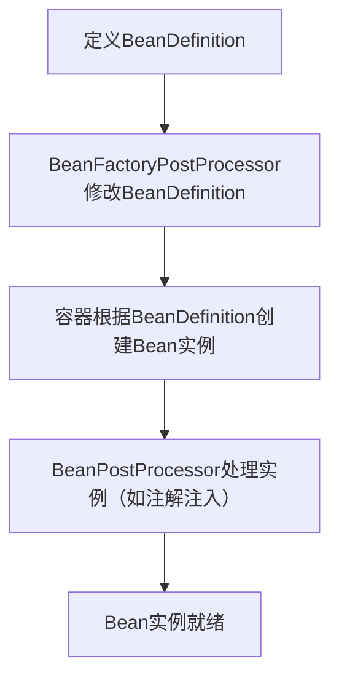

### 一、核心需求响应
你希望我详细解释`BeanDefinition`接口的这段核心代码，包括注释含义、接口设计目的、核心常量的作用，以及背后的设计思想。我会从基础概念到深层原理，逐步拆解这个Spring Bean体系的核心接口。

### 二、代码详细解释
#### 1. 接口注释完整解读
```java
/**
 * 一个BeanDefinition描述了一个bean实例，包含属性值、构造函数参数值，
 * 以及由具体实现类提供的更多信息。
 *
 * <p>这只是一个最小化的接口：其主要目的是允许{@link BeanFactoryPostProcessor}
 * 内省（检查）和修改属性值以及其他bean元数据。
 *
 * @author Juergen Hoeller
 * @author Rob Harrop
 * @since 19.03.2004
 * @see ConfigurableListableBeanFactory#getBeanDefinition
 * @see org.springframework.beans.factory.support.RootBeanDefinition
 * @see org.springframework.beans.factory.support.ChildBeanDefinition
 */
```
- **核心定义**：`BeanDefinition`是Spring中对**Bean的元数据描述**，不是Bean实例本身，而是存储了创建Bean实例所需的所有信息（比如类名、属性、构造器参数、作用域、是否懒加载等），相当于Bean的“说明书”。
- **设计定位**：“最小化接口”意味着它只定义了Bean元数据的核心操作，具体实现（如`RootBeanDefinition`）会扩展更多功能；核心价值是开放给`BeanFactoryPostProcessor`（如`ConfigurationClassPostProcessor`）修改Bean元数据，这是Spring实现动态配置的关键。
- **使用场景**：`BeanFactoryPostProcessor`（Bean工厂后置处理器）可以读取/修改`BeanDefinition`，比如修改Bean的作用域、替换属性值，典型例子是Spring Boot的自动配置、`@Value`注解解析、`@Configuration`类的处理。

#### 2. 接口继承关系
```java
public interface BeanDefinition extends AttributeAccessor, BeanMetadataElement
```
- `AttributeAccessor`：提供**通用的属性访问能力**（`getAttribute/setAttribute/removeAttribute`），允许给`BeanDefinition`附加自定义的键值对元数据；
- `BeanMetadataElement`：仅定义`getSource()`方法，用于获取Bean元数据的**原始来源**（比如XML配置文件中的`<bean>`标签、注解`@Bean`所在的方法），方便调试和定位Bean的定义位置。

#### 3. 核心常量解析
##### （1）作用域常量（Scope）
```java
// 标准单例作用域的标识符："singleton"
String SCOPE_SINGLETON = ConfigurableBeanFactory.SCOPE_SINGLETON;
// 标准原型（多例）作用域的标识符："prototype"
String SCOPE_PROTOTYPE = ConfigurableBeanFactory.SCOPE_PROTOTYPE;
```
- **SCOPE_SINGLETON**：
    - 含义：单例作用域，Spring容器中**仅创建一个Bean实例**，所有获取该Bean的请求都返回同一个实例；
    - 生命周期：随容器启动创建（非懒加载），容器销毁时销毁；
    - 备注：这是Spring Bean的默认作用域。
- **SCOPE_PROTOTYPE**：
    - 含义：原型（多例）作用域，**每次获取Bean时都创建新实例**；
    - 生命周期：Spring容器仅负责创建实例，不管理后续生命周期（销毁由用户自己处理）；
    - 备注：扩展的Bean工厂（如Web环境）还支持`request`/`session`/`application`等作用域，这些不是标准常量，需通过自定义方式设置。

##### （2）角色常量（Role）
```java
// 角色提示：BeanDefinition是应用的核心部分（用户自定义Bean）
int ROLE_APPLICATION = 0;

// 角色提示：BeanDefinition是更大配置的支撑部分（如外部组件的子Bean）
int ROLE_SUPPORT = 1;

// 角色提示：BeanDefinition是内部基础设施（对用户无意义）
int ROLE_INFRASTRUCTURE = 2;
```
- **ROLE_APPLICATION**：
    - 最常见的角色，代表**用户自定义的业务Bean**（比如`@Service`/`@Component`/`@Bean`标注的Bean）；
    - 示例：你自己写的`UserService`、`OrderDao`都属于这个角色。
- **ROLE_SUPPORT**：
    - 支撑性Bean，属于某个大组件的一部分，对整体应用不重要，但对组件本身重要；
    - 示例：一个分页组件中依赖的`PageHelper` Bean，属于组件的支撑部分。
- **ROLE_INFRASTRUCTURE**：
    - Spring**内部基础设施Bean**，用户无需关注，也不应该修改；
    - 示例：`ScheduledAnnotationBeanPostProcessor`、`AutowiredAnnotationBeanPostProcessor`等，都是Spring自动注册的、处理注解的核心Bean。
- **角色的作用**：Spring工具（如IDE、Bean分析工具）可根据角色过滤Bean，比如打印应用Bean列表时跳过基础设施Bean，只显示用户自定义的Bean。

### 三、背后原理解读
#### 1. `BeanDefinition`的核心价值：解耦Bean定义与实例化
- **传统方式**：直接`new`对象创建实例，耦合度高，无法动态修改属性；
- **Spring方式**：
    1. 先通过`BeanDefinition`描述Bean的“蓝图”（类名、属性、作用域等）；
    2. 容器根据“蓝图”在合适时机创建实例；
    3. 允许`BeanFactoryPostProcessor`在实例化前修改“蓝图”（比如动态替换数据源的URL）。
- 举例：你定义了一个`DataSource` Bean，`BeanDefinition`中存储了`url`/`username`/`password`，`PropertyPlaceholderConfigurer`（一种`BeanFactoryPostProcessor`）可以将`${db.url}`替换为真实的配置值，这个过程就是修改`BeanDefinition`的属性值。

#### 2. 接口设计的“最小化”原则
- `BeanDefinition`只定义核心常量和基础方法（比如`getScope()`/`setScope()`、`getRole()`/`setRole()`、`getBeanClassName()`等），不包含复杂逻辑；
- 具体实现类（如`RootBeanDefinition`、`GenericBeanDefinition`）负责扩展功能：
    - `RootBeanDefinition`：最常用的实现，描述独立的Bean（非子Bean）；
    - `ChildBeanDefinition`：描述继承自父BeanDefinition的子Bean（已被`GenericBeanDefinition`替代）；
    - `GenericBeanDefinition`：通用实现，支持动态设置父BeanDefinition，灵活性更高。

#### 3. 与Bean生命周期的关联

- `BeanDefinition`是Bean生命周期的**起点**，所有Bean的创建都基于它的描述；
- `BeanFactoryPostProcessor`的执行时机是“BeanDefinition加载完成，但Bean实例未创建”，这也是它能修改`BeanDefinition`的关键。

#### 4. 作用域的底层实现逻辑
- Spring容器在创建Bean时，会先读取`BeanDefinition`的`scope`属性：
    - 如果是`singleton`：检查缓存中是否已有实例，有则返回，无则创建并放入缓存；
    - 如果是`prototype`：直接创建新实例，不放入缓存；
- 自定义作用域（如`request`）：需实现`Scope`接口，并注册到`ConfigurableBeanFactory`，容器会调用自定义`Scope`的`get()`方法创建实例。

### 四、总结
1. **核心定位**：`BeanDefinition`是Spring对Bean的“元数据描述接口”，存储创建Bean实例的所有配置信息，而非Bean实例本身；
2. **关键常量**：
    - 作用域常量（`SCOPE_SINGLETON`/`SCOPE_PROTOTYPE`）定义Bean的创建策略，是Spring Bean生命周期管理的核心；
    - 角色常量（`ROLE_APPLICATION`/`SUPPORT`/`INFRASTRUCTURE`）用于区分Bean的用途，方便工具过滤和管理；
3. **设计思想**：通过“定义与实例化分离”的方式，允许`BeanFactoryPostProcessor`动态修改Bean配置，实现Spring的灵活扩展（如自动配置、属性占位符解析）。

