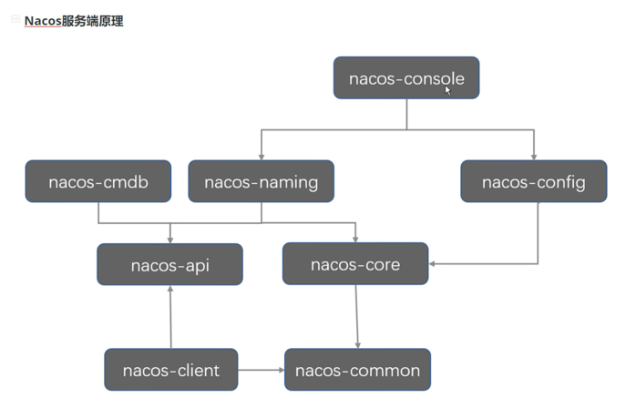
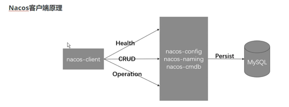
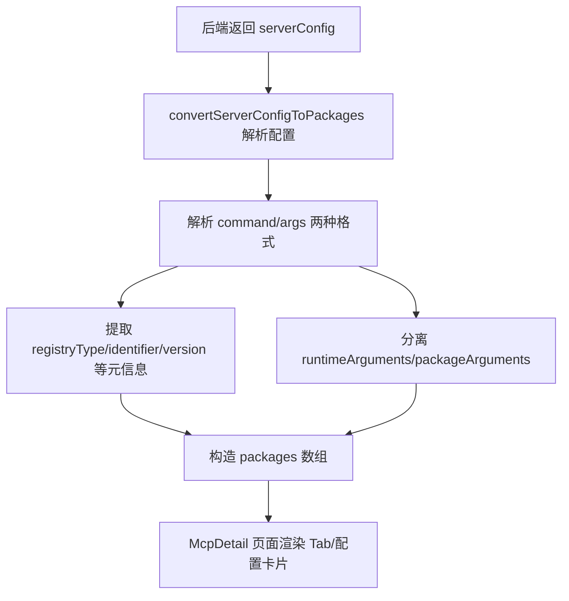
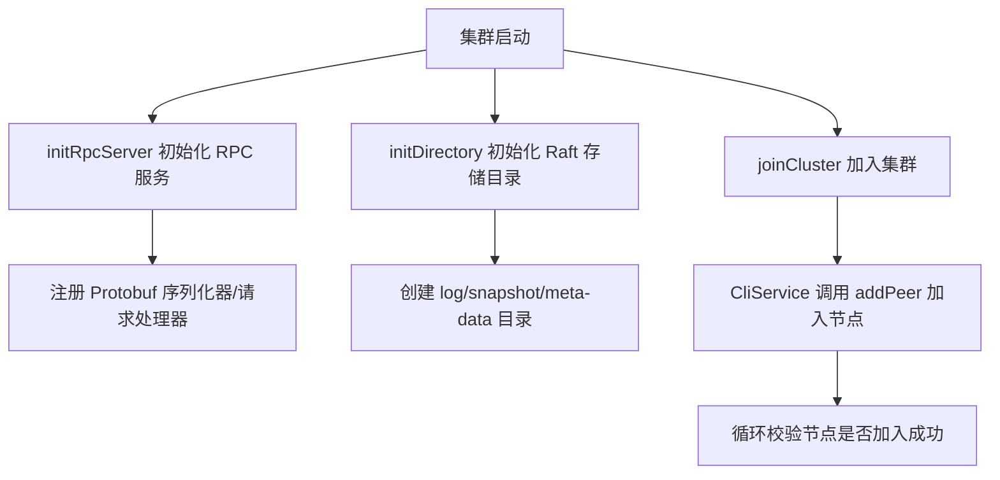
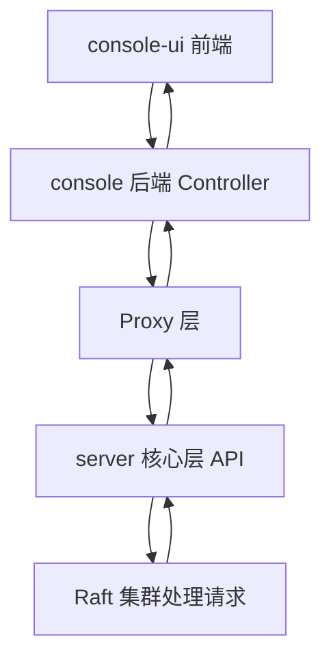
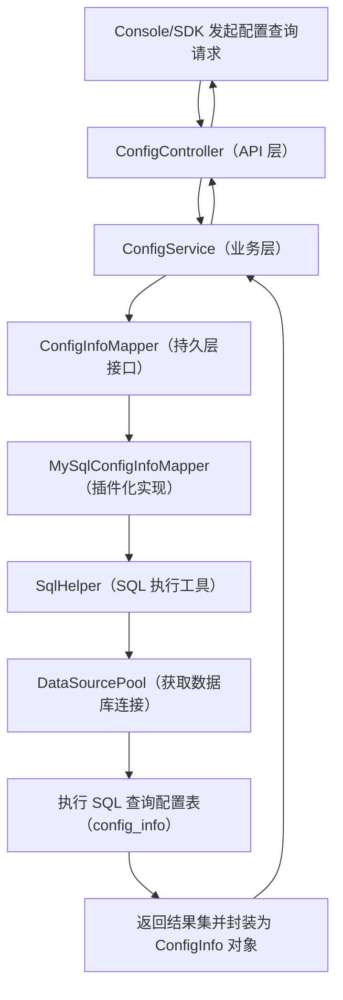

## 目录
- [Nacos 仓库 console 与 server 核心包执行逻辑](#nacos-仓库-console-与-server-核心包执行逻辑)
- [数据库交互核心代码位置](#数据库交互核心代码位置)






# Nacos 仓库 console 与 server 核心包执行逻辑
## 一、整体架构定位
Nacos 的 `console` 模块是控制台（前端+后端），负责可视化管理、配置展示、服务运维；`server` 模块（核心在 `core`/`distributed` 等子包）是 Nacos 服务端核心，提供配置中心、服务发现的分布式核心能力（如 Raft 共识、集群管理、协议处理）。两者的协作逻辑是：`console` 作为管控面，通过 HTTP 接口调用 `server` 提供的核心能力，同时 `server` 保障分布式场景下的一致性、高可用。

### 核心包边界
| 模块/包                | 核心职责                                                                 |
|-------------------------|--------------------------------------------------------------------------|
| console                 | 控制台后端（Controller/Proxy）+ 前端（console-ui），面向用户的交互层      |
| server/core/distributed | 分布式核心（Raft 共识、集群管理、RPC 通信），保障数据一致性和集群高可用   |
| console-ui              | 前端页面（React），渲染控制台UI、处理前端逻辑（如配置解析、代码示例展示） |

## 二、console 模块执行逻辑（后端+前端）
### 1. console 后端（Java）核心逻辑
以 `console/src/main/java/com/alibaba/nacos/console/controller/v3/ConsoleServerStateController.java` 为例，拆解执行链路：

#### （1）核心 Controller 执行流程
```mermaid
graph TD
    A[前端请求] --> B[/v3/console/server/* 接口]
    B --> C[ConsoleServerStateController]
    C --> D[依赖注入 ServerStateProxy]
    D --> E[Proxy 调用 server 核心层 API]
    E --> F[返回结构化结果（Result/ResponseEntity）]
    F --> G[前端渲染数据]
```

#### （2）关键组件原理解析
- **Controller 层**：
    - 基于 SpringMVC 实现，通过 `@RestController`/`@GetMapping` 暴露 HTTP 接口，处理前端的服务状态查询、公告获取、UI 引导信息查询等请求。
    - 入参校验：如 `getAnnouncement` 方法中校验 `language` 是否在 `SupportedLanguage` 范围内，保证参数合法性。
    - 结果封装：统一返回 `Result<T>` 或 `ResponseEntity`，适配前端的统一数据格式。

- **Proxy 层（ServerStateProxy）**：
    - 「门面模式」封装对 `server` 核心层的调用，解耦 Controller 与底层核心逻辑，便于后续扩展/替换底层实现。
    - 职责：屏蔽分布式细节，给控制台提供简洁的调用入口（如获取服务状态、公告内容）。

- **测试层（ConsoleServerStateControllerTest）**：
    - 基于 Mockito + Spring MockMvc 做单元测试，Mock `ServerStateProxy` 避免依赖真实集群，验证接口返回值、异常场景（如不支持的语言）。

### 2. console-ui 前端（React）核心逻辑
以 `console-ui/src/pages/AI/NewMcpServer/NewMcpServer.js`、`ShowCodeing` 组件为例，拆解执行逻辑：

#### （1）核心流程：配置解析与渲染


#### （2）关键逻辑原理解析
- **配置解析（convertServerConfigToPackages）**：
    - 兼容两种命令行格式：`command + args 分离`/`command 包含完整命令行`，通过 `parseCommandLine` 拆分命令与参数，适配不同的配置输入方式。
    - 「关注点分离」设计：将 runtime（运行时）参数与 package（包）参数分离，区分底层运行时配置和业务包配置，降低耦合。

- **代码示例展示（ShowCodeing/ShowServiceCodeing）**：
    - 硬编码多语言示例代码（Java/SpringBoot/Python/C#），通过模板替换（如 `${data.dataId}`）填充前端获取的配置参数，降低用户接入成本。
    - 「懒加载+按需渲染」：仅在用户打开弹窗时触发 `getData` 方法生成代码，避免初始化时的性能损耗。

- **McpDetail 页面渲染**：
    - 适配多版本/多端点/多安全配置：通过循环构建 `packageConfigs`/`endpoints` 数组，渲染多 Tab 卡片；
    - 折叠/展开逻辑：默认只展示核心配置字段，通过 `defaultSecurityCollapsed` 控制是否展开扩展字段，优化大屏展示体验。

## 三、server 核心包（以 distributed/raft 为例）执行逻辑
以 `core/src/main/java/com/alibaba/nacos/core/distributed/raft/utils/JRaftUtils.java` 为核心，解读 Nacos 分布式共识的实现逻辑：

### 1. Raft 核心执行流程
Nacos 基于 JRaft（蚂蚁金服开源的 Raft 实现）实现分布式一致性，JRaftUtils 是核心工具类，支撑 Raft 集群的初始化、通信、集群管理：


### 2. 关键逻辑原理解析
#### （1）RPC 服务初始化（initRpcServer）
- **序列化**：注册 Protobuf 序列化器（Log/WriteRequest/ReadRequest 等），保证 Raft 协议交互的二进制数据高效传输、跨语言兼容。
- **请求处理器**：注册 `NacosWriteRequestProcessor`（写请求）/`NacosReadRequestProcessor`（读请求），分离读写逻辑，适配 Raft 「读优化/写共识」的特性。
- **RPC 框架**：基于 gRPC 实现 JRaft 的 RPC 通信，保证集群节点间的低延迟、高可靠通信。

#### （2）Raft 存储目录初始化（initDirectory）
- **目录隔离**：为每个 Raft group 创建独立的 log/snapshot/meta-data 目录，避免多服务（配置中心/服务发现）的存储冲突。
- **容错处理**：通过 `DiskUtils.forceMkdir` 强制创建目录，异常时抛出 RuntimeException 终止启动，避免集群启动后存储目录缺失导致的数据丢失。

#### （3）集群加入（joinCluster）
- **首节点判断**：通过 `ServerMemberManager.isFirstIp()` 确保只有集群第一个节点执行「添加其他节点」逻辑，避免重复操作。
- **重试机制**：循环调用 `cliService.addPeer` 直到所有节点加入成功，适配节点启动顺序不一致的场景，保证集群最终一致性。
- **配置管理**：通过 `RouteTable` 获取集群配置，动态更新 Raft 集群的 Peer 列表，支撑集群扩缩容。

## 四、console 与 server 的协作原理
### 1. 通信链路


### 2. 核心协作原则
- **分层解耦**：console 不直接操作分布式核心逻辑，通过 Proxy 层调用 server API，符合「开闭原则」（扩展新功能时无需修改 console 代码）。
- **数据一致性**：console 仅做数据展示/转发，真正的一致性保障由 server 层的 Raft 协议实现，避免控制台成为一致性瓶颈。
- **前端适配**：console-ui 解析 server 返回的结构化配置（如 `serverConfig`），适配不同展示场景（多版本/多端点/多安全配置），提升用户体验。

## 五、核心设计思想总结
| 模块       | 核心设计思想                | 落地实现                                                                 |
|------------|-----------------------------|--------------------------------------------------------------------------|
| console    | 门面模式+关注点分离         | Proxy 封装底层调用、前端分离 runtime/package 参数、Controller 统一结果封装 |
| server/raft | 共识算法+存储隔离+重试机制  | JRaft 实现 Raft 共识、独立目录存储 Raft 数据、循环重试加入集群             |
| 整体       | 分层架构+高可用+用户体验    | console 作为管控面、server 作为数据面、前端适配多场景展示                 |

## 六、关键原理解读补充
### 1. Raft 共识算法在 Nacos 中的作用
Nacos 用 Raft 保证配置数据的分布式一致性：
- 写请求（如配置发布）：需经过 Raft 投票（半数以上节点确认），保证数据落地到多数节点后才返回成功；
- 读请求（如控制台查询配置）：可从本地节点读取（读优化），或走 Raft 线性读（强一致性读），兼顾性能与一致性。

### 2. console-ui 配置解析的容错设计
- 跳过无 command 的配置：避免无效配置导致前端渲染异常；
- 兼容 packageDef/packages 两种格式：适配不同版本的后端返回数据，提升前端兼容性；
- 环境变量格式化：将 `config.env` 转为数组并统一格式（name/value/format），便于前端统一渲染。

### 3. 控制台接口的兼容性设计
- 版本适配：`ConsoleServerStateController` 中 `versionSelections` 兼容 `isLatest`/`is_latest` 两种字段名，适配不同版本的后端数据；
- 语言适配：校验 `language` 参数，返回对应语言的公告/引导信息，支撑国际化。

[目录](#目录)


## 数据库交互核心代码位置
Nacos 与数据库交互的代码主要集中在 `server` 模块下的 **持久化层**，核心包/类分布如下（按功能模块划分）：

### 1. 核心包路径（Server 模块）
```
nacos-server/
├── core/src/main/java/com/alibaba/nacos/core/
│   ├── db/                # 数据库核心配置、数据源管理、SQL 工具类
│   │   ├── DataSourcePool.java       # 数据源连接池管理（HikariCP）
│   │   ├── DbConfig.java             # 数据库配置解析（适配 MySQL/Oracle/PostgreSQL）
│   │   ├── DbHealthCheckProcessor.java # 数据库健康检查
│   │   └── sql/                      # SQL 语句封装、分页工具
│   │       ├── SqlHelper.java        # 通用 SQL 执行工具（增删改查、分页）
│   │       └── SqlPaginationUtils.java # 分页查询封装
│   └── persistence/       # 各业务模块的数据库持久化实现
│       ├── config/        # 配置中心模块 DB 交互（配置元数据、历史记录）
│       │   ├── ConfigInfoAggrMapper.java    # 聚合配置 DB 映射
│       │   ├── ConfigInfoMapper.java        # 核心配置信息 DB 交互
│       │   └── impl/                        # Mapper 实现类（MyBatis）
│       ├── namespace/     # 命名空间 DB 交互
│       │   └── NamespaceMapper.java
│       └── user/          # 用户/权限 DB 交互
│           └── UserMapper.java
└── plugin/src/main/java/com/alibaba/nacos/plugin/datasource/
    ├── Constants.java     # 数据源插件常量（表名、字段名）
    ├── mapper/            # 插件化 Mapper 接口（适配不同数据库方言）
    │   ├── ConfigInfoMapper.java        # 插件化配置信息 Mapper
    │   └── HistoryConfigInfoMapper.java # 配置历史记录 Mapper
    └── impl/              # 不同数据库的实现（MySQL/Oracle/PostgreSQL）
        ├── mysql/
        │   ├── MySqlConfigInfoMapper.java
        │   └── MySqlHistoryConfigInfoMapper.java
        └── oracle/
            └── OracleConfigInfoMapper.java
```

### 2. 关键配置文件
数据库连接的配置/初始化代码在：
- `core/src/main/java/com/alibaba/nacos/core/env/DataSourceEnvironmentPostProcessor.java`：解析 `application.properties` 中的数据库配置（如 `spring.datasource.url`）；
- `core/src/main/resources/application.properties`：默认数据库配置模板（可通过外部配置覆盖）。

## 二、数据库交互核心执行逻辑
以「配置中心模块查询配置」为例，拆解完整的 DB 交互链路：

### 1. 核心流程（Mermaid 流程图）


### 2. 关键代码示例（核心交互逻辑）
#### （1）数据源初始化（DataSourcePool.java）
```java
// 核心逻辑：创建 HikariCP 连接池（高性能 JDBC 连接池）
public static DataSource createDataSource(DbConfig dbConfig) {
    HikariConfig hikariConfig = new HikariConfig();
    hikariConfig.setJdbcUrl(dbConfig.getUrl());
    hikariConfig.setUsername(dbConfig.getUsername());
    hikariConfig.setPassword(dbConfig.getPassword());
    // 连接池参数配置（核心：最大连接数、超时时间）
    hikariConfig.setMaximumPoolSize(dbConfig.getMaxActive());
    hikariConfig.setConnectionTimeout(dbConfig.getConnectTimeout());
    // 注册数据库驱动（适配 MySQL/Oracle）
    hikariConfig.setDriverClassName(DbType.getDriverClassName(dbConfig.getDbType()));
    return new HikariDataSource(hikariConfig);
}
```

#### （2）配置查询（MySqlConfigInfoMapper.java）
```java
// 插件化实现：MySQL 方言的配置查询
@Override
public ConfigInfo getConfigInfo(String dataId, String group, String tenant) {
    // SQL 语句封装（适配 MySQL 语法）
    String sql = "SELECT id, data_id, group_id, tenant_id, content, md5 " +
                 "FROM config_info WHERE data_id = ? AND group_id = ? AND tenant_id = ?";
    // 调用 SqlHelper 执行 SQL，封装结果为 ConfigInfo 对象
    return SqlHelper.queryOne(sql, new Object[]{dataId, group, tenant}, 
        rs -> {
            ConfigInfo configInfo = new ConfigInfo();
            configInfo.setId(rs.getLong("id"));
            configInfo.setDataId(rs.getString("data_id"));
            configInfo.setGroup(rs.getString("group_id"));
            configInfo.setTenant(rs.getString("tenant_id"));
            configInfo.setContent(rs.getString("content"));
            configInfo.setMd5(rs.getString("md5"));
            return configInfo;
        });
}
```

#### （3）通用 SQL 执行工具（SqlHelper.java）
```java
// 通用查询方法：封装 JDBC 操作，简化重复的连接/执行/关闭逻辑
public static <T> T queryOne(String sql, Object[] params, ResultSetExtractor<T> extractor) {
    // 从连接池获取连接
    try (Connection conn = DataSourcePool.getConn();
         PreparedStatement ps = conn.prepareStatement(sql)) {
        // 设置 SQL 参数
        for (int i = 0; i < params.length; i++) {
            ps.setObject(i + 1, params[i]);
        }
        // 执行查询并解析结果
        try (ResultSet rs = ps.executeQuery()) {
            if (rs.next()) {
                return extractor.extractData(rs);
            }
        }
    } catch (SQLException e) {
        throw new DbException("SQL execute failed: " + sql, e);
    }
    return null;
}
```

## 三、数据库交互设计原理
### 1. 插件化适配多数据库
- **核心思想**：通过「接口 + 多实现」适配不同数据库方言（MySQL/Oracle/PostgreSQL），符合「开闭原则」；
- **落地**：`ConfigInfoMapper` 为核心接口，`MySqlConfigInfoMapper`/`OracleConfigInfoMapper` 为不同数据库的实现类，通过 SPI 机制加载对应实现。

### 2. 连接池优化
- 使用 **HikariCP**（高性能 JDBC 连接池）作为默认连接池，相比传统的 C3P0/DBCP，性能提升 2-5 倍；
- 核心参数：`maximumPoolSize`（最大连接数）、`connectionTimeout`（连接超时）、`idleTimeout`（空闲连接回收），平衡性能与资源占用。

### 3. 防 SQL 注入
- 所有 SQL 操作均使用 `PreparedStatement` + 参数化查询，避免拼接 SQL 导致的注入风险；
- 核心工具类 `SqlHelper` 封装了所有 JDBC 操作，统一管控 SQL 执行规范。

### 4. 分库分表（高版本特性）
- Nacos 2.x 及以上版本支持配置表（config_info）的分表（按 data_id 哈希分表），核心代码在 `plugin/datasource/impl/mysql/ConfigInfoMapperByExample.java`；
- 分表逻辑：通过 `data_id` 的哈希值映射到不同分表（如 config_info_0 到 config_info_9），提升高并发下的查询性能。

### 5. 数据库健康检查
- `DbHealthCheckProcessor` 定时检查数据库连接可用性，若检测到数据库不可用，会触发告警并尝试重建连接池；
- 核心逻辑：每隔 5 秒执行 `SELECT 1` 测试连接，失败次数超过阈值则标记数据库异常。

## 四、总结
### 核心关键点
1. **代码位置**：数据库交互核心在 `server/core/db/`（数据源/工具）、`server/core/persistence/`（业务持久层）、`server/plugin/datasource/`（插件化数据库实现）；
2. **核心设计**：插件化适配多数据库、HikariCP 连接池优化、参数化查询防注入、分表提升性能；
3. **执行链路**：API 层 → 业务层 → 插件化 Mapper → SQL 工具 → 连接池 → 数据库，分层解耦且易于扩展。

### 扩展说明
- 若你需要修改数据库交互逻辑（如适配新数据库），只需实现 `plugin/datasource/mapper/` 下的对应接口，无需修改核心业务代码；
- Nacos 默认使用 MySQL，如需切换到 Oracle/PostgreSQL，只需修改 `application.properties` 中的 `spring.datasource.db-type` 并引入对应驱动依赖。


[目录](#目录)