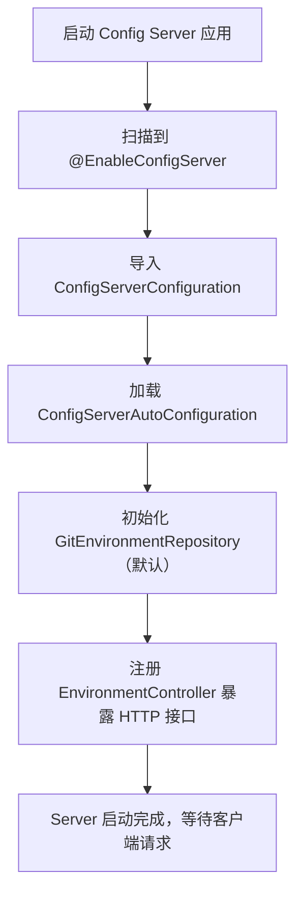

你想要深入理解 Spring Cloud Config 的源码实现，我会从**核心模块划分、关键类解析、核心流程（Server 启动/Client 拉取配置）、核心扩展点**四个维度，结合源码片段和执行链路，帮你穿透 Spring Cloud Config 的底层逻辑（基于 Spring Cloud 2022.0.x 版本，对应 Spring Boot 3.0+）。

### 核心定位先明确
Spring Cloud Config 的源码核心分为两大模块：
- `spring-cloud-config-server`：配置服务端，核心是「拉取 Git 配置 → 解析配置 → 暴露 HTTP 接口」；
- `spring-cloud-config-client`：配置客户端，核心是「启动时从 Server 拉取配置 → 融入 Spring Environment」；
  整体遵循「约定优于配置」，基于 Spring 原生的 `Environment`/`PropertySource` 抽象扩展，无侵入式集成。

---

## 一、源码核心模块与目录结构
Spring Cloud Config 的源码仓库：https://github.com/spring-cloud/spring-cloud-config
核心模块目录：
```
spring-cloud-config/
├── spring-cloud-config-server/  # 服务端核心
│   ├── src/main/java/org/springframework/cloud/config/server/
│   │   ├── config/            # 服务端自动配置类
│   │   ├── environment/       # 配置环境（Environment）核心处理
│   │   ├── git/               # Git 存储实现
│   │   ├── resource/          # HTTP 接口资源处理
│   │   └── EnableConfigServer.java  # 开启 Config Server 注解
├── spring-cloud-config-client/  # 客户端核心
│   ├── src/main/java/org/springframework/cloud/config/client/
│   │   ├── ConfigClientAutoConfiguration.java  # 客户端自动配置
│   │   ├── ConfigServicePropertySourceLocator.java  # 配置拉取核心类
│   │   └── ConfigClientProperties.java  # 客户端配置属性类
└── spring-cloud-config-core/     # 公共核心（如配置解析、加密解密）
```

---

## 二、Config Server 核心源码解析
### 1. 启动入口：@EnableConfigServer
```java
@Target(ElementType.TYPE)
@Retention(RetentionPolicy.RUNTIME)
@Documented
@Import(ConfigServerConfiguration.class)  // 导入核心配置类
public @interface EnableConfigServer {
}
```
- 核心作用：导入 `ConfigServerConfiguration`，触发 Config Server 自动配置；
- `ConfigServerConfiguration` 会导入 `ConfigServerImportSelector`，根据配置加载 Git/Native 等存储实现的配置类。

### 2. 自动配置核心：ConfigServerAutoConfiguration
```java
@Configuration(proxyBeanMethods = false)
@ConditionalOnWebApplication
@ConditionalOnConfigServer  // 仅当 @EnableConfigServer 生效时加载
@EnableConfigurationProperties(ConfigServerProperties.class)
@Import({ EnvironmentRepositoryConfiguration.class, ConfigServerEncryptionConfiguration.class })
public class ConfigServerAutoConfiguration {
    // 注册 Config Server 核心控制器（暴露 HTTP 接口）
    @Bean
    public EnvironmentController environmentController(EnvironmentRepository repository) {
        return new EnvironmentController(repository);
    }
}
```
- 核心逻辑：
  ① 加载 `EnvironmentRepositoryConfiguration`（配置存储仓库，如 Git/Native）；
  ② 注册 `EnvironmentController`（核心 HTTP 接口控制器，处理 `/{application}/{profile}/{label}` 请求）；
  ③ 加载加密解密配置（`ConfigServerEncryptionConfiguration`）。

### 3. 配置存储核心：EnvironmentRepository
`EnvironmentRepository` 是 Config Server 读取配置的核心接口，定义了「根据应用名/环境/分支获取配置」的规范：
```java
public interface EnvironmentRepository {
    // 核心方法：获取配置环境（包含所有 PropertySource）
    Environment findOne(String application, String profile, String label);
}
```
#### 核心实现类：GitEnvironmentRepository（默认）
```java
public class GitEnvironmentRepository extends AbstractScmEnvironmentRepository implements EnvironmentRepository {
    // Git 仓库配置（地址、分支、用户名密码等）
    private String uri;
    private String defaultLabel = "master";
    private String username;
    private String password;
    
    @Override
    public Environment findOne(String application, String profile, String label) {
        // 1. 解析 label（分支/标签/提交ID），默认用 defaultLabel
        String resolvedLabel = resolveLabel(label);
        // 2. 克隆/拉取 Git 仓库到本地临时目录
        File repo = cloneOrPullRepository(resolvedLabel);
        // 3. 扫描 Git 仓库中的配置文件（{application}-{profile}.yml 等）
        List<PropertySource> propertySources = scanRepoForProperties(repo, application, profile, resolvedLabel);
        // 4. 封装为 Environment 对象返回
        return new Environment(application, profile, resolvedLabel, propertySources, null);
    }
}
```
- 核心流程：
  ① 解析请求的 `label`（分支），默认 `master`；
  ② 克隆 Git 仓库到本地（首次）或拉取最新代码（非首次）；
  ③ 扫描本地仓库中符合 `{application}-{profile}.yml` 规则的配置文件；
  ④ 将配置文件解析为 `PropertySource`，封装为 `Environment` 对象返回。

### 4. HTTP 接口核心：EnvironmentController
```java
@RestController
public class EnvironmentController {
    private final EnvironmentRepository repository;
    
    // 处理 /{application}/{profile}/{label} 请求
    @GetMapping("/{application}/{profile}/{label:.*}")
    public Environment labelled(@PathVariable String application,
                                @PathVariable String profile,
                                @PathVariable String label) {
        return this.repository.findOne(application, profile, label);
    }
    
    // 简化接口：/{application}-{profile}.yml
    @GetMapping("/{name:.+}")
    public ResponseEntity<Resource> yaml(@PathVariable String name) {
        // 解析 name 为 application/profile/format，调用 findOne 获取配置，返回对应格式（yml/properties）
    }
}
```
- 核心作用：将 `EnvironmentRepository` 的结果通过 HTTP 接口暴露，支持多种请求路径（简化版/完整版），返回 JSON/YML/Properties 格式。

---

## 三、Config Client 核心源码解析
### 1. 自动配置核心：ConfigClientAutoConfiguration
```java
@Configuration(proxyBeanMethods = false)
@ConditionalOnClass({ RestTemplate.class, ConfigServicePropertySourceLocator.class })
@ConditionalOnProperty(value = "spring.cloud.config.enabled", matchIfMissing = true)
@EnableConfigurationProperties(ConfigClientProperties.class)
public class ConfigClientAutoConfiguration {
    // 注册配置拉取器（核心）
    @Bean
    @ConditionalOnMissingBean
    public ConfigServicePropertySourceLocator configServicePropertySourceLocator(ConfigClientProperties properties) {
        ConfigServicePropertySourceLocator locator = new ConfigServicePropertySourceLocator(properties);
        return locator;
    }
    
    // 注册引导配置处理器：将拉取的配置融入 Spring Environment
    @Bean
    public ConfigPropertySourceLocator configPropertySourceLocator(ConfigServicePropertySourceLocator locator) {
        return new ConfigPropertySourceLocator(locator);
    }
}
```
- 核心逻辑：
  ① 加载 `ConfigClientProperties`（封装 `spring.cloud.config` 配置，如 Server 地址、应用名、环境）；
  ② 注册 `ConfigServicePropertySourceLocator`（核心拉取类，调用 Server 接口获取配置）；
  ③ 注册 `ConfigPropertySourceLocator`，将拉取的配置融入 Spring `Environment`。

### 2. 配置拉取核心：ConfigServicePropertySourceLocator
```java
public class ConfigServicePropertySourceLocator implements PropertySourceLocator {
    private ConfigClientProperties properties;
    private RestTemplate restTemplate;
    
    @Override
    public PropertySource<?> locate(Environment environment) {
        // 1. 从 Spring 环境中获取客户端配置（application.name、profiles.active 等）
        ConfigClientProperties properties = resolveProperties(environment);
        // 2. 构建请求 URL：http://{uri}/{application}/{profile}/{label}
        String url = buildUrl(properties, environment);
        // 3. 发送 HTTP 请求到 Config Server，获取配置
        ResponseEntity<Environment> response = restTemplate.getForEntity(url, Environment.class);
        // 4. 将返回的 Environment 解析为 PropertySource
        List<PropertySource<?>> propertySources = convertToPropertySources(response.getBody());
        // 5. 封装为 CompositePropertySource 返回（融入 Spring Environment）
        return new CompositePropertySource("configService", propertySources);
    }
}
```
- 核心流程（客户端启动时）：
  ① 读取 `bootstrap.yml` 中的配置（`spring.application.name`/`spring.profiles.active`/`spring.cloud.config.uri`）；
  ② 构建请求 URL（如 `http://localhost:8888/order-service/dev/master`）；
  ③ 通过 `RestTemplate` 调用 Config Server 接口，获取 `Environment` 对象；
  ④ 将 `Environment` 中的 `PropertySource` 解析并封装为 `CompositePropertySource`；
  ⑤ Spring 启动时，将该 `PropertySource` 加入 `Environment`，优先级高于本地配置（可通过 `spring.cloud.config.override-none` 调整）。

### 3. 启动优先级：Bootstrap 上下文
客户端配置必须放在 `bootstrap.yml` 的核心原因：
Spring Cloud 启动时会创建「Bootstrap 上下文」（优先级高于应用上下文），`ConfigServicePropertySourceLocator` 会在 Bootstrap 阶段执行，确保在应用上下文初始化前拉取配置，避免本地配置覆盖远程配置。

核心类：`BootstrapApplicationListener`（监听 Spring 启动事件，创建 Bootstrap 上下文）。

---

## 四、核心流程全链路（Server + Client）
### 1. Config Server 启动流程


### 2. Config Client 拉取配置流程
```mermaid
graph TD
    A[启动 Client 应用] --> B[Bootstrap 上下文初始化]
    B --> C[加载 ConfigClientAutoConfiguration]
    C --> D[ConfigServicePropertySourceLocator 执行 locate() 方法]
    D --> E[构建请求 URL（application/profile/label）]
    E --> F[调用 Server 的 /{application}/{profile}/{label} 接口]
    F --> G[Server 侧：GitEnvironmentRepository.findOne() 读取 Git 配置]
    G --> H[Server 返回 Environment 对象（包含配置）]
    H --> I[Client 解析为 PropertySource，融入 Spring Environment]
    I --> J[应用上下文初始化，可通过 @Value 读取配置]
```

---

## 五、核心扩展点（自定义开发）
### 1. 自定义存储实现（替代 Git）
实现 `EnvironmentRepository` 接口，替换默认的 `GitEnvironmentRepository`：
```java
// 自定义存储实现（如数据库存储）
public class DbEnvironmentRepository implements EnvironmentRepository {
    @Override
    public Environment findOne(String application, String profile, String label) {
        // 从数据库读取配置，封装为 Environment 对象
        List<PropertySource> propertySources = new ArrayList<>();
        propertySources.add(new MapPropertySource("db-config", readConfigFromDb(application, profile)));
        return new Environment(application, profile, label, propertySources, null);
    }
    
    private Map<String, Object> readConfigFromDb(String application, String profile) {
        // 数据库查询逻辑
    }
}

// 注册为 Bean，替换默认实现
@Configuration
public class CustomEnvironmentRepositoryConfig {
    @Bean
    public EnvironmentRepository dbEnvironmentRepository() {
        return new DbEnvironmentRepository();
    }
}
```

### 2. 自定义配置解析规则
继承 `AbstractEnvironmentRepository`，重写 `scanRepoForProperties` 方法，自定义配置文件扫描规则（如支持自定义命名格式）。

### 3. 客户端配置拉取拦截
实现 `PropertySourceLocator` 接口，在拉取配置后添加自定义处理（如配置加密解密、参数替换）。

---

## 六、核心源码避坑点
### 1. Git 仓库本地缓存
`GitEnvironmentRepository` 会将 Git 仓库克隆到本地临时目录（默认 `${user.home}/.gitconfig`），生产环境需配置 `basedir` 指定固定目录，避免临时文件丢失：
```yaml
spring:
  cloud:
    config:
      server:
        git:
          basedir: /data/config-server/git-repo  # 自定义本地缓存目录
```

### 2. 客户端配置优先级
客户端拉取的远程配置优先级默认高于本地配置，如需调整：
```yaml
spring:
  cloud:
    config:
      override-none: true        # 远程配置不覆盖本地配置
      override-system-properties: false  # 不覆盖系统属性
```

### 3. 动态刷新核心
客户端动态刷新依赖 `RefreshScope`，核心类是 `RefreshScopeRefresher`，刷新时会重新调用 `ConfigServicePropertySourceLocator.locate()` 拉取最新配置，并更新 `Environment` 中的 `PropertySource`。

---

## 总结（核心关键点）
1. **核心接口**：
    - Server 侧：`EnvironmentRepository`（配置存储）、`EnvironmentController`（HTTP 接口）；
    - Client 侧：`PropertySourceLocator`（配置拉取）、`ConfigClientProperties`（客户端配置）；
2. **核心流程**：
    - Server 启动：`@EnableConfigServer` → 初始化 Git 仓库 → 暴露 HTTP 接口；
    - Client 拉取：Bootstrap 上下文 → 调用 Server 接口 → 解析配置融入 Spring Environment；
3. **扩展能力**：
    - 自定义存储（实现 `EnvironmentRepository`）、自定义解析规则、配置优先级调整；
4. **核心设计**：
    - 基于 Spring 原生 `Environment`/`PropertySource` 抽象，无侵入式集成；
    - Bootstrap 上下文保证配置拉取优先级；
    - 模块化设计（Git/Native/加密解密解耦）。

如果需要「自定义 EnvironmentRepository 完整示例」或「动态刷新源码解析」，我可以补充对应的代码片段和执行链路，帮你落地自定义扩展。


