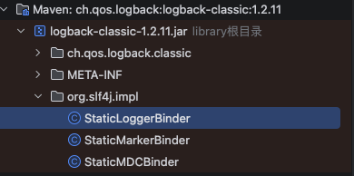

这张图展示的是 **logback-classic-1.2.11.jar** 内部的结构，核心是 `org.slf4j.impl` 包下的几个类，它们正是 SLF4J 1.7.x 及之前版本绑定 Logback 的关键实现。

---

### 1. 核心类的作用

#### ① `StaticLoggerBinder`
这是 **SLF4J 1.7.x 绑定机制的核心入口**：
- 它实现了 SLF4J 定义的绑定接口，提供 `getSingleton()` 方法。
- SLF4J 在初始化时，会通过反射查找并加载这个类，从而完成与 Logback 的绑定。
- 你之前看到的 `NoClassDefFoundError: org.slf4j.impl.StaticLoggerBinder` 错误，就是因为找不到这个类（或版本不兼容）。

#### ② `StaticMarkerBinder`
负责 SLF4J 的 **Marker 功能绑定**：
- Marker 是 SLF4J 提供的日志标记功能，用于对日志进行分类和过滤（如业务标签、链路追踪 ID）。
- 这个类提供了 `getSingleton()` 方法，为 Logback 提供 Marker 的具体实现。

#### ③ `StaticMDCBinder`
负责 SLF4J 的 **MDC（Mapped Diagnostic Context）功能绑定**：
- MDC 用于在多线程环境中传递上下文信息（如用户ID、请求ID），日志输出时可以自动携带。
- 这个类提供了 `getSingleton()` 方法，为 Logback 提供 MDC 的具体实现。

---

### 2. 为什么这些类在 `org.slf4j.impl` 包下？

这是 SLF4J 1.7.x 及之前版本的设计约定：
- SLF4J API 本身不包含这些实现类，它只定义了接口和查找规则。
- 每个日志实现框架（如 Logback、Log4j）都必须在 `org.slf4j.impl` 包下提供这些静态绑定类。
- SLF4J 在启动时，会通过类加载器扫描这个包，找到这些类来完成绑定。

---

### 3. 与你之前问题的关联

你之前遇到的报错：
```
SLF4J: Class path contains SLF4J bindings targeting slf4j-api versions 1.7.x or earlier.
SLF4J: Ignoring binding found at [jar:file:.../logback-classic-1.2.11.jar!/org/slf4j/impl/StaticLoggerBinder.class]
```
原因就是：
- 你使用的 `slf4j-api:2.0.17` 是 2.x 版本，它不再使用 `StaticLoggerBinder` 这种静态绑定机制，而是改用了基于 SPI 的新机制。
- 而 `logback-classic:1.2.11` 是 1.2.x 版本，它只提供了旧的静态绑定类，不支持新的 SPI 机制。
- 因此，SLF4J 2.x 会忽略这个旧的绑定类，导致绑定失败，降级为 NOP 模式。

---

### 总结

这张图里的三个类，是 **SLF4J 1.7.x 与 Logback 绑定的“三驾马车”**：
- `StaticLoggerBinder`：负责核心日志功能的绑定。
- `StaticMarkerBinder`：负责 Marker 功能的绑定。
- `StaticMDCBinder`：负责 MDC 功能的绑定。

它们的存在，是 SLF4J 1.7.x 能找到并使用 Logback 的前提，但在 SLF4J 2.x 中，这套机制被彻底淘汰了。

---

要不要我帮你对比一下 **SLF4J 1.7.x 静态绑定** 和 **2.x SPI 绑定** 的完整流程，让你更清晰地理解版本升级带来的变化？


