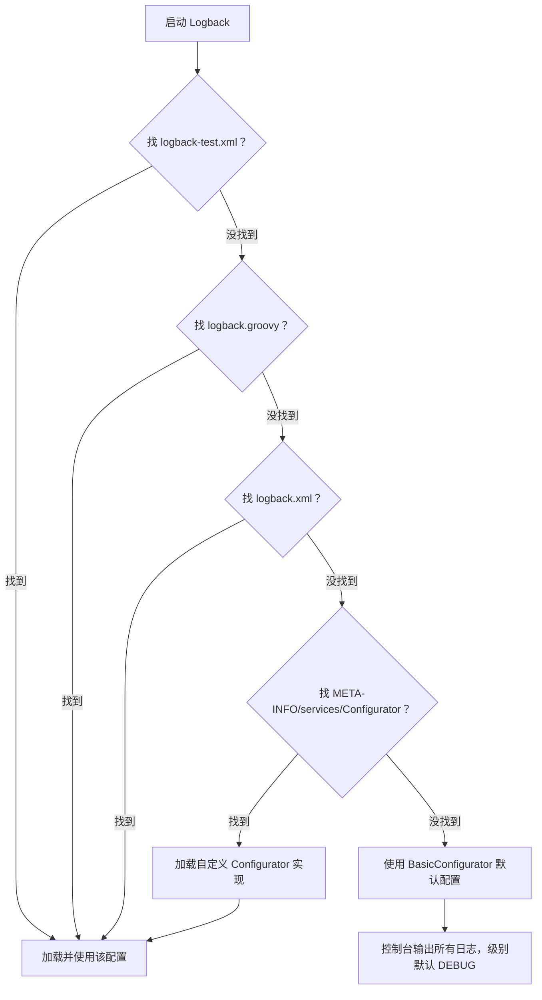

你想让我拆解这段关于 Logback 配置的核心说明——它主要讲了 Logback 的**配置方式**、**初始化加载顺序**、**环境区分技巧**和**启动性能优化**，我会用通俗的语言+实操示例讲清楚每一个配置细节，帮你理解“Logback 是如何找到并加载配置的”以及实际开发中该怎么用。

### 核心结论先明确
这段内容的核心是：**Logback 提供了灵活的配置方式和固定的加载优先级，既能适配测试/生产环境的区分，也能通过定制化优化启动性能，且保证无配置时也有基础控制台输出**。

---

## 一、配置 Logback 的核心背景：为什么需要规范配置？
```
在应用程序当中使用日志语句需要耗费大量的精力。根据调查，大约有百分之四的代码用于打印日志。即使在一个中型应用的代码当中也有成千上万条日志的打印语句。考虑到这种情况，我们需要使用工具来管理这些日志语句。
```
- **核心痛点**：日志代码占比高、数量多，如果硬编码（比如在代码里写死日志级别、输出目的地），修改时需要改代码、重新编译部署，效率极低；
- **解决方案**：Logback 提供“配置文件/编程式”管理方式，无需改代码，仅修改配置就能调整日志的级别、输出目的地、格式等，降低维护成本。

## 二、Logback 的配置方式：3 种核心方式
```
可以通过编程或者配置 XML 脚本或者 Groovy 格式的方式来配置 logback。对于已经使用 log4j 的用户可以通过这个工具来把 log4j.properties 转换为 logback.xml。
```
### 1. 三种配置方式对比

| 配置方式 | 格式 | 优点 | 缺点 | 适用场景 |
|----------|------|------|------|----------|
| XML 配置 | logback.xml/logback-test.xml | 结构化强、易读、支持热加载 | 语法稍繁琐 | 99% 的生产/测试场景（主流） |
| Groovy 配置 | logback.groovy | 语法简洁、支持动态逻辑（如条件判断） | 性能略低、Groovy 依赖 | 需动态配置的场景（小众） |
| 编程式配置 | Java 代码 | 灵活性最高、可动态生成配置 | 硬编码、修改需重新编译 | 框架封装、动态配置日志的场景 |
| Log4j 迁移 | 工具转换 | 无缝迁移 Log4j 项目 | 转换后需微调 | Log4j 迁移到 Logback 的场景 |

### 2. 示例（最常用的 XML 配置）
```xml
<!-- logback.xml 基础示例 -->
<configuration>
    <!-- 控制台输出 Appender -->
    <appender name="CONSOLE" class="ch.qos.logback.core.ConsoleAppender">
        <encoder>
            <pattern>%d{yyyy-MM-dd HH:mm:ss} [%thread] %-5level %logger{36} - %msg%n</pattern>
        </encoder>
    </appender>
    
    <!-- 根 Logger 配置 -->
    <root level="INFO">
        <appender-ref ref="CONSOLE" />
    </root>
</configuration>
```

## 三、Logback 的初始化加载顺序：固定优先级（关键）
```
以下是 logback 的初始化步骤：
logback 会在类路径下寻找名为 logback-test.xml 的文件。
如果没有找到，logback 会继续寻找名为 logback.groovy 的文件。
如果没有找到，logback 会继续寻找名为 logback.xml 的文件。
如果没有找到，将会通过 JDK 提供的 ServiceLoader 工具在类路径下寻找文件 META-INFO/services/ch.qos.logback.classic.spi.Configurator，该文件的内容为实现了 Configurator 接口的实现类的全限定类名。
如果以上都没有成功，logback 会通过 BasicConfigurator 为自己进行配置，并且日志将会全部在控制台打印出来。
```
### 1. 加载顺序可视化（优先级从高到低）


### 2. 关键步骤解析
- **步骤 1：logback-test.xml**  
  测试环境专属配置文件，Maven/Gradle 中放在 `src/test/resources` 下，打包时不会被包含到生产包中，实现“测试/生产配置隔离”。
- **步骤 2：logback.groovy**  
  Groovy 格式的配置，语法比 XML 简洁（比如支持 `if-else` 动态配置），但需要引入 Groovy 依赖，使用较少。
- **步骤 3：logback.xml**  
  生产环境核心配置文件，放在 `src/main/resources` 下，打包后在类路径中，是最常用的配置方式。
- **步骤 4：ServiceLoader 加载自定义 Configurator**  
  进阶用法：自定义配置加载逻辑，比如从数据库/配置中心读取日志配置。  
  示例：
    1. 创建 `META-INFO/services/ch.qos.logback.classic.spi.Configurator` 文件；
    2. 文件内容写自定义实现类全限定名：`com.example.MyLogbackConfigurator`；
    3. 实现 `Configurator` 接口，重写 `configure` 方法自定义配置。
- **步骤 5：BasicConfigurator 默认配置**  
  兜底方案：无任何配置时，Logback 会自动创建一个控制台 Appender，日志级别为 DEBUG，保证“至少能在控制台看到日志”，避免日志完全丢失。

### 3. 环境区分实操（Maven 示例）
```
如果你使用的是 maven，你可以在 src/test/resources 下新建 logback-test.xml。maven 会确保它不会被生成。所以你可以在测试环境中给配置文件命名为 logback-test.xml，在生产环境中命名为 logback.xml。
```
- **测试环境**：`src/test/resources/logback-test.xml`（测试时加载，优先级更高）；
- **生产环境**：`src/main/resources/logback.xml`（打包后加载，测试环境无该文件时才会用）；
- **Maven 原理**：`src/test/resources` 是测试类路径，`src/main/resources` 是主类路径，测试时测试类路径优先级更高，打包时只会包含 `src/main/resources` 的文件。

## 四、启动性能优化：减少 Joran 解析耗时
```
FAST START-UP Joran 解析给定的配置文件大概需要耗费 100 毫秒。为了减少启动的世间安，你可以使用 ServiceLoader 来加载自定义的 Configurator，并使用 BasicConfigurator 作为一个好的起点（个人的理解是通过继承这个类）。
```
### 1. 性能痛点
- Logback 默认用 **Joran**（Logback 内置的配置解析器）解析 XML/Groovy 配置，耗时约 100 毫秒；
- 对于微服务/高频重启的应用，100 毫秒的启动耗时可能需要优化。

### 2. 优化方案：自定义 Configurator
- **核心思路**：绕过 Joran 解析配置文件，直接通过代码编程式配置 Logback，减少解析耗时；
- **实操步骤**：
    1. 继承 `BasicConfigurator`（或实现 `Configurator`）；
    2. 重写 `configure` 方法，用代码创建 Appender、设置 Logger 级别；
    3. 通过 ServiceLoader 加载该自定义类；
- **示例代码**：
  ```java
  public class FastLogbackConfigurator extends BasicConfigurator {
      @Override
      public void configure(LoggerContext lc) {
          // 清空默认配置
          lc.reset();
          // 编程式创建控制台 Appender
          ConsoleAppender<ILoggingEvent> appender = new ConsoleAppender<>();
          appender.setContext(lc);
          appender.setName("CONSOLE");
          // 设置编码器
          PatternLayoutEncoder encoder = new PatternLayoutEncoder();
          encoder.setContext(lc);
          encoder.setPattern("%d [%thread] %-5level %logger - %msg%n");
          encoder.start();
          appender.setEncoder(encoder);
          appender.start();
          // 设置根 Logger
          Logger rootLogger = lc.getLogger(Logger.ROOT_LOGGER_NAME);
          rootLogger.addAppender(appender);
          rootLogger.setLevel(Level.INFO);
      }
  }
  ```
- **性能收益**：编程式配置无需解析 XML，启动耗时可从 100 毫秒降到 10 毫秒以内，适合对启动速度要求高的场景。

---

### 总结
这段配置说明的核心关键点可概括为：
1. **配置方式**：支持 XML/Groovy/编程式，XML 是主流，Log4j 可工具迁移；
2. **加载顺序**：logback-test.xml > logback.groovy > logback.xml > 自定义 Configurator > BasicConfigurator 兜底；
3. **环境隔离**：Maven 中用 `src/test/resources/logback-test.xml` 区分测试配置，避免污染生产；
4. **性能优化**：解析 XML 耗时约 100ms，可通过自定义 Configurator 编程式配置减少启动耗时；
5. **兜底保障**：无任何配置时，Logback 自动用 BasicConfigurator 输出控制台日志，保证日志不丢失。

补充：实际开发中，99% 的场景只需关注「logback-test.xml（测试）+ logback.xml（生产）」的配置方式，性能优化仅在微服务/高频重启场景下需要考虑。


