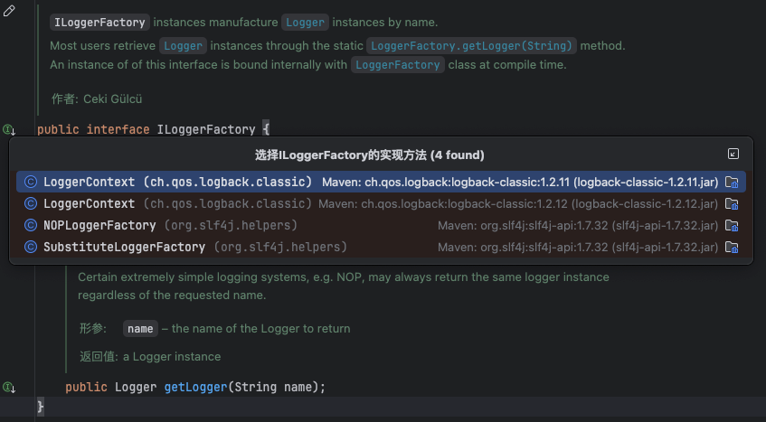

你想让我解释 SLF4J 核心接口 `ILoggerFactory` 的定义、作用和设计意图，这个接口是 SLF4J 实现“日志门面”解耦的关键。

### 接口整体功能总结
`ILoggerFactory` 是 SLF4J 定义的**日志工厂标准接口**，它规定了“按名称创建/获取 Logger 实例”的统一规则。不同的日志实现框架（如 Logback、Log4j2）只需实现这个接口，就能接入 SLF4J 门面，让用户通过统一的 `LoggerFactory` 调用不同日志框架的 Logger，这也是 SLF4J 实现“面向接口编程、解耦具体日志实现”的核心。

---

### 逐部分详细解释

#### 1. 类注释解读（核心设计思想）
```java
/**
 * <code>ILoggerFactory</code> instances manufacture {@link Logger}
 * instances by name.
 * 
 * <p>Most users retrieve {@link Logger} instances through the static
 * {@link LoggerFactory#getLogger(String)} method. An instance of of this
 * interface is bound internally with {@link LoggerFactory} class at 
 * compile time. 
 * 
 * @author Ceki G&uuml;lc&uuml;
 */
```
- **核心含义**：
    1. `ILoggerFactory` 的实例负责“按名称生产 Logger 实例”（工厂模式）；
    2. 普通用户无需直接使用这个接口，而是通过 `LoggerFactory.getLogger()` 静态方法获取 Logger（底层会委托给该接口的实现类）；
    3. 该接口的具体实现类会在编译/初始化阶段与 `LoggerFactory` 绑定（比如 Logback 的 `LoggerContext` 实现了这个接口，SLF4J 绑定 Logback 后，`LoggerFactory` 就会调用 `LoggerContext.getLogger()`）。
- **设计模式**：典型的**工厂方法模式** + **接口隔离原则**，SLF4J 只定义“生产 Logger”的规则，具体生产逻辑由各日志框架实现。

#### 2. 接口方法定义
```java
public Logger getLogger(String name);
```
这是接口唯一的核心方法，负责“按名称返回 Logger 实例”，方法注释里明确了 4 个关键规则：

##### 规则1：名称参数的特殊值——ROOT 日志器
> If the name parameter is equal to {@link Logger#ROOT_LOGGER_NAME}, that is the string value "ROOT" (case insensitive), then the root logger of the underlying logging system is returned.
- 当传入的 `name` 是 `Logger.ROOT_LOGGER_NAME`（即字符串 "ROOT"，大小写不敏感）时，返回底层日志框架的**根日志器（root logger）**；
- 根日志器是所有 Logger 的父级，默认配置（如日志级别、Appender）会被所有子 Logger 继承（比如 Logback 的 `rootLogger`、Log4j 的 `root`）。

##### 规则2：禁止空名称
> Null-valued name arguments are considered invalid.
- 传入 `null` 作为名称是非法的，实现类必须处理这种情况（通常抛出 `NullPointerException` 或返回默认 Logger）；
- 这是 SLF4J 强制的规范，避免各日志框架对“空名称”的处理不一致。

##### 规则3：简单日志实现的特例
> Certain extremely simple logging systems, e.g. NOP, may always return the same logger instance regardless of the requested name.
- 对于极简的日志实现（如 NOP 无操作日志），无论传入什么名称，都可以返回同一个 Logger 实例；
- 因为 NOP 日志的核心是“不输出任何内容”，无需区分不同名称的 Logger，这样能减少对象创建开销。

##### 参数与返回值
| 元素         | 说明                                                                 |
|--------------|----------------------------------------------------------------------|
| `name` 参数  | Logger 的名称（通常是类的全限定名，如 `com.example.HelloWorld`），用于区分不同 Logger |
| 返回值       | 符合 SLF4J 规范的 `Logger` 实例（底层是具体框架的 Logger 适配类）|

#### 3. 实际应用示例（Logback 的实现）
Logback 是 SLF4J 的官方实现，它的 `LoggerContext` 类实现了 `ILoggerFactory`，核心逻辑如下：
```java
// Logback 中的实现（简化版）
public class LoggerContext implements ILoggerFactory {
    // 存储名称到 Logger 的映射
    private final Map<String, Logger> loggerMap = new ConcurrentHashMap<>();
    // 根日志器
    private final Logger rootLogger;

    @Override
    public Logger getLogger(String name) {
        if (name == null) {
            throw new NullPointerException("Logger name cannot be null");
        }
        // 如果是 ROOT，返回根日志器
        if (Logger.ROOT_LOGGER_NAME.equalsIgnoreCase(name)) {
            return rootLogger;
        }
        // 按名称查找/创建 Logger（ConcurrentHashMap 保证线程安全）
        Logger logger = loggerMap.get(name);
        if (logger == null) {
            logger = new Logger(name, this); // 创建 Logback 自定义的 Logger
            loggerMap.put(name, logger);
        }
        return logger;
    }
}
```
- SLF4J 绑定 Logback 后，`LoggerFactory.getLogger("xxx")` 底层会调用 `LoggerContext.getLogger("xxx")`；
- 最终返回的 `Logger` 是 Logback 适配 SLF4J `Logger` 接口的实现类，保证用户调用的是统一接口，底层却是 Logback 的逻辑。

#### 4. 与 NOP 实现的对比（无操作日志）
NOP 是 SLF4J 提供的极简实现，它的 `NOPLoggerFactory` 实现 `ILoggerFactory` 时，无论传入什么名称，都返回同一个 `NOPLogger` 实例：
```java
// NOP 实现（简化版）
public class NOPLoggerFactory implements ILoggerFactory {
    private static final Logger NOP_LOGGER = new NOPLogger();

    @Override
    public Logger getLogger(String name) {
        return NOP_LOGGER; // 所有名称都返回同一个无操作 Logger
    }
}
```
- 这符合接口注释中“简单日志系统可返回同一个实例”的规则；
- 当 SLF4J 找不到任何日志实现时，就会使用这个 NOP 实现，所有日志调用都无操作。

---

### 总结
`ILoggerFactory` 接口的核心价值和关键点可概括为：
1. **统一标准**：定义了“按名称获取 Logger”的统一规则，让不同日志框架能接入 SLF4J 门面；
2. **解耦核心**：用户只依赖 SLF4J 的接口，无需关心底层是 Logback/Log4j，实现“切换日志框架不修改业务代码”；
3. **规则约束**：明确了 ROOT 日志器、空名称、极简实现的处理规则，保证各日志框架的行为一致性。

补充：这个接口是 SLF4J “门面模式”的核心体现——上层业务代码面向 `ILoggerFactory`/`Logger` 接口编程，下层日志框架实现接口，中间通过 SLF4J 的绑定机制连接，完美隔离了接口与实现。


