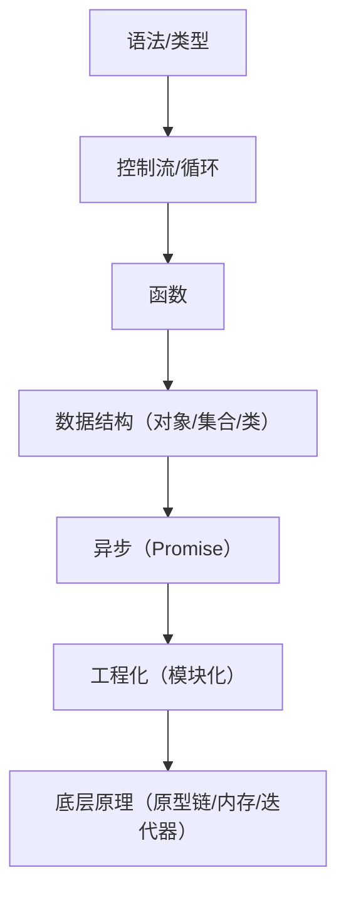

## 目录
- [1](#1)
- [2](#2)

# 1

**JavaScript Guide（JavaScript 指南）** 是 MDN Web Docs 提供的核心学习资源，旨在为开发者提供从入门到精通的 JavaScript 语言全景图。
Guide 是一个结构化的知识体系，涵盖了语法、类型、控制流、异步编程、模块化等所有核心概念。

结合 **2025-2026 年的最新标准（ES2025/ES2026）**，以下是对 JavaScript Guide 核心内容的详细解释及其背后的底层原理深度剖析。

---

### 一、JavaScript Guide 的核心架构与详解

指南通常分为三个层次：**基础语法**、**核心机制**、**高级特性**。

#### 1. 基础层：语法与类型 (Grammar and Types)
*   **内容**：变量声明 (`let`, `const`, `var`)、数据类型（原始类型 vs 引用类型）、字面量、严格模式。
*   **关键点**：
    *   **TDZ (暂时性死区)**：`let` 和 `const` 在声明前访问会报错，而 `var` 会返回 `undefined`。
    *   **类型系统**：JS 是`动态弱类型语言`，但内部有严格的`类型标签`。

#### 2. 控制流与函数 (Control Flow & Functions)
*   **内容**：条件判断、循环、异常处理 (`try...catch`)、函数定义、闭包、箭头函数。
*   **新特性 (ES2025+)**：
    *   **Promise.try()**：统一同步和异步错误的处理模式，无需再写 `try { sync(); } catch(...)`.
    *   **管道操作符 (Pipeline Operator, 提案阶段)**：`value |> fn1 |> fn2`，让数据流更清晰。

#### 3. 数据结构与集合 (Collections)
*   **内容**：数组、对象、`Map`/`Set`、`WeakMap`/`WeakSet`、Typed Arrays。
*   **新特性 (ES2025)**：
    *   **Record & Tuple (提案/部分实现)**：不可变的复合数据结构，解决对象/数组引用相等性问题。
    *   **JSON Modules**：原生支持 `import data from './data.json'`，无需额外 loader。

#### 4. 异步编程 (Asynchronous JavaScript)
*   **内容**：回调、Promise、`async/await`、事件循环。
*   **底层核心**：微任务队列 (Microtasks) 与 宏任务队列 (Macrotasks) 的调度。

#### 5. 面向对象与原型 (Objects & Classes)
*   **内容**：原型链、类 (`class`)、继承 (`extends`)、Getter/Setter。
*   **本质**：`class` 只是语法糖，底层依然是基于原型的委托机制。

#### 6. 模块化 (Modules)
*   **内容**：ES Modules (`import`/`export`)、动态导入 (`import()`)。
*   **新特性**：**Import Attributes** (原 Import Assertions)，允许在导入时指定元数据（如 `import json from './data.json' with { type: 'json' }`）。

#### 7. 资源管理 (Resource Management - ES2025 重点)
*   **新特性**：`using` 和 `await using` 声明。
*   **作用**：自动管理资源生命周期（如文件句柄、数据库连接），类似其他语言的 `try-with-resources` 或 `using` 语句，基于 **Disposable Stack** 协议。

---

### 二、背后/底层原理深度剖析

理解 Guide 中的概念，必须深入 JavaScript 引擎（如 V8, SpiderMonkey）的内部运作机制。

#### 1. 执行上下文与作用域链 (Execution Context & Scope Chain)
*   **现象**：为什么`内部函数可以访问外部变量`（闭包）？为什么 `let` 有 TDZ？
*   **底层原理**：
    *   **执行上下文栈**：每次函数调用都会压入一个上下文，包含 **变量环境 (Variable Environment)** 和 **词法环境 (Lexical Environment)**。
    *   **词法环境记录**：`let`/`const` 存储在词法环境记录中，初始状态为 `uninitialized`。引擎在访问时会检查标志位，若未初始化则抛出 ReferenceError（TDZ 的本质）。
    *   **闭包实现**：当函数返回时，其对应的词法环境不会被销毁，而是被返回的函数对象引用。引擎通过维护一个指向外部环境的指针链（Scope Chain）来实现变量查找。

#### 2. 原型链与属性查找 (Prototype Chain & Property Lookup)
*   **现象**：对象访问属性时，如果自身没有，为什么会去原型上找？
*   **底层原理**：
    *   **内部槽 `[[Prototype]]`**：每个对象都有一个隐藏的内部槽，指向另一个对象（即原型）。
    *   **查找算法**：当执行 `obj.prop` 时，引擎首先检查 `obj` 自身的属性表（Hash Map 或 隐藏类结构）。若未找到，则沿着 `[[Prototype]]` 链递归查找，直到原型为 `null`。
    *   **优化 (Hidden Classes)**：V8 引擎为了加速查找，会为具有相同属性结构的对象创建“隐藏类”（Hidden Class）。属性访问被优化为固定的内存偏移量读取，而非动态字符串匹配。但如果动态添加/删除属性，会导致隐藏类变更，触发去优化（Deoptimization）。

#### 3. 事件循环与微任务 (Event Loop & Microtasks)
*   **现象**：为什么 `Promise.then` 比 `setTimeout` 先执行？
*   **底层原理**：
    *   **调用栈 (Call Stack)**：执行同步代码。
    *   **微任务队列 (Microtask Queue)**：存储 `Promise` 回调、`MutationObserver`、`queueMicrotask`。**关键规则**：每当调用栈清空，引擎会**立即**清空整个微任务队列，然后才进行渲染或处理宏任务。
    *   **宏任务队列 (Macrotask Queue)**：存储 `setTimeout`, `setInterval`, I/O 回调。
    *   **检查点 (Checkpoints)**：JS 引擎在特定检查点（如 async/await 挂起后、宏任务结束后）会优先处理微任务。这保证了异步操作的可预测性。

#### 4. 垃圾回收机制 (Garbage Collection)
*   **现象**：为什么内存会自动释放？什么是内存泄漏？
*   **底层原理**：
    *   **分代回收 (Generational GC)**：对象分为新生代（短命对象）和老生代（长命对象）。新生代使用快速算法（如 Scavenger），老生代使用标记 - 清除（Mark-Sweep）或标记 - 整理（Mark-Compact）。
    *   **根集合 (Roots)**：GC 从全局对象、当前调用栈中的局部变量等“根”开始遍历。任何不可达的对象都被视为垃圾。
    *   **WeakMap/WeakSet**：它们持有的是**弱引用**。即使键值对在 WeakMap 中，如果外部没有其他强引用指向该键，GC 依然会回收该键，从而防止内存泄漏（常用于缓存、DOM 节点关联数据）。

#### 5. 模块系统的静态分析 (Module Static Analysis)
*   **现象**：为什么 `import` 必须放在文件顶部？为什么模块代码默认严格模式？
*   **底层原理**：
    *   **编译时链接**：ES Modules 在代码执行前（编译/解析阶段）就进行依赖分析和链接。引擎需要静态确定依赖图，以便进行树摇（Tree-shaking）和并行加载。
    *   **独立作用域**：每个模块都有自己独立的顶级作用域，不会污染全局对象 (`window`)。
    *   **Live Bindings**：`import` 引入的不是值的拷贝，而是对导出变量的**实时引用**。修改源模块的变量，导入方会立即看到变化（底层通过引用指针实现）。

#### 6. 资源管理协议 (Disposable Stack Protocol - ES2025)
*   **现象**：`using` 关键字如何自动清理资源？
*   **底层原理**：
    *   **Symbol.dispose**：对象只要实现了 `[Symbol.dispose]()` 方法，就被视为可处置资源。
    *   **显式资源管理**：当代码块执行完毕（正常结束或抛出异常），引擎会自动按**后进先出 (LIFO)** 的顺序调用栈中所有 `using` 声明对象的 `dispose` 方法。
    *   **AsyncDisposableStack**：对于异步资源（如网络流），使用 `await using`，引擎会在退出作用域时 `await` 对象的 `[Symbol.asyncDispose]()` 方法。这解决了 `try...finally` 写法冗长且易错的问题。

---

### 三、学习路径建议 (基于 Guide 结构)

1.  **入门阶段**：重点掌握 **Grammar and types** 和 **Control flow**。理解 JS 的动态类型和隐式转换陷阱。
2.  **进阶阶段**：深入 **Functions** (闭包是难点) 和 **Promises**。必须手写 Promise 或深入理解微任务机制。
3.  **高阶阶段**：研究 **Working with objects** (原型链本质)、**Iterators and generators** (生成器是异步流的基石) 以及最新的 **Resource management**。
4.  **避坑指南**：
    *   不要过度依赖 `eval` 或 `with`（已废弃）。
    *   理解 `this` 的绑定规则（调用位置决定，而非定义位置）。
    *   注意浮点数精度问题（参考 **Numbers** 章节，或使用新的 Decimal 提案）。

### 总结
**JavaScript Guide** 不仅仅是一本语法书，它是理解 JS 引擎行为的地图。
*   **表层**：教你如何写代码（语法、API）。
*   **深层**：揭示了 JS 如何通过 **原型委托** 实现继承，通过 **事件循环** 处理并发，通过 **闭包和作用域链** 管理状态，以及通过 **最新的 Disposable 协议** 优雅地管理资源。

掌握这些底层原理，能让你在面对复杂的异步流程、性能瓶颈或内存泄漏时，不再盲目试错，而是能从引擎的角度精准定位问题。

[目录](#目录)

# 2

我会从 **JavaScript Guide 的定位与价值**、**核心章节的底层逻辑与学习脉络**、**各模块的底层原理关联** 三个维度，详细拆解这份官方指南，让你理解它的编排逻辑、每个章节的核心价值，以及背后对应的 JavaScript 底层原理。

---

## 一、JavaScript Guide 核心定位（先搞懂“它是什么/为什么存在”）
### 1. 通俗解释
MDN 的《JavaScript Guide》是**面向实践的 JavaScript 系统学习指南**，核心目标是：
- 教你**如何使用** JavaScript（而非单纯罗列语法）；
- 给出语言的**整体概览**，帮你建立完整的知识框架；
- 区别于《JavaScript Reference》（参考手册）：Guide 是“教程式”，Reference 是“字典式”（穷尽单个特性的所有细节）。

### 2. 底层逻辑（为什么这么编排？）
指南的章节顺序完全遵循 **“从基础到高级、从语法到原理、从同步到异步、从简单到复杂”** 的学习规律，同时匹配 JavaScript 引擎的执行逻辑和语言设计哲学：
- 先学“语法/类型”（引擎编译的基础）→ 再学“控制流/循环”（代码执行的逻辑）→ 再学“函数/对象”（语言核心特性）→ 最后学“异步/模块化/高级特性”（工程化与底层原理）。

---

## 二、核心章节拆解（内容解读 + 底层原理关联）
### 1. 基础层：语法与类型（Grammar and types）
#### 核心内容
- 基础语法、注释、变量声明（`var/let/const`）、作用域、变量提升、数据类型/字面量。
#### 底层原理关联
- **变量提升**：引擎在“编译阶段”会先扫描变量/函数声明，将其提升到作用域顶部，这是 Guide 讲解该特性的底层依据；
- **作用域**：JavaScript 的词法作用域（静态作用域）决定了变量查找规则，Guide 会从使用角度解释，而底层是“作用域链”的遍历逻辑；
- **数据类型**：区分原始类型（栈存储）和引用类型（堆存储），这是 Guide 讲解“类型差异”的底层原因（比如赋值/拷贝的不同表现）。
#### 学习价值
这是所有 JS 代码执行的“地基”，理解后能避免 80% 的基础语法错误（如 `let/const` 无提升、作用域泄漏等）。

### 2. 执行层：控制流/循环（Control flow + Loops and iteration）
#### 核心内容
- 条件判断（`if/switch`）、错误处理（`try/catch/throw`）、循环（`for/while/for...in/for...of`）、中断（`break/continue`）。
#### 底层原理关联
- **执行上下文栈**：`if/switch` 会改变代码的执行路径，但引擎始终按“执行上下文”的入栈/出栈规则运行；
- **迭代器协议**：`for...of` 能`遍历数组/字符串`，底层是实现了 `[Symbol.iterator]` 接口（Guide 会在后续“迭代器”章节展开）；
- **for...in vs for...of**：Guide 会强调前者遍历“对象可枚举属性”（沿原型链），后者遍历“迭代器值”，底层是引擎的属性遍历规则不同。
#### 学习价值
掌握代码的“执行逻辑控制”，理解同步代码的执行顺序，是编写复杂逻辑的基础。

### 3. 核心特性层：函数（Functions）
#### 核心内容
- 函数定义/调用、作用域与闭包、参数、箭头函数。
#### 底层原理关联
- **闭包**：Guide 会解释“函数+词法环境”的组合，底层是函数的 `[[Scope]]` 内部属性保存了创建时的作用域链，即使函数脱离原作用域仍能访问；
- **箭头函数**：无 `this`/`arguments`/`new.target`，底层是箭头函数没有“函数执行上下文”的独立 `this` 绑定，继承外层 `this`；
- **参数处理**：`arguments` 对象是类数组，底层是引擎在函数执行时创建的局部变量，箭头函数无此对象。
#### 学习价值
函数是 JS 的“一等公民”，闭包是 JS 最核心的特性之一，理解后能编写模块化、复用性高的代码。

### 4. 操作层：表达式/运算符 + 数字/字符串（Expressions + Numbers and strings）
#### 核心内容
- 赋值/比较运算符、算术/位运算符、三元运算符；数字（`Number/Math`）、字符串（`String`、模板字面量）。
#### 底层原理关联
- **类型转换**：`==` 会触发隐式类型转换，底层是引擎按“ToPrimitive/ToNumber/ToString”规则转换（Guide 会在“相等比较”章节详解）；
- **模板字面量**：底层是引擎在编译期解析 `${}` 占位符，运行时拼接字符串（比 `+` 拼接更高效，且支持多行）；
- **Math 对象**：底层是调用浏览器/Node.js 提供的原生数学库（非 JS 引擎实现，性能远高于手写数学逻辑）。
#### 学习价值
掌握 JS 的“数据操作规则”，避免类型转换、运算精度（如 0.1+0.2≠0.3）等常见坑。

### 5. 数据结构层：集合/对象/类（Indexed/Keyed collections + Objects + Classes）
#### 核心内容
- 索引集合（数组）、键集合（`Map/Set/WeakMap/WeakSet`）、对象操作（属性/方法/存取器）、类（`class`/继承）。
#### 底层原理关联
- **原型链**：Guide 会讲解“对象继承”，底层是每个对象的 `[[Prototype]]` 指向原型对象，属性查找沿原型链向上；
- **Class 语法糖**：`class` 本质是对 `prototype` 的封装，底层仍遵循原型链继承（Guide 会在“高级主题”的“原型链”章节拆解）；
- **WeakMap/WeakSet**：底层是弱引用，引擎垃圾回收时不会因这些引用保留对象，解决内存泄漏问题（Guide 会解释其适用场景）。
#### 学习价值
掌握 JS 核心数据结构的“存储/访问/复用”方式，是编写高效代码的关键（如 `Map` 比对象更适合动态键值对）。

### 6. 异步层：日期/正则/Promise（Date + RegExp + Promises）
#### 核心内容
- 日期处理、正则表达式、Promise（链式调用/错误处理/组合）。
#### 底层原理关联
- **正则引擎**：JS 正则基于“NFA（非确定有限自动机）”实现，Guide 讲解的量词、分组、断言，底层是引擎的正则匹配算法；
- **Promise 状态机**：`pending/fulfilled/rejected` 状态不可逆转，底层是 Promise 的内部状态管理机制，确保异步执行的确定性；
- **微任务队列**：Promise 回调会进入微任务队列，底层是 JS 事件循环（Guide 虽未直接讲，但 Promise 的执行顺序依赖此）。
#### 学习价值
掌握异步编程的基础（Promise 是现代异步的核心），以及文本处理（正则）、时间处理的核心方法。

### 7. 工程化层：模块化/国际化/资源管理（Modules + Internationalization + Resource management）
#### 核心内容
- ES 模块（导出/导入/动态加载）、国际化（日期/数字格式化）、资源管理（`using` 声明、可销毁栈）。
#### 底层原理关联
- **ES 模块**：底层是引擎的模块解析机制（CJS/ESM 差异），模块有独立的作用域，导出/导入是静态绑定（编译期确定）；
- **国际化 API**：底层是浏览器/Node.js 集成的 ICU（International Components for Unicode）库，提供多语言/地区的格式化规则；
- **资源管理**：`using` 声明底层是“可处置对象”协议（`Disposable` 接口），引擎会自动调用 `[Symbol.dispose]` 释放资源。
#### 学习价值
从“写代码”到“写工程化代码”的关键，适配现代前端/Node.js 开发的需求。

### 8. 高级层：迭代器/类型数组/高级主题（Iterators + Typed arrays + Advanced topics）
#### 核心内容
- 迭代器/生成器、类型数组、原型链、内存管理、元编程等。
#### 底层原理关联
- **迭代器协议**：`for...of`、展开运算符依赖迭代器，底层是引擎对 `next()` 方法的调用规则；
- **TypedArray**：底层是直接操作二进制数据缓冲区（`ArrayBuffer`），绕过 JS 类型转换，提升性能（适用于音视频、游戏等场景）；
- **内存管理**：讲解垃圾回收算法（标记-清除）、内存泄漏原因，底层是 JS 引擎的内存分配/回收机制。
#### 学习价值
深入 JS 底层机制，理解“为什么这么设计”，能解决性能优化、内存泄漏等高级问题。

---

## 三、Guide 的学习逻辑与底层原理映射（总结）
### 1. 学习脉络（从“使用”到“原理”）

### 2. 核心底层原理贯穿始终
Guide 看似是“使用教程”，但所有知识点都围绕以下 3 个底层核心展开：
- **执行上下文与作用域链**：变量查找、闭包、`this` 绑定的基础；
- **原型链**：对象/类继承、属性访问的基础；
- **事件循环与任务队列**：异步执行（Promise、定时器）的基础。

### 3. 学习建议（结合 Guide）
1. **按章节顺序学**：Guide 的编排符合认知规律，跳过基础直接学高级会导致理解不深；
2. **边学边练**：每个章节的示例代码都要动手运行，验证底层原理（如闭包的作用域、Promise 的执行顺序）；
3. **结合 Reference**：Guide 讲“怎么用”，Reference 讲“所有细节”，遇到具体特性的疑问（如 `Array.prototype.map` 的参数），查 Reference 补充。

---

### 总结
1. **定位**：《JavaScript Guide》是 JS 从“入门到进阶”的系统教程，核心是“教使用、建框架”，区别于纯参考的 Reference；
2. **逻辑**：章节按“基础语法→执行逻辑→核心特性→异步→工程化→底层原理”编排，匹配 JS 引擎的执行逻辑和学习规律；
3. **核心**：所有知识点最终都映射到“执行上下文/原型链/事件循环”三大底层原理，理解这三点能打通 Guide 的所有章节。

这份指南的价值不在于“记住所有语法”，而在于建立完整的 JS 知识体系，理解“为什么这么写”，而非仅“知道怎么写”。

[目录](#目录)