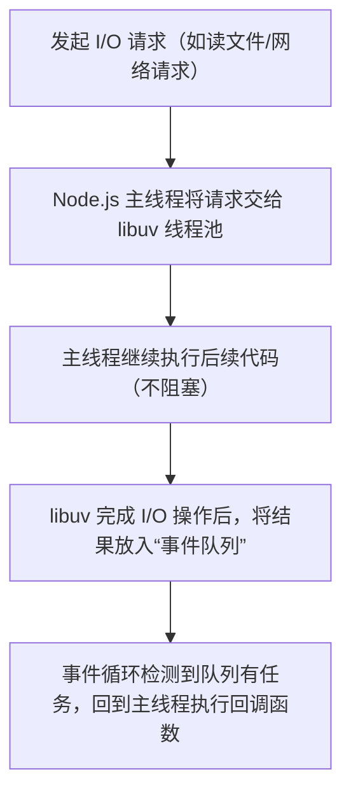

## 目录
- [1](#1)
- [2](#2)


# 1

### 1. 核心概念：什么是 Node.js？

**定义**：
Node.js 是一个开源、跨平台的 **JavaScript 运行时环境 (Runtime Environment)**。
*   **关键点**：它不是语言，也不是框架，而是一个让 JavaScript 代码能够在浏览器之外（即服务器端、本地脚本等）运行的环境。
*   **核心引擎**：它内置了 **Google Chrome 的 V8 引擎**。V8 负责`将 JavaScript 代码 编译成 机器码`并执行，这使得 Node.js 具有极高的执行性能。

**主要优势**：
1.  **全栈 JavaScript**：前端开发者可以使用同一种语言（JavaScript）编写客户端和服务器端代码，降低了学习成本和上下文切换成本。
2.  **ECMAScript 标准支持**：开发者可以立即使用最新的 JS 特性（如 ES6+），无需等待浏览器更新，只需升级 Node.js 版本或通过 flags 开启实验性功能。
3.  **高并发处理能力**：能够用`单线程`处理成千上万的并发连接。

---

### 2. 底层原理深度解析 (The "Under the Hood" Mechanics)

这是 Node.js 最核心、也是最独特的部分，解释了它为何能高效处理 I/O。

#### A. 单线程事件循环模型 (Single-Threaded Event Loop)
*   **传统模式对比**：传统的服务器（如早期的 Apache 或 Java Servlet 容器）通常采用 **"每个请求一个线程" (Thread-per-request)** 的模式。当有 10,000 个并发请求时，可能需要创建 10,000 个线程。这会导致巨大的内存开销和 CPU 在线程上下文切换（Context Switching）上的浪费，且容易引发`死锁`等并发 Bug。
*   **Node.js 模式**：
    *   **单进程单线程**：Node.js 应用在一个单独的进程中运行，主线程只有一个。
    *   **无阻塞 I/O (Non-blocking I/O)**：这是关键。当 Node.js 执行 I/O 操作（如读文件、查数据库、网络请求）时，它`不会`暂停当前线程去等待结果。
    *   **机制**：
        1.  Node.js 发起 I/O 请求，将其交给操作系统内核或内部线程池。
        2.  主线程立即继续执行下一行代码（处理其他请求）。
        3.  当 I/O 操作完成（数据返回或出错）时，系统会触发一个`回调 (Callback)` 或 `Promise`，将其放入`事件队列 (Event Queue)`。
        4.  `事件循环 (Event Loop)` 会不断检查队列，一旦发现有完成的任务，就将其回调函数推入主线程执行。

> **原理总结**：Node.js 利用 **异步 I/O 原语** 和 **事件驱动架构**，避免了线程阻塞。CPU 不会因为等待慢速的 I/O（如磁盘读写、网络延迟）而空转，从而极大地提高了吞吐量。

#### B. V8 引擎的作用
*   **即时编译 (JIT)**：V8 引擎将 JavaScript 代码直接编译为高效的机器码，而不是解释执行，这保证了 JS 在服务器端的运行速度足以胜任高性能场景。
*   **内存管理**：V8 自动处理垃圾回收 (Garbage Collection)，开发者无需手动管理内存。

#### C. 模块系统与标准库
*   **原生网络支持**：Node.js 的标准库（Standard Library）非常强大，特别是 `http`、`net`、`fs` 等模块，它们本身就是基于非阻塞范式编写的。
*   **模块格式**：支持 **CommonJS (CJS)** (`require`) 和 **ECMAScript Modules (ESM)** (`import`)。
    *   `.js` 文件默认通常为 CJS（取决于 `package.json` 配置）。
    *   `.mjs` 文件或 `"type": "module"` 配置启用 ESM。

---

### 3. 代码示例深度拆解

文档中提供的 "Hello World" Web 服务器示例完美展示了上述原理：

```javascript
const { createServer } = require('node:http'); // 1. 引入原生 http 模块
const hostname = '127.0.0.1';
const port = 3000;

// 2. 创建服务器
const server = createServer((req, res) => {
  // 这个回调函数是“事件处理器”
  // 每当有新的 HTTP 请求到达时，事件循环会触发此函数
  
  res.statusCode = 200; // 设置状态码
  res.setHeader('Content-Type', 'text/plain'); // 设置响应头
  res.end('Hello World\n'); // 结束响应并发送数据
});

// 3. 监听端口
server.listen(port, hostname, () => {
  // 这是一个异步操作的回调
  // 当服务器成功绑定到端口后，执行此函数
  console.log(`Server running at http://${hostname}:${port}/`);
});
```

**流程解析**：
1.  **初始化**：`createServer` 注册了一个请求处理函数，但此时并没有阻塞程序。
2.  **监听**：`server.listen` 告诉操作系统：“如果有连接到端口 3000 的请求，请通知我”。这也是非阻塞的，注册完回调后，程序继续（如果没有其他代码，则进入事件循环等待）。
3.  **请求处理**：
    *   当用户访问 `http://127.0.0.1:3000`，操作系统接收 TCP 包。
    *   Node.js 的事件循环检测到新连接，触发 `request` 事件。
    *   执行回调函数 `(req, res) => { ... }`。
    *   `req` (http.IncomingMessage) 包含请求详情（Header, URL 等）。
    *   `res` (http.ServerResponse) 用于构建响应。
    *   `res.end()` 发送数据并关闭连接，释放资源。

---

### 4. 总结：为什么 Node.js 如此流行？

| 特性 | 传统多线程模型 | Node.js 模型 | 优势 |
| :--- | :--- | :--- | :--- |
| **并发模型** | 多线程 (Thread-per-request) | **单线程 + 事件循环** | 节省内存，无线程切换开销，无死锁风险 |
| **I/O 处理** | 阻塞式 (Blocking) | **非阻塞异步 (Non-blocking)** | CPU 利用率极高，适合 I/O 密集型任务 |
| **语言统一** | 后端 (Java/Python/Go) + 前端 (JS) | **全栈 JavaScript** | 开发效率高，代码复用，人才池大 |
| **生态扩展** | 依赖特定语言库 | **NPM (全球最大的包管理器)** | 拥有海量现成的模块和工具 |

**适用场景**：
*   **非常适合**：实时应用（聊天室、游戏）、API 网关、微服务、数据流处理、I/O 密集型应用。
*   **不太适合**：CPU 密集型计算（如视频编码、复杂数学运算），因为单线程会被长时间占用，阻塞事件循环（虽然可以通过 Worker Threads 或子进程解决，但这增加了复杂度）。

Node.js 通过巧妙结合 **V8 的高性能** 和 **事件驱动的非阻塞 I/O**，彻底改变了服务器端开发的格局，使其成为现代 Web 开发不可或缺的基石。

[目录](#目录)

# 2

### Node.js 深度解析：核心概念 + 底层原理
我们从**基础定义→核心原理→代码拆解→底层机制**四个维度，把这段介绍讲透，让你不仅知道“是什么”，更明白“为什么”。

---

## 一、Node.js 核心定义（通俗解读）
原文中“Node.js is an open-source and cross-platform JavaScript runtime environment”的核心是：
- **不是编程语言/框架**：Node.js 不是新语言，也不是像 React/Vue 那样的框架，而是**让 JavaScript 脱离浏览器运行的“执行环境”**。
- **跨平台+开源**：可在 Windows/macOS/Linux 运行，核心代码开源（GitHub：nodejs/node）。
- **适用场景**：后端 API、CLI 工具、实时应用（聊天室/直播）、微服务等，几乎覆盖所有后端场景。

---

## 二、Node.js 底层核心原理（最关键部分）
### 1. V8 引擎：Node.js 高性能的基石
- **原理**：Node.js 内置 Google Chrome 的 V8 引擎（用 C++ 编写），负责将 JavaScript 代码编译为机器码（而非解释执行）。
    - V8 的**即时编译（JIT）**：先解释执行代码，再把高频执行的“热点代码”编译为机器码，兼顾启动速度和运行性能。
    - 对比：浏览器中的 V8 受限于浏览器安全沙箱，而 Node.js 中的 V8 直接对接操作系统，能调用文件、网络等系统 API。
- **为什么快**：V8 是目前最快的 JavaScript 引擎之一，Node.js 复用这个成熟引擎，天生具备高性能。

### 2. 单线程 + 事件循环（Event Loop）：非阻塞 I/O 的核心
这是 Node.js 最独特的设计，也是理解其“高并发”的关键：
#### （1）单线程的本质
- Node.js 主线程（执行 JavaScript 代码的线程）是**单线程**：同一时间只能执行一个任务，避免了多线程的“线程切换/锁竞争”问题（多线程的常见 bug 来源）。
- 注意：“单线程”仅指 JavaScript 执行线程，Node.js 底层的 I/O 操作（文件/网络/数据库）由 **libuv**（C++ 编写的跨平台异步 I/O 库）管理，通过**线程池**（默认 4 个线程）处理阻塞操作。

#### （2）事件循环：非阻塞 I/O 的实现逻辑
当 Node.js 处理 I/O 操作时，流程如下：

- **核心优势**：单线程 + 事件循环让 Node.js 能以极低的资源消耗处理**高并发 I/O 场景**（如电商秒杀、API 服务），因为大部分后端请求都是“等待 I/O 响应”（而非 CPU 密集计算）。
- **反例**：如果用 Node.js 做大量 CPU 密集计算（如视频编码），会阻塞主线程，导致性能暴跌——这是 Node.js 的“短板”。

### 3. 异步 I/O 原语：非阻塞的标准化实现
Node.js 标准库提供的 `fs`（文件）、`http`、`net` 等模块，底层都基于 libuv 实现了**异步非阻塞 API**：
- 非阻塞（Non-blocking）：发起 I/O 后，主线程不等待结果，直接执行下一行代码。
- 异步（Asynchronous）：I/O 完成后，通过“回调/Promise/async-await”通知主线程处理结果。
- 对比传统同步 I/O：
  ```javascript
  // 同步 I/O（阻塞）：主线程等待文件读取完成，期间无法处理其他请求
  const fs = require('node:fs');
  const data = fs.readFileSync('/file.txt'); // 阻塞！
  console.log(data);

  // 异步 I/O（非阻塞）：主线程立即返回，文件读取完成后执行回调
  fs.readFile('/file.txt', (err, data) => {
    if (err) throw err;
    console.log(data);
  });
  console.log('先执行这行，不等待文件读取');
  ```

### 4. ECMAScript 兼容性：自主掌控版本
浏览器中 JS 版本受限于用户的浏览器版本（如老浏览器不支持 ES6），而 Node.js 中：
- 你可以通过升级 Node.js 版本选择支持的 ES 标准（如 Node.js 18+ 完全支持 ES2022）。
- 可通过命令行 flag 启用实验性特性（如 `node --experimental-modules server.mjs`）。
- 原理：V8 引擎会持续跟进 ES 标准，Node.js 同步升级 V8 版本，因此能快速支持新特性。

---

## 三、示例代码底层拆解（Hello World 服务器）
我们逐行解析这段核心代码的底层逻辑：
```javascript
// CJS 模块：导入 http 核心模块（底层基于 libuv 实现 TCP/HTTP 协议）
const { createServer } = require('node:http');
const hostname = '127.0.0.1';
const port = 3000;

// 创建 HTTP 服务器：底层是 libuv 监听 TCP 端口（80/3000）
const server = createServer((req, res) => {
  // 回调函数：每次收到 HTTP 请求时触发（事件循环驱动）
  res.statusCode = 200; // 设置 HTTP 响应状态码
  res.setHeader('Content-Type', 'text/plain'); // 设置响应头
  res.end('Hello World'); // 结束响应并返回内容（异步写入 TCP 流）
});

// 监听端口：底层是 libuv 将“端口监听”加入事件循环
server.listen(port, hostname, () => {
  console.log(`Server running at http://${hostname}:${port}/`);
});
```

### 代码底层执行流程：
1. `require('node:http')`：加载 Node.js 内置的 http 模块（C++ 核心 + JS 封装）。
2. `createServer()`：创建一个 TCP 服务器实例，注册“请求事件”的回调函数。
3. `server.listen()`：libuv 调用操作系统的 `bind()`/`listen()` 系统调用，监听 3000 端口，将“连接事件”加入事件循环。
4. 当有客户端访问 `http://127.0.0.1:3000`：
    - libuv 检测到 TCP 连接请求，触发事件循环中的“请求事件”。
    - 主线程执行回调函数，设置响应状态码/头，调用 `res.end()` 向客户端返回数据。
    - 整个过程**单线程**完成，无需创建新线程，因此能同时处理数千个这样的请求。

---

## 四、Node.js 核心优势总结
1. **语言统一**：前端开发者无需学习新语言（如 Java/Python），用 JS 写全栈代码，降低跨端开发成本。
2. **高性能 I/O**：单线程 + 事件循环 + 非阻塞 I/O，极致适配高并发后端场景。
3. **生态丰富**：npm 是全球最大的包管理器（超 200 万个包），覆盖所有后端需求。
4. **灵活可控**：自主选择 ES 版本，支持自托管/容器化部署，适配云原生架构。

---

### 关键点回顾
1. **核心引擎**：Node.js 复用 Chrome V8 引擎，将 JS 编译为机器码，保证高性能。
2. **核心机制**：单线程主线程 + libuv 事件循环 + 线程池，实现非阻塞 I/O，适配高并发场景。
3. **核心定位**：不是框架/语言，而是 JS 运行时，统一前后端开发语言，擅长 I/O 密集型后端任务。

[目录](#目录)


